[Naver D2 - 모나드란 무엇인가?](https://www.youtube.com/watch?v=jI4aMyqvpfQ) 보고 정리한 글입니다.

영상은 [Naver TV](https://tv.naver.com/v/5340169?query=Monad&plClips=false:5340169) 에서도 확인할 수 있습니다.

---
# Monad란 무엇인가?

모나드는 수학의 *범주론* 에서 사용되는 구조. 하스켈이나 스칼라 등에서 이를 프로그래밍 언어에 적용하였다.

위키피디아에서 모나드를 검색해보면 다음과 같이 나온다.

> 범주론에서 모나드는 내부 함자 범주의 모노이드 대상이다. 폐포연산과 대수 구조 다양체의 공통적인 일반화이다....

음... 너무 어렵다... 여기서는 크게 `map()` 과 `flaptMap()` 에 대해 이야기해보면서 모나드가 무엇인지 알아보자.

## map() 과 flatMap()

``` java
List<String> alpha = Arrays.asList("a", "b", "c", "d");
List<String> collect = alpha.stream().map(String::toUpperCase).collect(Collectors.toList());
``` 

자바에서는 위 코드와 같이 `map()` 함수를 사용한다.

만약 `[1, 2, 3, 4, 5]` 리스트가 있고 `.map(x => x + 1)` 을 적용한다고 해보자. 일반적으로 `map()` 함수를 이해할 때 `1` 원소를 들고와 1 더하고, `2` 원소를 들고와서 2 더하고.. 아! for 문을 옆으로 쓰는 거구나!, 일종의 이터레이터구나 하고 인지하게 된다.

그럼 flatMap()은? 아! map 인데 이름처럼 flat 하게 만들어 주는거구나! 하고 이해햐기 쉽다.

이렇게 이해하는 순간 모나드를 이해하기가 어렵다 ;;

## 모나드는 어떤 경우에 필요한가?

### 비동기 연산 처리

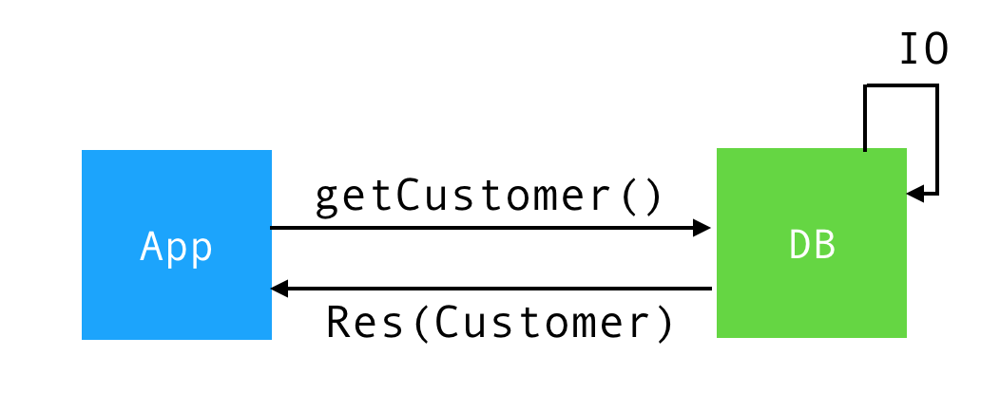

위 그림과 같이 Customer 들 들고오기 위해 메소드를 호출하였을 경우 I/O 작업을 한다. 이게 만약 Blocking 으로 호출하면 Thread 가 모두 소진될 수 있으므로 비동기 방식으로 처리를 해야 효율적이다.

비동기 방식으로 처리할 때 callback 혹은 Promise 또는 async/await 를 사용한다. 여기서 Promise 가 모나드의 일종이라고 말할 수 있다. 즉, 비동기 연산처리를 할 떄 모나드가 사용될 수도 있다.

### Null 처리

java 에서의 Null 처리 예제를 보자.

```java
Cart cart = response.getCart();
if (cart != null) {
    Product product = cart.getProduct();
    if (product != null) {
        System.out.println(product.getName());
    }
}
```

위 코드를 모나드를 이용하여 다음과 같이 작성할 수 있다.

```java
Optional.ofNullable(response.getCart()).ifPresent(c -> {
	Optional.ofNullable(c.getProduct()).ifPresent(p -> System.out.println(p.getName()));
});
```

스칼라 코드는 다음과 같이 작성할 수 있다.

```scala
response.getCart().map{ c => {
	c.getProduct().map(p => System.out.println(p.getName()))
}}
```

모나드를 이용하면 null 체크를 따로 하지않아도 간결하게 코드를 작성할 수 있는 것을 볼 수 있다.

`Optional` 클래스 자체도 일종의 모나드라고 할 수 있다. 이런식의 일반적으로 우리가 할 수 없는 비동기 연산 즉 값이 미래에 준비되거나 값이 null 인 경우, 이런 것들을 모델링할 때 모나드를 사용한다.

## 모나드의 정의

1. 모나드는 **값을 담는 컨테이너**의 일종
2. **Functor**를 기반으로 구현되었음
3. **flatMap()** 메소드를 제공함
4. **Monad Laws**를 만족시키는 구현체를 말함.

## Functor ?

### Functor 의 정의

``` java
import java.util.function.Function;

interface Functor<T> {
	<R> Functor<R> map(Function<T,R> f);
}
```

위 코드를 보면 인터페이스로 `map` 하나만 가지고 있다. 그리고 타입 인자로 `T` 를 가지고 있다. 따라서 `T` 라는 값을 가지는 컨테이너라고 볼 수 있다. `map` 메소드는 함수를 전달인자로 받는다. 함수는 `T` 타입을 받아서 `R` 타입을 반환하는 함수이다. 최종적으로 `map` 함수의 결과값은 `R` 타입의 Functor 가 된다.

정리하자면,

1. 함수를 인자로 받는 `map` 메소드만 가짐.
2. 타입 인자 `<T>` 를 가진다.
3. 전달인자인 함수 f 는 `<T>` 타입 값을 받아 `<R>` 타입 값을 반환하는 함수
4. Functor는 `map` 함수를 거쳐  `<R>` 타입의 Functor를 반환


Functor 에 String 이 있을 때 `stringToInt` 함수를 전달한다고 하면 이 함수는 `Function<String, Int> f` 와 같은 형태가 될 것이다.

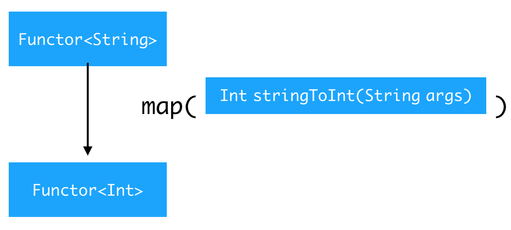

이것을 `map` 에다가 전달을 하면 `Functor<String>` 이었는데 `Int stringToInt(String args)` 함수의 반환값 `Int` 이기 때문에 `Functor<Int>`로 바뀌게 된다.

### map()의 진정한 의미

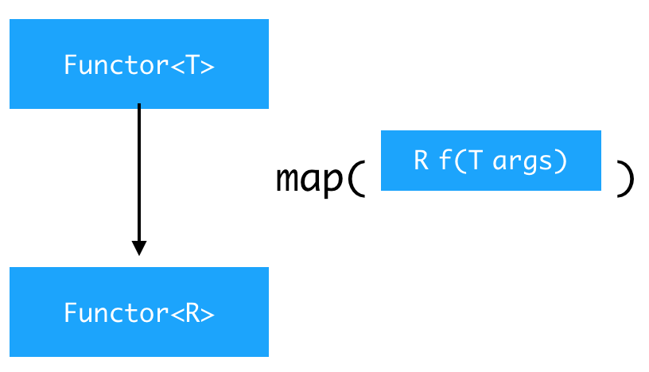

`map()` 의 진정한 의미는 컬렉션의 원소를 순회하는 방법이 아니라 **T 타입의 Functor를 R 타입의 Functor 로 바꾸는 기능** 이다.

### Functor
그럼 값을 꺼낼 수도 없고, 할 수 있는 일이라고는 `map()` 메소드로 값을 변경하는 것 뿐인데 이런 Functor 를 왜 사용하는 걸까? 라고 궁금증을 가질 수 있다.

Functor 를 이용하면, **함수들을 손쉽게 합성**할 수 있다.

Functor 를 이용하면, **일반적으로 모델링할 수 없는 상황을 모델링**할 수 있다.

1. 값이 없는 케이스
2. 값이 미래에 준비될 것으로 예상되는 케이스

**Functor - 값이 없는 케이스**예를 보자

``` java
class FOptional<T> implements Functor<T, FOptional<?>> {
	private final T valueOrNull; // T 값을 하나 가짐
	private FOptional(T valueOrNull) {
		this.valueOrNull = valueOrNull;
	}
	public <R> FOptional<R> map(Function<T,R> f) {
		if (valueOrNull == null) {
            // 값이 비어있으면, empty() 호출하고, f 함수는 호출하지 않음
			return empty();
		} else {
			return of(f.apply(valueOrNull);
		}
	}
	public static <T> FOptional<T> of(T a) {
		return new FOptional<T>(a);
	}
	public static <T> FOptional<T> empty() {
        // 값이 비어있는 경우 null을 값으로 가지는 Functor를 반환
		return new FOptional<T>(null);
	}
}
```

`map` 에 전달된 `f` 함수를 `valueOrNull` 값에 적용을 하는건데 `valueOrNull` 값이 비어있으면 `empty()` 를 호출하고 있으면 `f` 함수를 적용하는 것이다.

실제 사용은 다음과 같이 사용할 수 있다.

``` java
FOptional<String> optionStr = FOptional(null);
FOptional<Integer> optionInt = optionStr.map(Integer::parseInt);
```

```java
FOptional<String> optionStr = FOptional("1");
FOptional<Integer> optionInt = optionStr.map(Integer::parseInt);
```

`null` 값이 들어있음에도 불구하고 문자열이 있는거처럼 `map` 함수를 적용할 수 있다. 이는 실제 값이 들어있는 때랑 동일한 로직이다.

사용하는 쪽에서 null check 가 필요없고 null 인 경우, 그냥 로직이 실행되지 않는다. 그래서 **타입안정성을 유지하면서 null을 인코딩**할 수 있다.


**Functor - 값이 미래에 준비되는 케이스** 예를 보자

``` java
Promise<Customer> customer = // ... DB에서 customer 정보를 들고왔다.
Promise<byte[]> bytes = customer.map(Customer::getAddress) // return Promise<Address>
			.map(Address::street) // return Promise<String>
			.map((String a) -> a.substring(0, 3)) // return Promise<String>
			.map(String::toLowerCase) // return Promise<String>
			.map(String::getBytes); // return Promise<byte[]>
```

`Promise<Customer>` 는 아직 Customer 값을 가지고 있지 않지만 `FOptional` 과 동일하게 마치 값이 있는거처럼 `map` 메소드를 적용할 수 있다. 문법적으로나 의미적으로 완전히 동일하다.

위 코드의 중간과정들의 결과값은 모두 `Promise` 이다. 이게 다 비동기로 이루어지는 연산들인데 마치 동기로 동작하는 거처럼 작성을 할 수 있다. 이게 다 `Promise` 로 반환하기 때문에 다 non-blocking 으로 일어난다는 말이고 이는 **비동기 연산들의 합성이 가능**하다는 말이다. 이런것들을 가능하게 하는 것이 모나드의 장점이라고 말할 수 있다.

## 그럼 List 는 무엇인가?

앞에서 본 `List` 는 무엇인가? `List` 도 일종의 Functor 인데 값이 하나가 아닌 리스트인것이다.

```java
class FList<T> implements Functor<T, FList<?>> {
    // 단순히 Functor 가 담고 있는 값이 List 임
	private final ImmutableList<T> list; 
	
    FList(Iterable<T> value) {
		this.list = ImmutableList.copyOf(value);
	}

	@Override
	public <R> FList<?> map (Function<T,R> f) {
		ArrayList<R> result = new ArrayList<R>(list.size());
		for (T t : list) {
            // List의 모든 원소에 함수 f 를 적용
			result.add(f.apply(t));
		}
		return new FList<>(result);
	}
}
```

```java
List<String> num = Arrays.asList("1","2","3","4","5")
List<Integer> collect1 = num.stream().map(Integer::parseInt).collect(Collectors.toList());
```

그래서 리스트에 대해서 `parseInt` 메소드를 리스트의 각 원소에 적용한다.

실제로 스칼라 컬렉션에 리스트를 보면 리스트에서 이미 `map` 함수가 있는 것을 볼 수 있다.

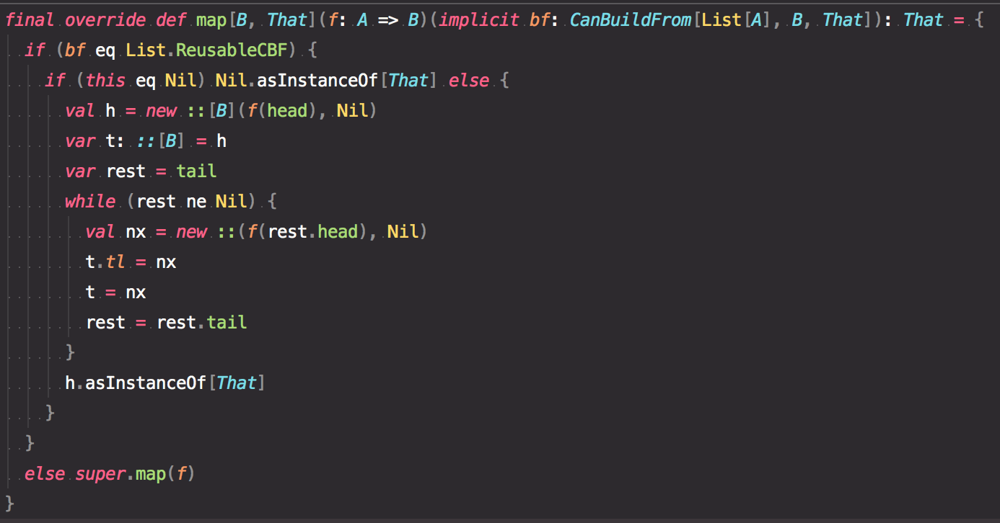

앞에 보았던 다른 `map` 함수와 먼가 형태가 달라보이지만 어쨌건 안에 있는 모든 원소들에 대해서 전달된 f 함수를 적용한다.

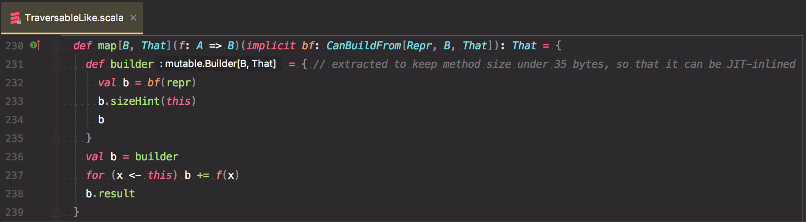


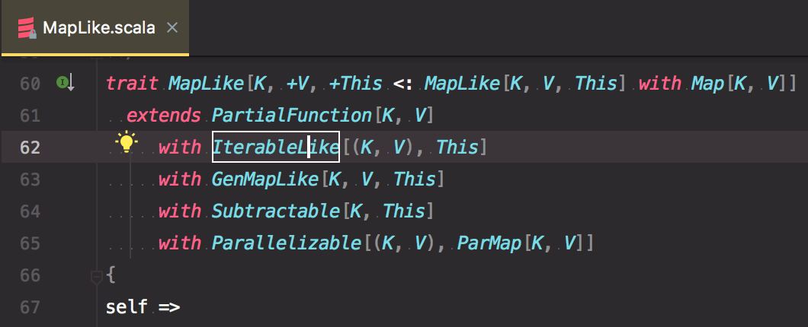

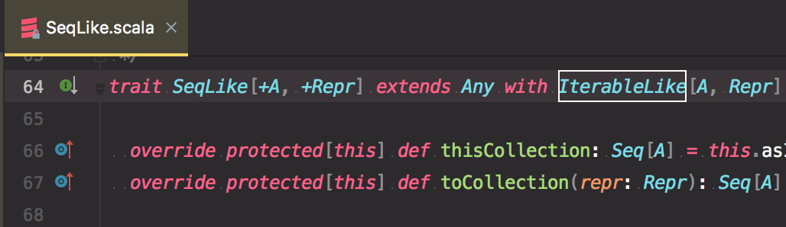

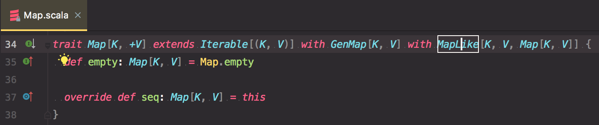

맵 이나 시퀀스 이런 것들은 `TraversableLike` 라는 trait 이 있는데 이 녀석을 `IterableLike` 가 상속하고 있고 `IterableLike`를 `MapLike` 와 `SeqLike` 가 상속하고 있다. 최종적으로 `MapLike`를 `Map` 이 상속을 함으로써 앞에서 본 `map` 함수를 가지게 되는 것이다.

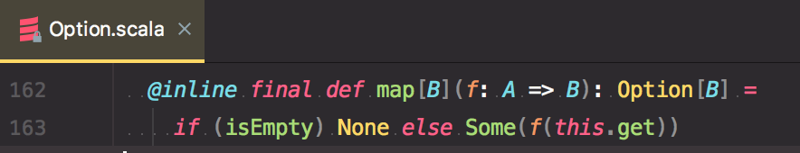

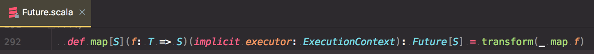

실제로도 스칼라의 대부분 컬렉션에 `map` 함수를 가지고 있다. 뿐만 아니라 `Option` 이나 `Future` 에도 map 이 들어있다. 이런 것들이 다 Functor 로 구현됬구나라는 것을 알 수 있다.

## 그럼 Monad 는 대체 무엇인가? 

Monad 는 Functor 에 `flatMap()` 을 추가한 것. Functor 에 문제점이 있어서 요녀석이 나온것인데 문제점이 무엇인지 알아보자.

### Functor 문제점

```java
FOptional<Integer> tryParse(String s) {
	try {
		final int i = Integer.parseInt(s);
		return FOptional.of(i); // 여기서 이미 Functor 를 반환
	} catch (NumberFormatException e) {
		return FOptional.empty();
	}
}
```

`tryParse` 함수는 `String` 을 받아서 `parseInt` 해서 `Integer` 로 바뀌면 그 값을 반환하고 만약 문제가 발생하면 `empty()` 로 반환하는 것이다. 

Functor 에다가 `tryParse` 함수를 전달하는 순간 문제가 생긴다.

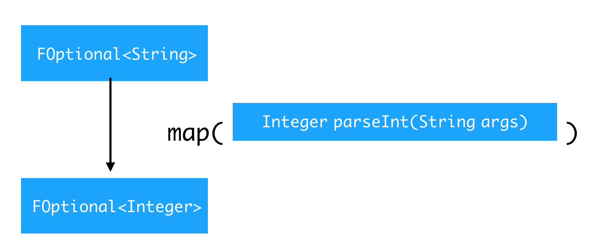

일반적으로 앞에서 보았던 예제는 `FOptional<String>` 이었는데 `parseInt` 라는 메소드를 전달해서 반환값이 `Integer` 이기때문에 `FOptional<Integer>` 가 된다.

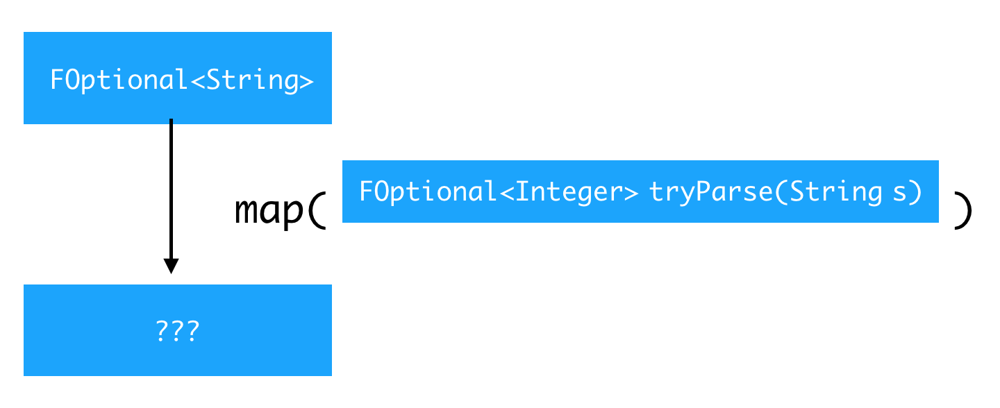

하지만 `tryParse` 를 전달하면 `tryParse` 는 이미 `FOptional<Integer>` 를 반환하고 있기 때문에 `FOptional<FOptional<Integer>>` 형태로 되어버린다. 이처럼 Functor 가 Functor 에 감싸져 있으면, 함수의 합성과 체이닝이 어려워진다.

```java
FOptional<Integer> num1 = //...
FOptional<FOptional<Integer>> num2 = // ...

FOptional<Date> date1 = num1.map(t -> new Date(t))
FOptional<Date> date2 = num2.map(t -> new Date(t)) // 컴파일 안됨
```

맨 마지막 줄를 보면 `t` 가 이미 `FOptional<Integer>` 이기 때문에 `Date` 에 전달을 할 수 없다.

그래서 Functor 가 두번 감싸져, Functor 가 제 기능을 하지 못하게 되었다. 하지만 앞에서 보았던 `tryParse` 함수처럼 반환값이 Functor 인 함수는 매우 일반적인 케이스이다. 

Functor 의 `map` 함수는 어떤 형태이든 받을 수 있는 구조로 되어있는 것인데 Functor 를 반환한다고 해서 처리가 안되면 안된다. 그래서 나온 것이 `flatMap` 이다.

## flatMap 정의

`flatMap` 정의는 다음과 같다.

``` java
interface Monad<T, M extends Monad<?,?>> extends Functor<T, M> {
	M flatMap(Function<T,M> f); // 변형함수 f의 타입인자인 M을 반환
}
```

`flatMap` 도 결국엔 함수를 전달인자로 받는 녀석인데 `Function` 은 `T` 를 받아 `M` 을 반환하고 `flatMap` 의 반환값도 `M` 이다.

`map` 과 비교 해보자.

```java
interface Functor<T> {
	<R> Functor<R> map(Function<T,R> f);
}
```

`map` 은 `f` 함수가 `R` 타입을 반환하니깐 `Functor<R>` 으로 반환한다. 하지만 `flatMap` 은 `f` 가 `M` 을 반환하면 그냥 `M` 을 반환한다.


### flatMap 적용

```java
FOptional<string> num = FOptional.of("42");
// tryParse 반환값: FOptional<Integer>
FOptional<Integer> answer = num.flatMap(this::tryParse);
FOptional<Date> date = answer.map(t -> new Date(t)); // 합성 가능
```

실제로 사용해보면 `tryParse` 를 `flatMap` 에 전달하면 `tryParse` 반환값이 `FOptional<Integer>` 이기 때문에 그냥 이 값으로 바뀌게 되어 `answer.map(t -> new Date(t))` 처럼 함수를 합성할 수 있다.

이것이 된다는 말은 아래 코드와 같이 `flatMap` 을 하고 난 다음 `map` 을 할 수 있고 또 다른 `flatMap` 을 할 수 있다. 이 처럼 합성을 할 수 있게 하는 것이 모나드가 가지는 강점이라고 볼 수 있다.

```java
num.flatMap(this::tryParse)
	.map(t -> new Date(t)) // 합성 가능
	.
	.
	.
```

## 결론 - Monad 의 정의

1. Monad는 **값을 담는 컨테이너**의 일종
2. **Functor**를 기반으로 구현되었음
3. **flatMap()** 메소드를 제공함
4. **Monad Laws**를 만족시키는 구현체를 말함.

> Monad Laws 를 만족하지 않아도 스칼라에서는 모나딕이라고 하면서 똑같이 사용할 수 있다.

값이 없는 상황이나, 값이 미래에 이용가능해질 상황 등 일반적으로는 할 수 없는 여러 상황을 모델링 할 수 있다.

**비동기 로직**을 구현할 때 마치 동기 로직을 구현하는 것과 동일한 형태로 구현하면서도, **함수의 합성 및 완전한 non-blocking pipeline** 을 구현할 수 있다.

## Reference

[Monad Programming with Scala Future](http://tech.kakao.com/2016/03/03/monad-programming-with-scala-future/)

[한글번역 - Functor and monad examples in plain Java · GitHub](https://gist.github.com/jooyunghan/e14f426839454063d98454581b204452)

[Functor and monad examples in plain Java](https://www.nurkiewicz.com/2016/06/functor-and-monad-examples-in-plain-java.html) 

## Appendix

* flatMap() 에 대해 더 알아보기
* Monad Transformer
* Pure Function Library

---

## 더 참고해볼 만한 자료

[Functional JavaScript - Functors, Monads, and Promises - DEV Community 👩‍💻👨‍💻](https://dev.to/joelnet/functional-javascript---functors-monads-and-promises-1pol)
