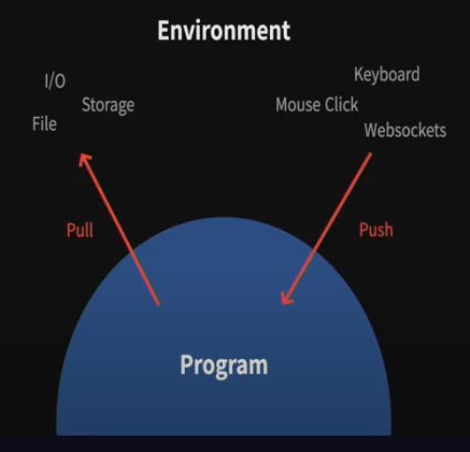

# 비동기를 우아하게 처리하기 위한 Observable

Rx 와 관련이 있는 발표. Rx의 주요 구성 요소중 하나인 Observable 에 대해 설명하고 RxJS로 어떻게 비동기 프로그래밍을 하는지 보여준다. 

Promise 가 비동기 처리에서 어떤 한계가 있는지 살펴보고 더 깔끔하게 비동기 처리를 할 수 있는 Observable 에 대해 알아본다.


## Agenda

1. Promise 한계
2. Observable 소개
3. RxJS로 비동기 프로그래밍
4. Advanced RxJS

---


JS 는 싱글스레드 기반으로 동작하기 때문에 동시성을 확보하기 위해 비동기 프로그래밍을 이용할 수 있다. 보통 웹에서 처리하는 비동기들은 다음과 같다.

* DOM Events
* Ajax
* Animations
* 시간 (Throttling/Deboucing 등)
* Websockets, Workers 등

보통 웹 개발에 필수적인 요소들을 비동기로 처리를 하고 있다.


보통 비동기로 처리할 때 사용할 수 있는 방법은 Callback 이 있지만 쉽게 Callback Hell 이 발생하는 문제가 있다.  또 다른 방법으로는 Promise 가 있다.

> Promise 는 미래의 완료 또는 실패된 값을 다루는 인터페이스이다.

Promise 는 표준 스펙이기 때문에 대부분 브라우저에서 바로 사용이 가능하며  aysnc function, async iteration 과 같이 좀 더 확장할 수 있는 syntax 도 있다. 하지만 promise 도 한계가 있다.


## Promise 한계

크게 2가지 한계가 있다.

1. 취소 불가능
2. 단일값


### 취소 불가능

프로미스는 한번 실행하면 취소가 불가능하다. 비동기 작업이 끝나면 성공 또는 실패의 불변 상태만을 가지고 어떤한 일이 일어나더라도 미래의 값을 보장하는 역할을 한다.

 ### 왜 취소가 필요한가?

ex) Auto Complete


위 그림처럼 취소를 하지않으면 마지막에 검색한 react 결과값이 보여지는 것이 아니라 angular 에 대한 검색 결과값이 사용자에게 보여주게 된다.

그래서 이전 요청을 취소하는 기능이 필요하다.

auto complete 말고도 다음과 같은 경우에 취소가 필요하다.

* 라우트 변경
* Impression
* 사용자가 원할 떄
* 등등..


### 단일값

프로미스는 단일값을 다룬다. 웹에서 다루는 대부분의 비동기는 값이 여러개이다. (Ajax 는 크게 상관이 없지만 DOM Events, Animations, 시간(Throttling/Debouncing 등), WebSockets, Workers 등은 여러개의 값들을 다룬다)


### 무엇을 사용해야 할까?

콜백은 여러 값을 다룰 수는 있지만, 로직이 복잡해지면 코드가 쉽게 더러워진다. 그럼 무엇을 사용해야 할까? 바로 Observable 인터페이스를 사용하면 된다.

Observable 는

- 비동기로 발생하는 여러 데이터를 다루는 인터페이스
- 이벤트 스트림
- 취소 가능
- 비동기 흐름을 쉽게 읽을 수 있는 장점

있다.


## Observable 살펴보기

옵저버블은 비동기 값을 받기 위해 구독(subscriptions)이라는 개념을 사용한다.

subscribe 에 observable 을 등록하여 이벤트를 구독하는 형태

옵저버는 각각 `next`, `error`, `complete` 의 3가지 property 를 가진다. 각각 콜백이고 `next` 는 다음에 받을 값을 받는 콜백, `error` 는 에러를 받는 콜백, `complete` 는 이 옵저버가 끝났을 떄 호출되는 콜백이다.


자세한 내용은 [6:15](https://youtu.be/oHF8PEkteq0?t=378) 내용을 참고.

**비동기 흐름을 선언적으로 작성을 해서 한눈에 파악**이 가능.


## RxJS

- Observable 구현체 제공
- Composition 및 생성 유틸리티 제공 (operator)
  - operator 를 사용할 때마다 Observable 을 재활용하기 때문에 성능 이슈를 줄임
- Scheduling


옵저버블 생성 유틸리티를 사용하는 설명은 [13:29](https://youtu.be/oHF8PEkteq0?t=809) 를 참고하자.


### Piping

RxJS에서 옵저버블을 컴포지션할때 piping 이라는 개념을 사용한다.

5.5.0 버전 이전에는 프로토타입을 확장해서 사용하고 있었다.  따라서 다음과 같은 형태로 체이닝 형태로 작성할 수 있다.

``` js
Observable.from([1, 2, 3])
	.map(x => x * 2)
	.filter(x => x < 5)
	.subscribe();
```

5.5.0 버전 이후부터는 `pipe` 라는 메소드를 추가하였다. `pipe` 메소드는 여러 operator 를 인자로 받는 형태이다. 

```javascript
Observable.from([1, 2, 3]).pipe(
    map(x => x * 2),
    filter(x => x < 5)
).subscribe();
```

이렇게 변경된 이유는 다음과 같다.

* prototype 을 확장하면 문제가 많다.
  * Global
  * Tree-shaking 이 힘듬

그래서 코드의 가독성이 조금 떨어지더라도 프로토타입을 사용하지 않는 방향으로 움직인 것 같다.


## RxJS 실전 예제

ex) auto complete

[15:56](https://youtu.be/oHF8PEkteq0?t=956) 를 참고하자.

예제 코드는 https://github.com/seokju-na/rxjs-autocomplete-example 를 참고.


## Observable 이 좋은선택일 수 있는 이유

보통 프로그램이 외부와 통신할 때 2가지 시나리오가 있다. Pull 과 Push 이다.


Pull

* 외부에 명령하여 응답받고 처리
* 값을 가지고 오기 위해서는 계속 호출
* iteration

Push

* 외부에 응답이 오면 그때 반응하여 처리
* 값을 가지고 오기 위해서 구독
* observation


이 2가지 시나리오를 그림으로 표현하면 다음과 같다.



I/O, Storage, File 은 Pull 에 해당하고 Keyboard, Mouse Click, Websockets 같은 경우에는 Push 에 해당한다.

웹에서 처리하는 대부분의 비동기 처리들은 Push 모델에 적합하다. (언제 값이 올지 모르기 떄문에)

따라서 Observable 이 좋은 선택이 될 수 있다.


Push 형태의 비동기를 Pull 형태로 강제로 변경할 수도 있다. 예를 들어 DOM Event 를 async iterator 를 이용하여  (for await of) 한 개씩 가져오는 식으로 바꿀 수는 있다. 하지만 언제 이벤트가 발생할 지 모르기 때문에 그것들을 미리 저장해 두기 위해 (보통 **backpresure** 를 해결한다라고 말함) 메모리에 할당해야 하기 때문에 메모리 부담이 되는 trade off 가 발생한다.  redux-saga 같은 push 를 효율적으로 pull 로 변경할 수 있는 라이브러리를 사용하지 않는 이상 observable 이 좀 더 좋은 선택이 될 수 있다. 


## 결론

Observable 은 비동기로 발생하는 여러 데이터를 처리하는 인터페이스며 프로미스와는 다르게 취소가 가능하다. 그리고 옵저버블은 컴포지션이 가능하기 때문에 비동기 흐름을 선언적으로 작성할 수 있는 장점이 있다. 웹의 비동기 대부분이 Push 형태이데 옵저버블은 Push 형태의 비동기 처리에 적합한 모델이다.


* Observable
  * 비동기로 발생하는 여러 데이터를 처리
  * 취소가 가능하다
* Observable composition
  * 비동기 흐름을 선언적으로 작성
* Observable은 Push 형태의 비동기 처리에 적합한 형태
  * 웹의 비동기 대부분이 Push 형태이다.

 

단점도 있다.

* 익숙하지 않아 러닝커브 높음
* 디벙깅의 어려움
* API가 명료하지 않아 표준 스펙으로 체텍의 어려움이 있다 
  * 이에 대한 논의가 이루어지고 있음 - https://github.com/tc39/proposal-observable/issues/201


## Two More Things

Rx 로 좀 더 활용할 수 있는 방법을 소개.


### 1. RxJS Scheduling and Animation

RxJS 스케쥴러를 이용하여 애니메이션을 처리할 수 있다. RxJS 스케쥴러는 언제 구독이 시작될지 또는 언제 값이 전달될지 타이밍을 계산해준다.  기본값으로 스케쥴러는 지정되어 있지는 않다.


스케쥴러 중에 animationFrameScheduler 라고 있는데 이 스케쥴러는 다음 requestAnimationFrame 에 값이 전달되는 스케쥴러이다.  이것을 이용하면 애니메이션을 처리하는데 도움이 된다.

예시 코드는 [29:23](https://youtu.be/oHF8PEkteq0?t=1763) 를 참고하자


### 2. ESNext pipelin operator

[32:42](https://youtu.be/oHF8PEkteq0?t=1962) 를 참고.


---

## Reference

[FEConf Kore 2019 -  비동기를 우아하게 처리하기 위한 Observable](https://youtu.be/oHF8PEkteq0)


