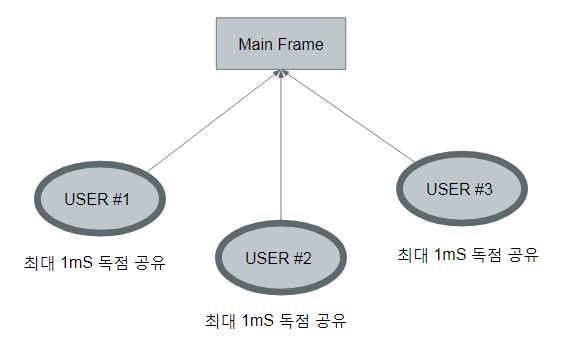
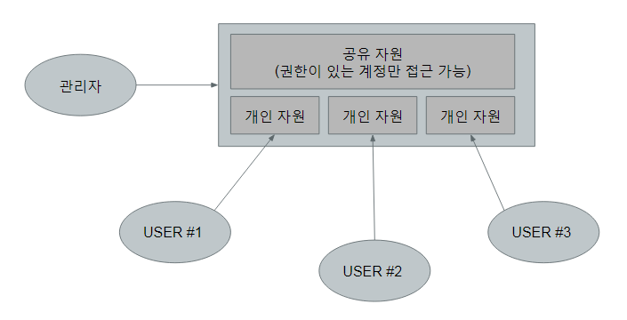
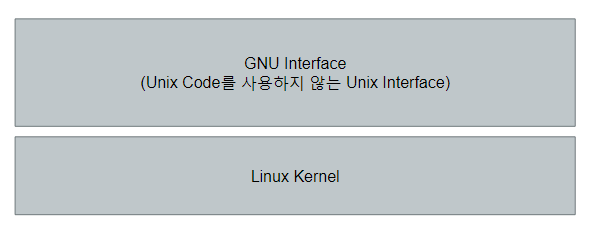
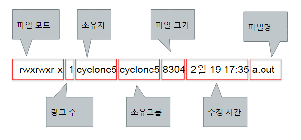
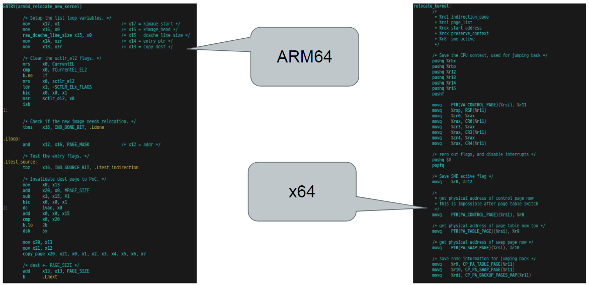

# Unix System Programming
우분투한국커뮤니티에서 주최한 [Unix System Programming](https://festa.io/events/247) 에 참여하여 정리.

> NOTE: Multiplexing I/O 코드는 MacOS 에서 실행되지 않음

---
## Unix 와 Multics

Unix(유닉스)가 나오기 전에는 Multics(멀틱스)라는 것이 있었다. 옛날에는 메인 프레임이 비싸다보니 여러 사람들이 같이 사용하였는데 이로 인한 자원 공유에서 오는 충돌이 문제가 되었다. 그래서 heap 메모리 같은거는 공유자원으로 만들고 유저마다 개인 자원을 할당하여 서로 충돌나지않게 OS에서 관리할 수 있도록 만들어서 나온 것이 유닉스이다.   

> 여러명에서 메인 프레임을 사용하는 것을(Multics) 메인 프레임을 각자의 공간을 제공한다고해서 UNIX.

## Unix 분류
System V 계열 과 BSD 계열이 있다.

* **System V**
    - 상용 Unix
    - H/W 와 같이 판매
    - 코드가 공개되어있지 않음
    - Solaris

* **BSD**
    - 공개 Unix
    - H/W 와 같이 판매 또는 S/W 만 배포
    - 코드가 공개되어 있음
    - FreeBSD

> MacOS 가 BSD 계열

## Linux 와 GNU
Linux는 Linus 가 개발한 unix. 리눅스는 유닉스가 아니다. 리눅스와 유닉스는 다르지만 사용하는거는 같다. GNU는 리눅스 커널위에 GNU에서 만든 GNU Interface 를 탑재한 거라고 볼 수 있다.

## Unix Permission
리눅스 or 유닉스 사용할 떄 권한문제 때문에 어려운 부분이 있다. 권한때문에 다소 불편함을 느낄 수 있지만 유닉스의 역사를 보면 권한이 있는 것은 당연하다 (유닉스 시작은 여러명에서 사용하는 OS 에서부터 시작했기때문 -> 하드웨어 접근은 root 계정) 

개인 별로 계정을 지급하고 계정 고유의 파일 소유권, 그룹 고유의 파일 소유권, 관리자 계정을 각 계정 및 그룹별로 접근성을 제한한다. 3가지 권한으로 파일시스템 사용헌다(유닉스는 모든 것이 파일시스템). 

### 파일 모드

파일 모드를 보면 `-rwxrwxr-x` 라고 되어있는데 각 부분마다 의미하는 것이 있다.
왼쪽에서 차례대로
- `-` : 항목유형
    - 블록 특수 파일의 경우 b
    - 문자 특수 파일의 경우 c
    - 기호 링크의 경우 d
    - 파이프의 경우 p
    - 소켓의 경우 s
    - 일반 파일의 경우 -
- 맨처음 `rwx` : 소유자 권한 (읽고 쓰고 실행 가능)
- 중간 `rwx` : 소유 그룹 권한 (읽고 쓰고 실행 가능)
- 끝에 `r-x` : 기타 유저 권한 (읽고 실행 가능, 쓰기 불가능)

이때 r은 읽기 가능, w는 쓰기 가능, x는 실행 가능을 뜻한다. 

## 파일 시스템
유닉스는 시스템의 모든 자원을 File로 관리한다.

- 일반 파일
- 라이브러리
- 실행 파일
- Device
- Process
- Kernel 정보

> 일반 파일, 라이브러리, 실행 파일는 대부분의 OS에서 파일로 관리한다.  
> 윈도우에서는 Device, Process, Kernel 정보를 레지스트리에 설정한다.

### 주요 파일 디렉토리

- `/bin` : 실행파일
- `/etc` : 유닉스/리눅스 설정파일
- `/dev` : Device 관리
- `/proc` : Process 정보 (가상 Directory)
- `/home` : 개인 디렉토리
- `/lib` : 공유 라이브러리
- `/usr` : 공유 파일
- `/usr/include` : C언어 Header file
- `/sbin` : 사용자가 쓰는거 아님. 시스템 관리자가 쓰는 실행 파일.

> TODO  
> ls /proc - 실제로 있는거 아니고 OS 에서 편하게 관리하기 위해 만든 가상 디렉토리  
> 페이지 기법 (메모리 관리 기법)  
> 페이지 - 물리적 메모리와 가상 메모리 매핑 (관리는 관리자가)  
> 가상디스크 - 메모리에 올라가있다.(메모리의 일정영역)  
> swap 설정

## C언어의 등장

어떻게 빌드되고 어떻게 실행되는지 알아보자.

어셈블리같은 경우에는 메인 프레임마다 다르다 (x86 / ARM - 어셈블리어 다르다) x86 - CISC , ARM - RISC

다음 ARM / x86 어세블리 코드를 보면

하는 일은 같으나(하드디스크에 있는 커널 이미지를 메모리에 탑재) 명령어 자체는 다르다. 아키텍쳐에 종속될 수 밖에 없다.

c언어는 메인 프레임에 종속되는 부분을 공용 라이브러리로 만들었다. (지금은 너무나도 당연한 이야기)

Unix System Program 은 Unix 공용 라이브러리를 사용하여 File System 을 관리하는 것.

Posix - Portable Operating System Interface (X)
(X) 는 unix 에서 x 를 따온거
File and Directory Opereration - 이번시간에 할 내용

> TODO  
> 컴파일 & 링크 & 빌드  
> main.c 에는 호출하는 라이브러리가 존재하지않음  
> 오브젝트 파일 - 연결해줌  
> 이 두개를 합치는 것을 빌드?

우리가 실제로 실행하는 파일은 ELF 파일.
OS가 ELF 파일을 메모리로 올려놓고 main() 함수를 찾아 실행.

`a.out` : ELF 파일 (gcc main.c 를 통해 a.out 이 생성됬음)

`readelf -h a.out` : ELF Header 를 분석.

## 파일 입출력

읽을 파일, 쓸 파일 어떻게 구분? - 파일 디스크립터(fd - int 형)를 이용.
예를 들어 open() 할 경우 open() 함수의 리턴값으로 fd 값이 옴
파일을 열엇으면 닫아야한다. - 닫지않으면 다른 사람이 사용못함

block i/o, blocked i/o

block i/o - 한 바이트씩 보내고 받는게 아니라 덩어리로 i/o 를 얼만큼 하냐 (memory read write, socket read write)
blcoked i/o - i/o 가 끝날때까지 너는 기다려

표준 스트림

파일 디스크립터를 받을 떄 3을 받게되는데 0, 1, 2 는 미리 배정되어있어서 그렇다.

stream (강의 지류)

stream 은 강의 지류라는 뜻. 이 개념을 i/o에 가져온다. (그림 참고)

Device Control

rtc - real time clock

I/O Multiplexing

blocked I/O 문제를 해결하기 위한 거.
기다리고 있어서 하나의 I/O 를 처리하기 위해서 하나의 프로세스나 스레드를 이용. 요청이 많아지면 문제가됨.
I/O Multiplexing - 하나의 프로세스 또느 스레드에서 여러개의 I/O 를 다룬다.

주고 싶은거 있어요?? 이런식으로 쭈욱 처리를 함. 일단 물어봄(폴링 방식) - POSIX (이게 먼저 만들어짐 - 시스템이 너무 비싸서 밑에 방식으로 못함)
메세지를 받아주는 놈이 따로 있음. - Linux, BSD 계열

epoll() 실습 - fd 번호가 0, 4 가 뜨는데
3은 epoll() 로 할당되기때문.

## Reference

[Unix System Programming - 발표자료](https://docs.google.com/presentation/d/10LI8cRAjKIDCircnoIbfwlmhKiOPFOeogXtV-q1joEU)