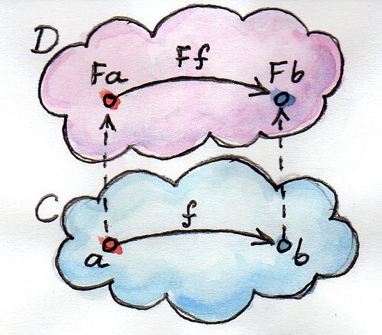

# 함수형 프로그래밍

> [[10분 테크토크] 도넛의 함수형 프로그래밍](https://www.youtube.com/watch?v=ii5hnSCE6No) 을 보고 정리한 글

함수형 프로그래밍의 역사와 정의, 특징, 그리고 자바에서의 적용에 관해서 알아보자.

## Hilbert's program

요즘 현대 수학은 굉장히 엄밀하지만 이 당시에만 해도 그렇지 않아 잘못하다가는 수학이 다 무너지겠다고 느껴 유한한 단계를 통해 수학의 **완전성**과 **무모순성**을 증명하려 하였다고 한다.

> **완전성** : 모든 참인 명제는 증명 가능
>
> **무모순성** : 형식적 추론을 통해 모순이 도출되지 않음

## Gödel’s incompleteness theorems

그러다가 *Kurt Gödel(쿠르트 괴델)* 이 **불완전성 정리**를 발표하게 된다

1. 무모순적 공리계는 반드시 참이지만 증명할 수 없는 명제가 존재함
2. 체계의 무모순성은 스스로 증명할 수 없음

> 사실 여기서 컴퓨터가 시작된다

## 불완전성 정리 증명의 두 가지 방법

1. **괴델수**
    * 마치 ASCII 코드처럼 명제의 글자들을 수로 치환하여 계산을 시도
    * 여기에 영향을 받아 **Turing Machine(튜링 머신)**이 나오게 된다
2. **재귀함수**
    * 재귀 함수의 개념은 원래부터 있던 기법이 아닌 괴델을 비록한 동시대의 수학자들이 개발한 것
    * *Alonzo Church(알론조 처치)* 의 **람다 대수(Lambda Caculus)** 가 여기서 영향을 받음

### 튜링 머신과 정지 문제

*Alan Mathison Turing(앨런 매티슨 튜링)* 이 *David Hilbert(다비트 힐베르트)* 의 **결정문제**에 대하여 유한한 단계 이후에 계산이 완료될지 안될지 아는 것은 불가능하다 라는 것을 증명하기 위해 **튜링 머신**이 나오게 되고 여기서 컴퓨터가 딱! 나오게 된다.

### 람다 대수와 처치-튜링 명제

처치는 이름이 없는 함수들 간의 연산으로 이루어진 대수 체계를 만들었고 그것이 바로 람다 대수이다.

> 익명함수를 람다라고 하는 것이 이러한 이유 때문이다

그리고 튜링과 처치와 같이 연구하여 결국엔 **튜링 머신, 람다 대수를 비록한 일련의 체계들은 본질적으로 같음**을 증명하게 된다.

### Combinatory Logic

[람다 대수와 처치-튜링 명제]()에서 말한 튜링 머신, 람다 대수를 제외한 일련의 체계들 중 대표적으로 *Haskell Brooks Curry(해스켈 브룩스 커리)* 이 만든 **Combinatory Logic**이 있다.

**Combinator**는 자유 변수없이 종속 변수로만 이루어진 함수를 말한다.

예를 들어, `f(x) = x + y` 가 있을떄 `x`는 종속 변수, `y`는 자유 변수이다.

**Combinatory Logic**이라는 것은 간단하게 말해서

```
S(x, y, z) = x(z)y(z)
K(x, y) = x
I(x) = x
```

를 조합하여 모든 프로그램을 작성할 수 있다는 이야기이다.

## 함수형 프로그래밍이란 무엇인가?

하나의 프로그램을 수학에서의 함수의 합성체로 보는 관점, 수학에서의 함수로 프로그래밍하는 관점이라고 쉽게 생각하면 될 것 같다

> `Program(x) = f · g ·   ...  (x)`

## 함수형 프로그래밍의 요소들

함수형 프로그래밍의 간단한 요소들을 살펴보자면 다음과 같다

1. 고차 함수
2. 일급 함수
3. 커링과 부분 적용
4. 재귀와 꼬리 재귀 최적화
5. 멱등성
6. 순수 함수와 참조 투명성
7. 불변성과 영속적 자료구조, 메모이제이션(캐싱)

### 고차 함수 (Higher-Order Function)

인자로 함수를 받을 수 있고 반환도 함수로 할 수 있는 함수를 말한다

### 일급 함수 

우선 **first class(일급)** 이라는 말을 살펴보자

* 값으로 다룰 수 있다
* 변수에 담을 수 있다
* 함수의 인자로 사용될 수 있다
* 함수의 결과로 사용될 수 있다

따라서 일급 함수라는 것은

* 함수를 값으로 다룰 수 있다
* 함수를 변수에 담을 수 있다
* 함수를 함수의 인자로 사용될 수 있다
* 함수를 함수의 결과로 사용될 수 있다

라고 할 수 있다.

### 커링과 부분 적용

```java
public class Curry {
	public static int sum(int a, int b) {
		return a + b;
	}
	public static Function<Integer, Function<Integer, Integer>> curriedSum = a -> b -> a + b;
}
```

```java
@Test
void sumTest() {
	assertThat(Curry.sum(5, 6)).isEqualTo(11));
}

@Test
void curriedSumTest() {
	assertThat(Curry,curriedSum.apply(5).apply(6).isEqualTo(11));
}

@Test
void partialApplicatioinTest() {
	Function<Integer, Integer> sum9 = Curry.curriedSum.apply(9);
	// b -> 9 + b
	assertThat(sum9.apply(7)).isEqualTo(16);
	assertThat(sum9.apply(11)).isEqualTo(20);
	assertThat(sum9.apply(-5)).isEqualTo(4);
}
```

### 꼬리 재귀

```java
public class Factorial {
	public static int recursive(int n) {
		if (n == 1) {
			return 1;
		}
		return n * recursive(n - 1);
	}

	public static int tailRecursive(int n, int acc) {
		if (n == 1) {
			return acc;
		}
		return tailRecursive(n - 1, n * acc);
	}
}
```

스택을 계속 사용하지 않고 최적화가 가능하기 떄문에 **Stack Overflow 발생을 방지**할 수 있다.

> 이 부분은 컴파일러가 해줘야 되는 부분인데 자바는 해주지 않는다고 한다

### 영속적 자료구조

값을 바꿀 필요성이 있을 때 새로 만들면 비용이 많이 들고 안좋다고 생각하는데 그렇지 않다.


[그림출처 - Persistent data structure](https://en.wikipedia.org/wiki/Persistent_data_structure)

```
xs = [0, 1, 2]
ys = [3, 4, 5]
```

리스트 합친 걸 만든다고 했을 떄 전부 새롭게 복사할 필요없이 위 그림처럼 하는 기법을 영속적 자료구조라고 한다. 

> 함수형 프로그래밍 언어뿐만 아니라 리액트 라이브러리인 리덕스에서 이런식으로 활용해서 쓴다고 한다

## 왜 함수형 프로그래밍 언어를 배우는게 좋은가?

1. 높은 표현력을 통해 불필요한 코드를 줄일 수 있다
    * 무엇을 하는 지 명확함 
	* **"How(계산 순서)는 기술하지 않고 What(함수 정의)만을 기술한다"**

2. 함수형 프로그래밍 언어군은 프로그래밍 언어론의 최신 연구 결과를 반영하고 있다.
    * ex) 소프트웨어 트랜잭셔널 메모리, 타입 클래스, 대수적 자료형과 패턴 매칭 등

> 하스켈에서 소프트웨어 트랜잭셔널 메모리을 처음으로 도입하였다고 한다

### 대수적 자료형

```haskell
data Bool = False | True
data [] a = [] | a : [a]
-- data List a = Nil | Cons a (List a)
data Maybe a = Just a | Nothing
data Either a b = Left a | Right b
-- data Result a b = Failure a | Success b
```

**대수적 자료형**이란 다른 자료형의 값으로 구성된 자료형을 의미하는데 대표적으로 곱타입과 합타입이 있다.

> **곱타입** : `class` / `struct` 와 비슷. 여러 값이 내부에 동시에 존재함
>
> **합타입** : `enum` / `union` 과 유사. 한 번에 한 값이 존재함

그럼 이것이 왜 좋은가? 바로 **패턴 매칭**을 할 수 있다.


### 패턴 매칭

```java
public <T extends Number> double sumOf(List<T> numbers) {
	if (numbers.isEmpty()) return .0;
	return numbers.get(0).doubleValue() + sumOf(numbers.subList(1, numbers.size()));
}
```

```haskell
sumOf :: Num a => [a] -> a
sumOf [] = 0
sumOf (x:xs) = x + sumOf xs
```

패턴 매칭은 `if`, `switch/case`문보다 발전하여 **자료형의 구조를 뜯어볼 수 있다**.

## 대표적인 함수형 프로그래밍 언어

* Lisp 계열 (Common Lisp, Scheme, Clojure, ..)
* ML 계열 (OCaml, Standard ML, F#, ...)
* Scala
* Erlang 계열 (Erlang, Elixir, ...)
* **Haskell**

## Haskell

* ML, Miranda 언어의 영향을 받은 함수형 프로그래밍 언어
* 함수형 프로그래밍 언어의 영어와 같은 존재
* 최초로 타입 클래스, 모나드, 소프트웨어 트랜잭셔널 메모리를 도입
* 처음부터 학술 위원회에서 설계된 언어

보통 하스켈은 어렵다고 하는데 왜 어려운가..

## Haskell의 극단적인 설계

1. 사실상 사용되는 언어들 중 유일한 순수 함수형 언어
2. 엄격한 정적 타이핑
3. 사실상 사용되는 언어들 중 유일하게 지연 평가 정책을 디폴트로 채택

## 자바 타입 체계의 문제점

```java
@Test
void brokenGenericsTest() {
	Comparable obj = compare(Position.of("a2"), 35);
}

<T extends Comparable> T compare(T a, T b) {
	return a.compareTo(b) > 0 ? a : b;
}

```

`java.lang.ClassCastException: class java.lang.Integer cannot be cast to class model.board.Postion`

## 모나드

**모나드**란 그저 자기함자 범주의 모노이드일 뿐이다 .... ~~뭔 말이야..~~

모나드는 **Category Theory** 에서 나온 것이다..

## 범주론 (Category Theory)

집합같은 경우는 집합안의 요소가 무엇이 있는지 중점을 두는데 범주론에서는 대상이 있고 그 대상들 사이의 관계성을 중시한다.

범주는 수학적 구조를 가진 대상(Object)과 그 대상들 사이의 사상(Morphism)을 다룬다.

수학적 구조가 너무 많이 나오다보니깐 그것을 공통적으로 설명할 필요성이 생겨 나오게 되었다고 한다.

## 수학적 구조의 예시

군, 환, 체 ....


[그림출처 - Algebraic structures system - wiki](https://ko.wikipedia.org/wiki/%ED%8C%8C%EC%9D%BC:Algebraic_structures_system001.svg)

## 함자 Functor

모나드는 함자의 일부이다.

함자라는 것은 **한 범주의 대상과 사상을 다른 범주로 대응하는 함수를 말한다**.


[그림출처 - Functors](https://bartoszmilewski.com/2015/01/20/functors/)

위 그림을 보자.

카테고리 `C`에 `a`, `b`라는 대상이 들어있고 `a`에서 `b`로 가는 사상 `f`가 있는 것이다. 이것을 다른 카테고리로 맵핑을 하는 것이다.

> `Stream`, `Optional`의 `map`이 바로 함자 연산이다.
>
> (`CompletedFuture`는 `thenApply`)

## 함자의 문제점

하지만 함자도 문제점이 있는데 바로 함자가 중첩될 때 더 이상 정상적인 합성이 불가능해진다는 점이다.

그래서 모나드가 필요하다고 할 수 있다.

## 모노이드 Monoid


[그림출처 - 도넛의 함수형프로그래밍](https://www.youtube.com/watch?v=ii5hnSCE6No&t=1458s)


항등원을 가지고 결합법칙을 따르는 이항연산을 갖춘 집합이다. 예를들어 자연수의 덧셈과 곱셈, 리스트 concat 이 있다.

## 모나드

함자를 이용해서 **모노이달 카테고리**를 만들 수 있다.

위에서 대상과 그 사상을 맵핑하는 것을 함자라고 하였다. 마찬가지로 함자도 이런식으로 해볼 수 있다. 그걸 **자연변환**이라고 한다.

함자와 함자를 연산하는 범주가 있을 수 있을 것이다. 위에서 말한 결합법칙, 항등원, 이항연산 이런 것들이 성립하는 것을 **모노이달 카테고리**라고 하는데 성립하는 연산의 종류로는 물론 여러가지 있을 수 있는데 그 중에서 `T · T -> T` (두개를 합성하면 하나로 줄여준다) 이 연산이 있는 것을 **모나드**라고 한다.

ex) `Optional<Optional<T>> -> Optional<T>`, `Stream<Stream<T>> -> Stream<T>`

`T · T -> T` 연산을 `join`연산이라고 하는데 다른 말로는 `flat` 이라고 한다.

`join(flat) + map = bind(flatmap)` 연산을 이용하면 함수의 합성이 용이해진다. (`CompletedFutre`는 `thenCompose`)

## 모나드 결론

5-60년대 *Heinrich Kleisli* 등의 수학자에 의해 범주론에서 개척된 모나드를 1991년 수학자 *Eugenio Moggi*가 함수형 프로그래밍에 적용하였는데...

그는 실제 세계의 프로그램을 단순히 한 값에서 다른 값으로 이어지는 함수가 아니라 그 값에 대한 계산을 구성하는 변환이라는 것을 깨달았다.

그냥 결과로 나오는 타입을 잘 맞춰주멵서 쓰면 된다.

리스트, 옵션, 퓨처 등 외부 맥락 `M`이 있을 때

* `f: a -> b` 꼴인 함수를 내부에 적용하려면 `Map`
* `f: a -> M[b]` 꼴인 함수를 내부에 적용하려면 `flatMap`

## FP in JAVA

### Lambda

```java
int i = 0;
list.forEach(elemnt -> {
	System.out.println(element + i++); //!!
});

int[] j = 0;
list.forEach(element -> {
	System.out.println(element + j[0]++);
});
```

익명 함수 내부의 변수는 불변하거나 실질적으로 불변해야하는 제약이 있다. 이는 배열을 쓰면 회피 가능하다.

```java
byte[] letters = { 'W', 'O', 'O', 'W', 'A' };

IntStream.range(0, 100).forEach(x -> {
	System.out.write(letters); // !!
});

IntStream.range(0, 100).forEach(x -> {
	try {
		System.out.write(letters);
	} catch (IOException e) {
		// ..
	}
});
```

익명 함수는 `Checked Exception`을 던질 수 없어서 반드시 내부에 `try-catch` 문을 써줄 수 밖에 없다. 이는 `Exception`을 던지는 `FunctionalInterface`를 직접 정의하여 회피 가능하다.

```java
@FunctionalInterface
interfae Subroutine {
	void execute() throws Exception;
}

public static void execute(Subroutine subroutine) {
	try {
		subroutine.execute();
	} catch (Exception e) {
		throw new RuntimeException(e);
	}
}

IntStream.range(0, 100).forEach(x -> {
	Try.execute(() -> System.out.write(letters));
});
```

### Currying

```java
public static <A, B, C> Function <A, Function<B, C>> convert2(BiFunction<A, B, C> function) {
	return a -> b -> function.apply(a, b);
}
```

```java
private static List<Function<Position, Piece>> otherPiecesConstructors(final Color owner) {
	return Stream.of(
		(BiFunction<Color, Position, Piece>)
		Rook::new,
		Knight::new,
		Bishop::new,
		Queen::new,
		King::new,
		Bishop::new,
		Knight::new,
		Rook::new
	).map(Curry::convert)
	.map(f -> f.apply(owner))
	.collect(Collectors.toList());
}
```
커리 함수를 만들면 어느 함수나 커링 가능.

### Stream

`Stream` 은 실질적으로 `List`와 동일하나 **Lazy Evaluation(지연 평가)**를 적용하여 **무한의 개념을 이용할 수 있다**.

### CompletedFuture

* 퓨처 : 소비자 API
    * 특정 시점에 값이 도달했는지 알 수 있다
    * 도착했다면 값을 얻을 수 있다

* 프로미스 : 생산자 API
    * 아직 완료되지 않은 계산을 임의로 중지할 수 있다
    * 또한 특정한 값을 임의로 반환할 수 있다

`CompletedFuture` 는 프로미스다.

그러나 싱글 스레드여서 레이스 컨디션 자체가 존재하지 않는 자바스크립트에서 프로미스가 굉장히 유요한 것과 달리 자바에서는 공유 상태에 잘못 접근하면 위험할 수 있는 모델이다. 

### Optional


[그림출처 - I will never let monads be in a Clojure project](https://grishaev.me/en/no-monads/)

`Optional`은 값이 존재하거나 존재하지 않음을 나타내는데, 이를 `Exception` 대신에 활용이 가능하다.

`Exception`의 종류를 알아야 할 경우 `Either(Result)` 타입을 쓸 수 있으나 자바에는 없다.

```java
public TestUser(String name, int age, String address) {
	this.name = validateIfEmpty(name).orElseThrow(IllegalArgumentException::nex);
	this.age = validateIfAdult(age).orElseThrow(IllegalArgumentException::nex);
	this.address = validateIfAddress(address).orElseThrow(IllegalArgumentException::nex);
}

private static Optional<String> validateIfEmpty(String input) {
	return Optional.ofNullable(input).filter(x -> x.length() > 0);
}

private static Optional<Integer> validateIfAdult(int age) {
	return Optional.of(age).filter(x -> x -> MIN_AGE_OF_ADULT);
}
```

일반적으로 생성자에서 `Optional`을 통해 null check 및 추가적인 validation을 하여 `Exception`을 발생시킬 수 있다.

```java
public static Optional<TestUser> of(String name, int age, String address) {
	return validateIfEmpty(name).flatMap(
		validName -> validateIfAdult(age).flatMap(
			validAge -> validateIfEmpty(address).map(
				validAddress -> new TestUser(validName, validAge, validAddress)
			)
		)
	);
}

private TestUser(String name, int age, String address) {
	this.name = name;
	this.age = age;
	this.address = address;
}
```

하지만 대신 `Exception`을 발생시키지 않고 **팩토리 메소드**를 통해 `Optional` 타입으로 반환할 수도 있다.

이를 통해 반환 타입이 일정하므로 예외 처리 없이 일관성 있게 코드를 짤 수 있다.

하지만 모든 예외 처리를 `Optional`로 대신하는 것은 좋지 않다. 예를 들어 `0`으로 나눌 때 `ArithmeticException`을 발생시키지 않기 위해 `Optional<Number>`를 반환하는 경우 어차피 `if`문으로 `0`을 거르는 것 이상의 비용이 발생한다.

```java
Optional<String> W = Optional.of("W");
Optional<String> O = Optional.of("O");
Optional<String> A = Optional.of("A");
Optional<String> NOTHING = Optional.empty();
Stream.of(W, O, NOTHING ,O, W, NOTHING, A, NOTHING)
		.map(Optional::stream); // !!

Stream.of(W, O, NOTHING ,O, W, NOTHING, A, NOTHING)
		.map(x -> x.map(Stream::of).orElseGet(Stream::empty));
```

`Stream<Optional<T>>>`를 `Stream<T>`로 바꾸는 법: 자바 9 버전 이후는 API에서 `Optional::stream` 메소드를 지원하지만 8 버전이라면 이렇게 하면 된다.

```java
public boolean tryLogin(String email, String password, HttpSession session) {
	return userRepository.findByEmail(email)
						.filter(user -> user.authenticate(password))
						.map(user -> {
							session.setAttribute("name", user.getName());
							session.setAttribute("email", user.getEmail());
							return true; // user 관련해서 리턴해야 될 것 같지만 사실 아무거나 리턴해도 상관없음
						}).orElse(false);
}
``` 

`Optional`에서 내부의 값이 존재하는 경우, `map`으로 타입을 바꿀 때 반드시 원래 값과 관련이 있을 필요는 없다.

## Reference

[[10분 테크토크] 도넛의 함수형 프로그래밍](https://www.youtube.com/watch?v=ii5hnSCE6No)