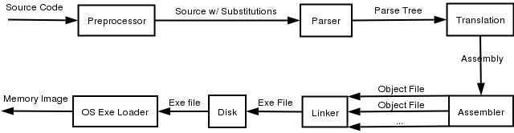
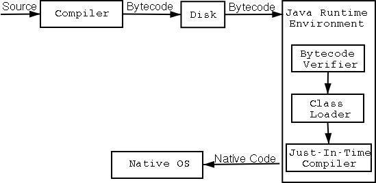
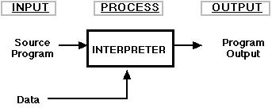

# Build (빌드)
소스코드가 실행할 수 있는 파일이 되기까지의 과정. compiler, preparser, preprocessor, linker 등이 이에 포함.

## Complie Language
대표적으로  C/C++ 이 이에 속한다. 소스코드가 기계어로 번역(compile)되어 실행파일이 된다. 기계어로 바로 번역되어 실행속도가 빠르며 직접 하드웨어가 실행되는 실행파일을 만드므로, 하드웨어 제어가 가능.

소스코드가 컴파일되어 실행파일이 되는 과정은 다음 그림과 같다.

1. Preprocessor(전처리기) : `#define` 와 같은 매크로나 지시자를 전처리가 바꾸어준다. (c파일이 i파일로 바뀜)
2. Parser : 문법검사기. 문자열을 입력받아 문법이 맞는지 체크 후 Tree 형태로 출력.
3. Translation : 번역기. 소스코드를 어셈블리어로 바꾸어준다. (i파일이 s파일로 바뀜)
4. Assembler : 어셈블리어를 기계어만큼 낮은 수준의 언어로 바꾸어준다. (s파일이 o파일로 바뀜)
5. Linker : 작성된 코드가 사용하는 시스템콜(OS API) 또는 C/C++ 라이브러리를 불러와 연결시켜 실행파일을 만든다.
6. Disk : 완성된 실행파일은 하드디스켕 생성된다.
7. OS Exe Loader : 해당 파일을 메모리에 적재시킨다

## Byte Code Language
대표적으로 Java, C# 이 있다. 작성된 소스코드는 컴파일러에 의해 가상머신이 읽을 수 있는 **바이트 코드** 로 컴파일 된다. 자바로 예를 들면 `.java` 파일이 `.class` 파일로 바뀌는 것을 말하며 이때 `.class` 파일이 바이트 코드 파일이다. 이를 JRE, CLI(Common Language Interface, 닷넷 계열의 실행환경) 와 같은 인터프린터가 한줄씩 읽어서 동작한다.

여담으로 흔히 자바는 C++ 보다 느리다고하는데 전부 그런것은 아니다. JRE 즉 바이트 코드를 실행하는 JVM은 바이트 코드를 인터프린터 형식으로 실행되는데 이때 기계어로 번역되어 실행한다. 뿐만 아니라 JVM은 GC 튜닝이 가능하기 떄문에 어떤 경우에는 C++ 보다 빠를 수 있다. 그러나 소스코드가 직접적으로 하드웨어에 반영되는게 아니기 때문에 자바와 같은 바이트 코드 언어는 직접적인 하드웨어 제어가 불가능하다. 그래서 포인터나 Win32 API 같은 수준의 시스템콜을 사용할 수 없다. 이러한 이유때문에 보안 또는 최적화가 요구되는 프로그램은 C/C++ 을 사용한다.

1. Compiler : 가상머신이 읽을 수 있는 바이트 코드로 번역. (C++ 컴파일 과정과 유사. 결과물만 다름)
2. Bytecode Verifier : 바이트 코드가 유효한지 검사.
3. Class Loader : class 파일을 메모리에 적재.
4. JIT Compiler : JRE에 포함된 JVM이 바이트코드를 실행할 때 플랫폼별로 컴파일하는데 이 과정에서 실제 실행코드가 기계어로 번역됨.

## Interpreter Languages
대표적으로 JS, Python, Ruby 가 있다. 컴파일 언어는 소스 파일 전체가 컴파일 되는 반면에 인터프린터 언어는 한줄씩 컴파일 되어 실행된다. 그래서 번역하는 과정에서 메모리가 적게 소모되어 효율적이다. 즉시 실행될 수 있다는 장점으로 인해 실시간 분석 또는 대화형으로 프로그래밍이 가능하다.

## Reference
[빌드과정에 따른 프로그래밍 언어의 분류](http://jaynewho.com/post/14)
[소스코드가 프로그램이 되는과정 즉 빌드 과정](http://the1900.tistory.com/73)