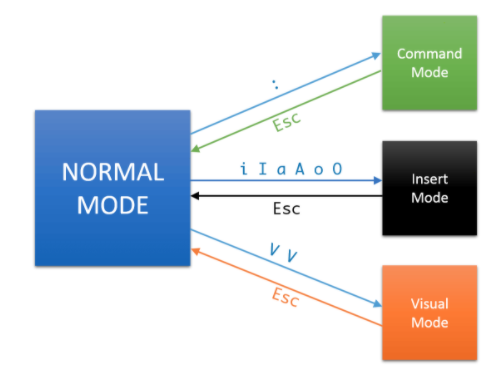
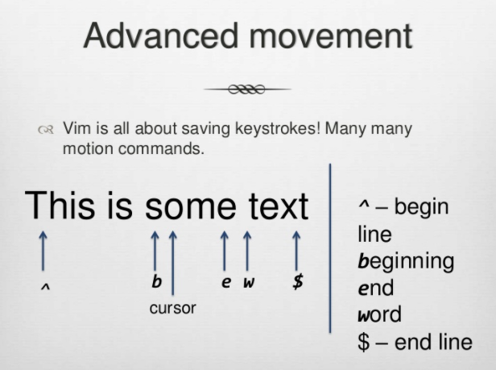
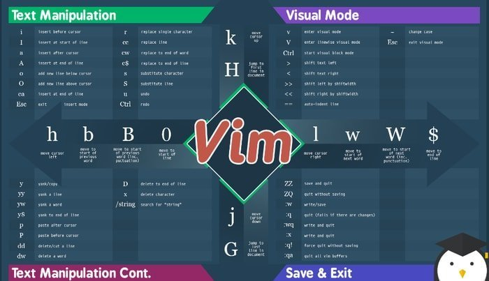

# Vim

## 왜 배워야 하는가?

- CLI 에디팅 용이
  - 서버 관리에 유용
  - ssh 등을 이용한 원격 파일 수정에 유용
- 유닉스 계열 컴퓨터에 기본으로 설치되어 있음

위 장점 보다 아래 장점 때문에 사용

- **생산성 증진**
- **타이핑 피로도 개선**

어떻게? -> 강력한 vim 만의 고급 단축키 시스템이 있음! (Modal Editing)

## Vim의 철학: Modal Editing

vim은 여러 모드가 있다.



그림 출처 : [How to Exit Vim? | Your First Lesson In Vim](http://www.freblogg.com/2016/10/your-first-lesson-in-vim-2.html)

- Normal mode: 커서의 움직임, 수정, 복사, 삭제
- Insert mode: 일반적인 글쓰기
- Visual mode: 영역 선택
- Command mode: 함수 실행, 에디터 세팅 변경

이러한 모드들은 기존 대중적인 에디터의 단축키의 문제점들을 보완한다.

- 기존 대중적인 에디터 단축키의 문제점
  - `cmd`, `ctrl`, `shift`, `alt` 를 조합 (**한정적임**)
  - f1 - f12 키 사용
  - 메뉴 아이템 버튼
  - 마우스 오른쪽 버튼 클릭 후 패널 선택

즉, **마우스 드래그와 방향키의 개입이 잦음**. 이는 오른손의 움직임이 많아지면서 손목에 피로도가 쌓인다.

반면에 Modal Editing 덕분에 **Vim 에서는 모든 행동을 단축키로 설정**할 수 있다.

### Normal Mode: 커서 움직임



그림 출처 : [Introduction to Vim](https://www.slideshare.net/brandonliu/introduction-to-vim)

## 코딩에 필수적인 유용한 단축키들

- 현재 라인의 맨 뒤 / 앞에 커서 옮기기 : `^` / `$`

  `cmd <-` / `cmd ->`

- 현재 라인 바로 위 / 아래 새로운 줄 열기 : `O` / `o`

  `cmd shift enter` / `cmd enter`

- 현재 라인 선택하기 : `V`

  `cmd -> shift <-` or `home shift end`

- 현재 라인 위 또는 밑으로 옮기기 : `ddp`

  `alt 화살표`

- 다음 단어로 커서 옮기기 : `w`

  `cmd 화살표`

## Vim 에서 단축키 만드는 법

- `.vimrc` 에 다음과 같이 추가

  `inoremap a b` : a 키를 누르면 b 키를 누른 것으로 인식한다.

- 각 모드별로 구분하여 단축키를 설정하기 위한 세부적인 map 명령어들
  - `nnoremap`: normal mode 에서의 매핑
  - `inoremap`: insert mode 에서의 매핑
  - 그 외 cnoremap, vnoremap, xnoremap, onoremap ...

## map 대신 noremap 을 사용

- Vim 의 매핑은 매우 강력하여 한번 설정해 둔 매핑은 재귀적으로 동작함

```
imap a b;
imap c a;
```

`c` 를 누르면 최종적으로 `b` 를 누른 것으로 인식 -> 의도치 않은 동작을 야기시킴

즉, `noremap` 은 not recursion 하기 때문에 키 설정면에서 편하다.

## 단축키 정리


insert 모드로 들어가는 것은 빨간색으로 표기되어있다.

- 정규식 지원함
- `c...` 는 `d...i` 와 같음.
- `yy` 한줄 복사
- `dw`, `cw` 보다는 `daw`, `ciw`
  - `daw` 는 보통 노말 모드에서 삭제만하고 싶을 떄 사용
  - `ciw` 는 삭제하고 바로 입력모드로 가시 때문에 수정하고 싶을 떄 사용
- `:reg` 삭제된거 볼 수 있음
- `$` 는 endline 을 뜻함
  - `d$` 은 `D` 과 같음
- `p` (put, paste)
- `gg` 맨 위로
  - `10gg` 10번 째 줄로 이동
- `G` 맨 밑으로
- `ctrl o` 원래 있던 자리로
- `%` 괄호 짝 찾기
- `:s/thee/the` thee 를 the 로 치환 (하나만)
- `:s/thee/the/g` global 하게 치환
- `J` 줄 병합
- `di` (delete inside) 괄호안 삭제
- `I` 맨 앞으로 감
- `ctrl v` 박스 형태 드래그
- `ctrl V` 라인 단위 비주얼
- `s`, `m` 거의 안씀
- `a`, `s`, `c`, `i`, `o`, `y`, `n`, `b` 많이 사용됨

- `ctrl i`
- `shift g`
- `r`

아래 그림이 조금 더 직관적으로 정리가 잘 되어있다.



그림 출처 : [Vim quickies/ cheatsheet](https://dev.to/rubiin/vim-quickies-cheatsheet-30gm)

## 추가적으로 볼 것

- visual mode
- macro
- 시스템 클립보드에 복사하는 방법 `"+y`

## 결론

Vim 은 Modal Edting (모달 에디팅) 을 구현해놓은 구현체 레퍼런스 에디터에 불구하다.
모달 에디팅의 철학은 모든 에디터에 구현이 가능하다. 그래서 vscode 와 vim 은 vs관계가 아니라 협력관계이다. vscode 에서 vim plugin 을 사용하면 modal edting 의 철학을 vscode 에 심어줄 수 있다.

vim 은 그냥 구현체일뿐. 중요한건 modal edting. 조금 더 쉽게 말하자면
vim key mapping 을 여기저기 에디터에 깔아서 사용하려고 배우는 것이다.

왜? modal editing 을 통해 생산성 증진 및 타이핑 피로도 개선을 얻기위해서.
그래서 modal editing 철학이 중요하다.

## Reference & Further more

- [vim 스터디 1강](https://www.youtube.com/watch?v=QLnsXd80iPU)

- [vim 스터디 2강](https://www.youtube.com/watch?v=saojv4rGgDQ)

- [vim 스터디 3강](https://www.youtube.com/watch?v=38WX7x6fb0g)

- [vim 스터디 4강](https://www.youtube.com/watch?v=p6kj7Ltr7KU)

[하버드 CS50 - Vim](https://www.youtube.com/watch?v=pksX5m8D1B4&feature=youtu.be)

[MIT - Vim](https://www.youtube.com/watch?v=a6Q8Na575qc&feature=youtu.be)

[Editors(Vim)](https://missing-semester-kr.github.io/2020/editors/)
