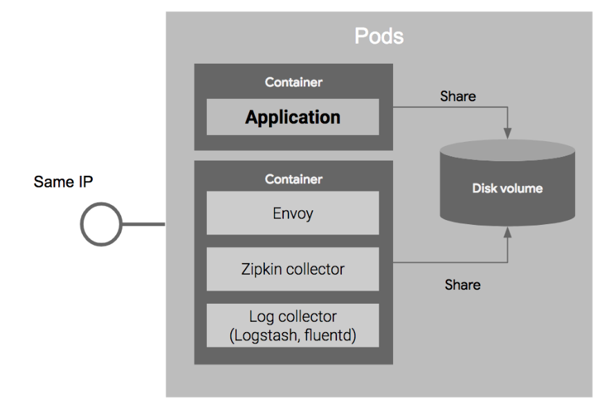
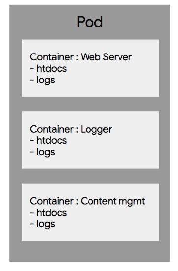
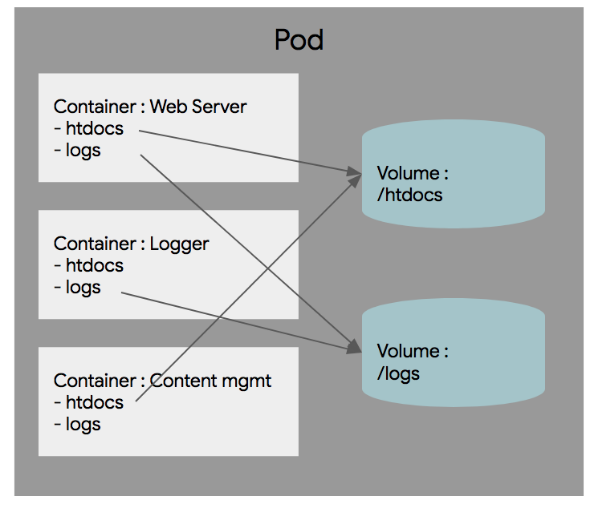
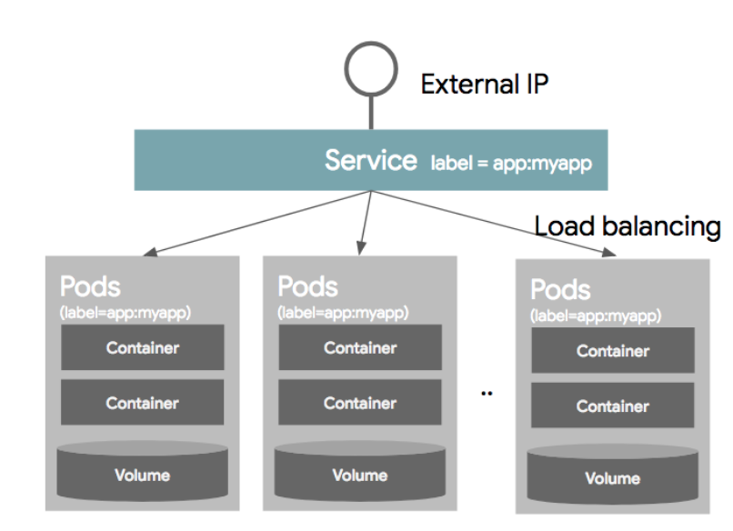
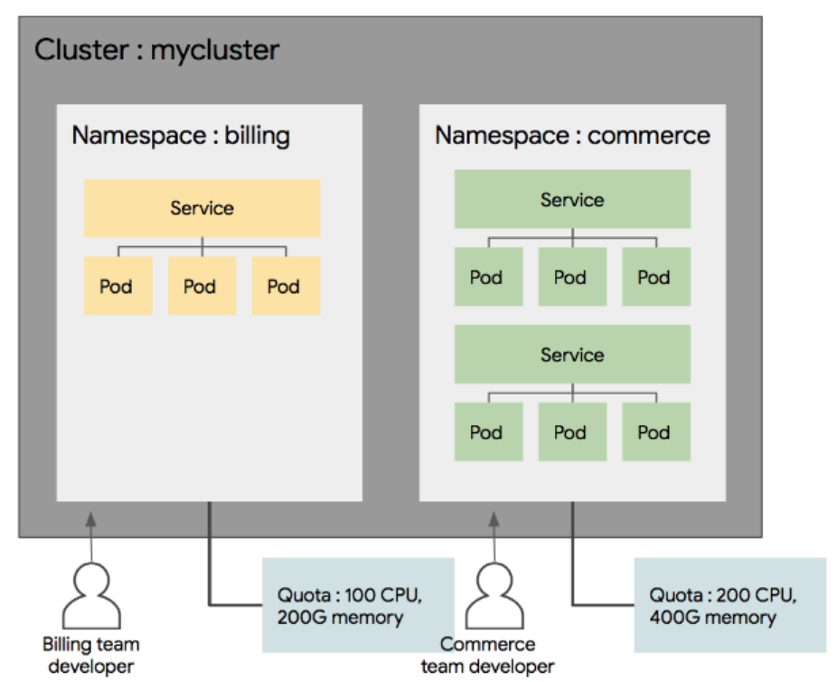

# Kubernetes Basic

* [Master and Node]()
* [Object](#object)
    * [Object Spec](#object)
    * [Basic Object](#object)
        * [Pod](#pod)
        * [Volume](#volume)
        * [Service](#service)
        * [Namespace](#namespace)
    * [Label](#label)
* [Reference](#reference)

쿠버네티스의 개념은 크게 오브젝트 두개의 개념에서 출발한다.

----
## Master and Node
쿠버네티스를 이해하기 위해서는 클러스터 구조를 파악해야한다. 구조는 다음과 같다.

- **Master** : 클러스터 전체를 관리하는 컨트롤러 
- **Node** : 컨테이너가 배포되는 머신(VM or 물리적인 서버)

----
## Object

쿠버네티스는 다음 2개의 오브젝트로 이루어져있다.

- **Basic Object** : 가장 기본적인 **구성 단위**
- **Controller** : Basic Object(기본 오브젝트)를 관리하고 생성

그리고 이러한 오브젝트의 스펙(설정)이외에 추가정보인 메타 정보들로 구성이 된다고 보면 된다.

### Object Spec (오브젝트 스펙)

- 오브젝트들은 모두 오브젝트 특성을 기술한 object spec 으로 정의된다. 
- 오브젝트 생성시 `yaml` 또는 `json` 파일로 스펙을 정의할 수 있다.

### Basic Object (기본 오브젝트)

쿠버네티스에 의해 배포 및 관리되는 가장 기본적인 오브젝트는 컨테이너화되어 배포되는 애플리케이션의 워크로드를 기술하는 오브젝트로 크게 4가지가 있다. 

- **Pod** : 컨테이너화된 어플리케이션
- **Service** : 디스크
- **Volume** : 로드 밸런서
- **Namespace**  : 패키지명

#### Pod

- 쿠버네티스에서 가장 기본적인 **배포 단위**.
- 쿠버네티스는 하나의 컨테이너 단위로 배포하는 것이 아님. Pod 단위로 배포
- Pod 는 하나 이상의 컨테이너를 포함

다음은 Pod를 정의한 오브젝트 스펙이다. 

~~~ yaml
apiVersion: v1
kind: Pod
metadata:
  name: nginx
spec:
  containers:
  - name: nginx
    image: nginx:1.7.9
    ports:
    - containerPort: 8090
~~~

- `apiVersion` : 이 스크립트를 실행하기 위한 쿠버네티스 API 버전
- `kind`: 리소스의 종류를 정의
- `metadata` : 리소스의 각종 메타 데이터 (ex. 라벨, 이름 등)
- `spec` : 리소스에 대한 상세한 스펙 정의 (컨테이너를 정의하고 이름은 nginx으로 하며 도커 이미지 nginx:1.7.9 를 사용하고 컨테이너 포트 8090을 오픈)

Pod는 다음과 같은 특징을 가지고 있다.

- **Pod 안의 컨테이너는 IP 와 Port를 공유함**
    - 2개의 컨테이너가 하나의 Pod를 통해 배포되었을때 localhost를 통해 통신이 가능
- **Pod 내에 배포된 컨테이너간에는 디스크 볼륨을 공유함**
    - 어플리케이션 뿐만 아니라 Reverse proxy, 로그 수집기 등 다양하게 같이 배포되는 경우가 많음. 로그 수집기를 예로 들면 하나의 Pod 내에서 컨테이너들끼리 볼륨을 공유할 수 있기 때문에 다른 컨테이너의 파일을 읽을 수 있다.

위와 같이 배포하는 배턴을 MSA에서 **Side car pattern** 이라고 한다. 이 외에 **Ambassador**, **Adapter Container** 등 다양한 패턴이 있다.

#### Volume
Pod가 실행될때 default로 컨테이너마다 로컬 디스크가 실행되는데 영구적이지 않다. 즉 컨테이너가 restart 하거나 새롭게 배포되면 내용이 유실된다. DB와 같이 영구적으로 파일을 저장해야 하는데 이러한 형태의 스토리지를 **Volume (볼륨)** 이라고 한다. 

볼륨은 컨테이너의 외장 디스크로 생각하면 된다. Pod가 실행될때 컨테이너에 마운트해서 사용한다.

위와 같이 웹 서버를 배포하는 Pod가 있다고 가정하자. 컨테이너 구성은 다음과 같다

- Web Server : `htdocs` 디렉토리의 턴에티너를 서비스하고 `/logs` 디렉토리에 웹 엑세스 기록을 기록
- Content mgmt : 컨테츠 내용(/htdocs)를 업데이트하고 관리하는 컨테이너
- Logger : 로그 메세지 관리 컨테이너 

이 경우 `htdocs` 디렉토리는 WebServer 와 Content 컨테이너가 공유해야 하고 `logs` 디렉토리는 WebServer 와 Logger 컨테이너가 공유해햐 한다.

따라서, 볼륨을 생성하고 마운트하여 공유하여 아래 그림과 같이 구성할 수 있다.

#### Service

분산환경에서는 하나의 Pod로 서비스하는 경우는 드물다. 여러개의 Pod를 서비스할 경우 로드밸런서가 필요한데 **Service** 가 로드밸런서 역할을 한다. 즉, 하나의 IP와 포트로 묶어서 서비스를 제공한다.

장애가 발생하면 자동으로 restart 되는데 이 때 IP가 변경되기 때문에, 로드밸런서에서 Pod의 목록을 지정할 떄 IP주소를 이용하는 것은 어렵다. 또한 **Auto scaling** 으로 인하여 Pod가 동적으로 생성되고 삭제되기 때문에 로드밸런서는 이렇게 생성되고 삭제된 Pod 목록을 유연하게 선택해야한다. 그래서 사용하는 것이 **Label (라벨)** 과 **Label Selector** 라는 개념이다.

- **Label Selector** : 어떤 Pod를 서비스로 묶을 것인지 정의
- **Label** : 각 Pod를 생성할 때 메타데이터 정보 부분에 정의

Service는 라벨 셀렉터에서 특정 라벨을 가지고 있는 Pod만 선택하여 서비스에 묶게 된다. 

아래 그림은 service가 `myapp` 이라는 라벨을 가지는 것만 골라서 service에 넣고 그 Pod간에만 로드벨런싱을 통하여 외부로 제공하는 형태이다. 

이를 스펙으로 정의하면 다음과 같다.

~~~ yaml
kind: Service
apiVersion: v1
metadata:
  name: my-service
spec:
  selector:
    app: myapp
  ports:
    - protocol: TCP
    port: 80
    targetPort: 9376
~~~

- Service 라는 리소스 종류
- 스크립트를 실행할 때 api 버전은 v1
- service 의 이름을 my-service로 지정
- selector에서 라벨이 app:myapp인 Pod만 선택
- 포트는 TCP를 이용하고 service는 80포트로 서비스하되 80 포트의 요청을 컨테이너의 9376 포트로 연결하여 서비스를 제공

#### Namespace

한 쿠버네티스 클러스터내의 **논리적인 분리단위**

Pod, Service 등은 네임스페이스 별로 생성, 관리될 수 있고 사용자의 권한 역시 이 네임스페이스 별로 나눠서 부여할 수 있다. 즉, 하나의 클러스터 내에 개발/운영/테스트 환경이 있으면 클러스터를 개발/운영/테스트 3개의 네임스페이스로 나누어 운영할 수 있다. 

네임스페이스로 다음과 같이 이용할 수 있다. 

- 사용자별로 네임스페이스별 접근 권한을 다르게 운영
- 네임스페이스별로 리소스의 쿼타(할당량)을 지정 (ex. 개발계이는 CPU 100, 운영계에는 CPU400 와 같이 사용 가능한 리소스 수 지정가능)
- 네임스페이스별로 리소스를 나눠 관리할 수 있음 (Pod, Service 등)

네임스페이스는 논리적인 분리 단위이다. **물리적으로 환경을 분리한 것이 아니다.** 따라서 다른 네임스페이스간의 Pod라도 통신이 가능하다. 네트워크 정책을 이용하여 네임스페이스간의 통신을 막을 수 있다. 하지만 쿠버네티스 클러스터 자체를 분리하는 것을 권장한다.

> 참고 : [Kubernetes best practices: Organizing with Namespaces](https://cloud.google.com/blog/products/gcp/kubernetes-best-practices-organizing-with-namespaces)

----

### Label
Service를 설명하면서 잠깐 언급되었지만 다시 정리하자면 라벨은 쿠버네티스의 리소스를 선택하는데 사용된다. 

라벨의 특징을 정리하자면 다음과 같다.

- 각 리소스는 라벨을 가질 수 있다. 
- 특정 라벨을 선택하여 특정 리소스만 배포하거나 업데이트할 수 있고 Service에 연결하거나 네트워크 접근 권한을 부여하는 등의 행위를 할 수 있다.
- metadat 섹션에 Key/Value 쌍으로 정의 가능
- 하나의 리소스에 여러 라벨을 동시에 적용 가능

~~~ yaml
"metadata": {
  "labels": {
    "key1": "value1",
    "key2": "value2"
  }
}
~~~

라벨 셀렉터는 오브젝트 스펙에서 `selector` 라고 정의하고 라벨 조건을 적으면 되며 쿠버네티스는 다음과 같이 2가지의 라벨 셀렉터를 지원한다.

- **Equaility based selector** : 같은가, 다른가와 같은 조건을 이용, 등가 조건에 따라 리소스 선택 (`environment = dev`, `tier != frontend`) 

- **Set based selector** : 집합의 개념을 사용. (`environment in (production,qa)`, `tier notin (frontend,backend)`)

----

## Reference

[조대협님의 블로그 - 쿠버네티스 #2 개념 이해 (1/2)](https://bcho.tistory.com/1256 )