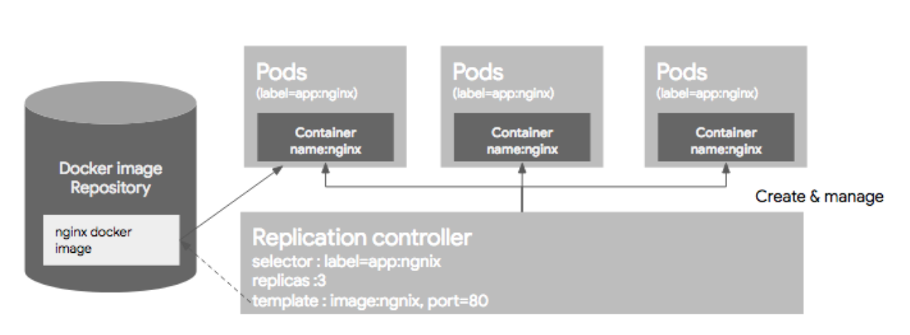
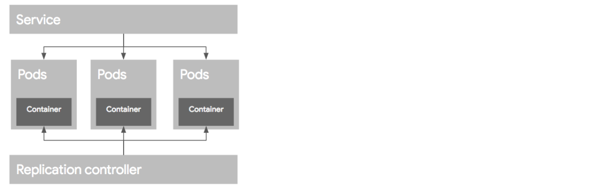
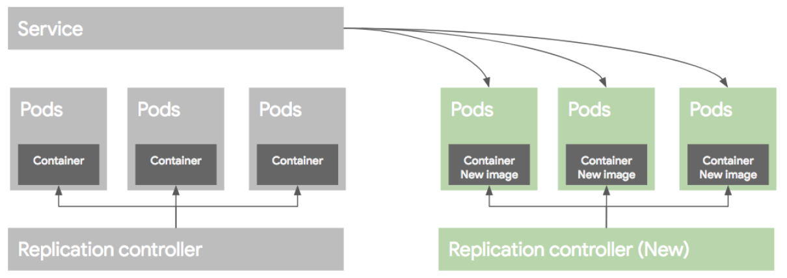
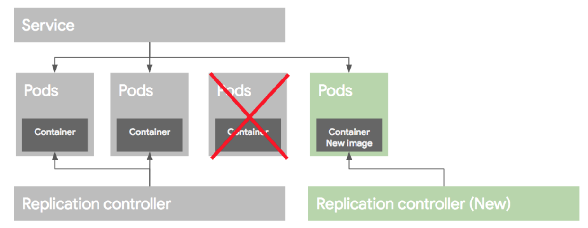
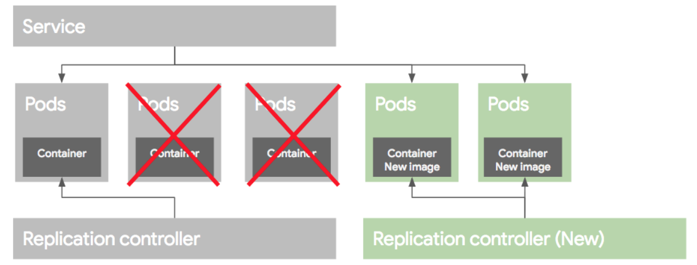
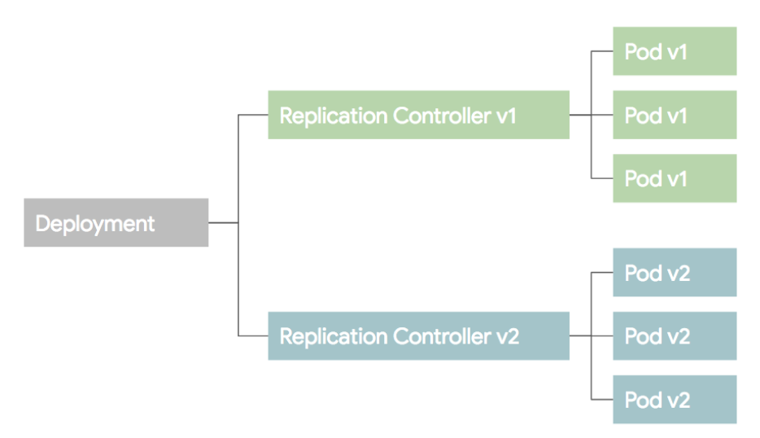

# Kubernetes Basic 2

* [Controller](#controller)
    * [Replication Controller](#Replication_Controller)
    * [ReplicaSet](#ReplicaSet)
    * [Deployment](#Deployment)
        * [Blue/Green Depolyment](#Blue/Green_Depolyment)
        * [Rolling Update](#Rolling_Update)
* [Reference](#Reference)

[Kubernets Basic](.k8s_basic.md) 에서 4개의 Basic Object 를 정리하였다. 이번에는 **Controller** 에 대해 알아보자. 어플리케이션을 설정하고 배포하는 것을 조금 더 편리하게 관리하기 위해서 쿠버네티스는 **Controller** 라는 개념을 사용한다. 

----
## Controller

컨트롤러는 기본 오브젝트를 생성하고 이를 관리하는 역할을 해준다. 컨트롤러는 **Replication Controller**, **Replication Set**, **DaemonSet**, **Job**, **StatefulSet**, **Deployment** 들이 있다.

### Replication_Controller
Replication Controller(RC)는 지정된 숫자로 Pod를 기동 시키고 관리하는 역할을 한다. 크게 Replica 수, Pod Selector, Pod Template 3가지로 구성된다.

- **Replica 수** : RC에 의해 관리되는 Pod 수
- **Pod Selector** : 라벨을 기반으로 하여, RC가 관리하는 Pod를 가지고 오는데 사용
- **Pod Template** : Pod를 추가로 기동할 때 어떻게 Pod를 만들지 Pod에 대한 정보(docker image, port, label 등)를 Pod template 부분에 정의

주의할점은 이미 실행되고 있는 Pod가 있는 상태에서 RC 리소스를 생성할때 그 Pod의 라벨이 RC의 라벨과 일치하면 새롭게 생성된 RC의 컨트롤을 받는다. 만약 해당 Pod들이 RC에서 정의한 replica 수 보다 많으면, replica 수에 맞게 pod를 삭제하고, 부족하면 template에 정의된 Pod 정보에 따라서 새로운 Pod를 생성하는데, 기존에 생성되어 있는 Pod가 template에 정의된 스펙과 다를지라도 그 Pod를 삭제하지 않는다. 예를 들어 기존에 아파치 웹서버로 기동중인 Pod가 있고, RC의 template은 nginx로 Pod를 실행하게 되어 있다하더라도 기존에 돌고 있는 아파치 웹서버 기반의 Pod를 삭제하지 않는다. 

아래 예를 보자.

~~~ yaml
apiVersion: v1
kind: ReplicationController
metadata:
  name: nginx
spec:
  replicas: 3
  selector:
    app: nginx
  template:
    metadata:
      name: nginx
      labels:
        app: nginx
    spec:
      containers;
      - name: nginx
        image: nginx
        ports:
        - containerPort: 80
~~~

이 예제는 nginx 라는 이름의 RC를 정의한 것이다. 예제를 정리하자면 다음과 같다. 

- `label` 이 `app: nginx` 인 Pod들을 관리
- 3개의 Pod가 항상 운영되도록 설정 
- Pod는 `app: nginx` 라는 라벨을 가진다 
- Pod 이름이 `nginx` 이며 `nginx` image를 사용해서 생성
- 컨테이너 `port` 는 80번 포트를 사용

### ReplicaSet

**Replica Set (RS)** 은 RC와 비슷하다. RC의 새버전이라고 생각하면 될 것 같다.

- RC : Equality 기반 Selector 이용
- RS : Set 기반 Selector 이용

### Deployment

**Deployment** 는 RC 와 RS의 좀더 상위 추상화 개념이다. 실제 운영에서는 RS 또는 RC를 바로 사용하지 않고 좀 더 추상화된 Depolyment를 사용한다. 

deployment 없이 어떻게 배포를 하는지에 대해 알아보자. 다음과 같이 Pod 와 RC 가 있다고 하자

어플리케이션이 업데이트되어 새로운 버전으로 배포하는 시나리오를 생각해보자.

여기서는 **Blue/Green 배포** 와 **Rolling 업데이트** 2가지 방법에 대해 설명한다.

#### Blue/Green_Depolyment

**Blue/Green 배포** 방식은 블루(옛날)버전으로 서비스하고 있던 시스템을 그린(새로운)버전을 배포한 후 트래픽을 블루에서 그린으로 한번에 돌리는 방식을 말한다. 새로운 RC를 만들어 새로운 template으로 Pod를 생성한 후 Pod 생성이 끝나면 service를 새로운 Pod로 옮기고 배포가 완료되고 문제가 없으면 예전 버전의 RC와 Pod를 지워주면 된다. 

#### Rolling_Update

**Rolling Update** 방식은 Pod를 하나씩 업그레이드 해가는 방식이다. 

먼저 새로운 RC를 만들고 기존 RC에서 replica 수를 하나 줄이고 새로운 RC에는 replica 수를 1로 준다.

라벨을 같은 이름으로 해주면 새로운 RC에 의해 생성된 Pod가 service에 포함된다. 마찬가지로 기존 RC의 replica 수를 하나 줄이고, 새로운 RC의 replica 수를 하나 늘린다.

그러면 기존 버전의 Pod가 하나더 service에 빠지게 되고 새로운 버전의 Pod가 service에 추가된다. 마찬가지로 작업을 반복하면 아래 그림과 같이 옛날 버전의 Pod들은 모두 빠지고 새로운 버전의 Pod만 서비스된다.

만약에 배포가 잘못되면 기존 RC의 replica 수를 원래대로 올리고 새 버전의 replica 수를 0으로 만들어서 예전 버전의 Pod로 rollback이 가능하다. 

이 과정은 `kubectl rolling-update` 라는 명령으로 RC 단위로 컨트롤이 가능하다. 하지만 배포 과정을 모니터링 해야되고 이 명령은 클라이언트에서 실행하는 명령으로 명령어 실행중에 연결이 끊어지면 배포작업이 비정상적으로 끊어질 수 있기 때문에 권장하지는 않는 것 같다.  마지막으로 롤백과정 역시 수동 컨트롤이 필요할 수 있다. 

따라서, 이러한 과정을 자동화하고 추상화한 개념을 **Deployment**라고 생각하면 된다. Deployment는 Pod 배포를 위해 RC를 생성하고 관리하는 역할을 하며, 롤백을 위한 기존 버전의 RC 관리등 여러 가지 기능을 포함하고 있다.

----

## Reference

[조대협님의 블로그 - 쿠버네티스 #2 개념 이해 (1/2)](https://bcho.tistory.com/1256 )
