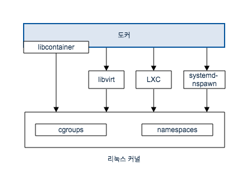
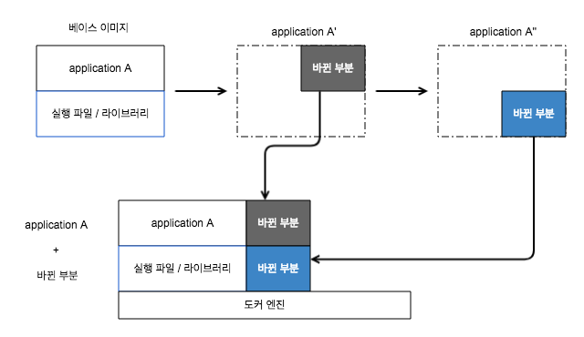

# 도커(Docker)란 무엇인가??
 - 서비스 운영 환경을 묶어서 손쉽게 배포하고 실행하는 **경량 컨테이너 기술**.
 - 2013년에 등장한 **컨테이너 기반 가상화 도구**.
 - 리눅스 커널에서 제공하는 컨테이너 기술(LXC)를 이용.
 - 하나의 어플리케이션을 격리된 공간(컨테이너)에서 독립적으로 실행할 수 있도록 해준다.
 - 격리된 공간(컨테이너)들을 생성하고 관리해주는 것이 Docker Engine!!

# 도커 장점
 - **계층화된 파일시스템**을 사용하기 때문에 가상화된 컨테이너의 변경사항을 모두 축적하고 관리해준다. 따라서 특정 상태가 항상 보존되어 필요할 때 언제 어디서나 이를 실행가능하다.
 - 복잡한 리눅스 어플리케이션을 컨테이너로 묶어서 실행 가능.
 - 개발, 테스트, 서비스 환경을 하나로 통일하여 효율적으로 관리 가능.
 - 이미지를 여러 사람들과 공유 가능.
 - Github와 비슷한 방식의 Docker hub 제공.

# 가상 머신(Virtual Machine; VM)과 도커
컴퓨터안에 컴퓨터를 만들어내기 위한 시도가 있었습니다. 1960년대쯤에 가상화 개념이 등장하고 서버의 성능이 좋아지자 서버가 많은 시간을 놀고 있자 서버에 이 가상 머신을 여러개 띄워 일을 더 시키게 됩니다. 
가상 머신에 각종 서버프로그램, DB등을 설치하여 어플리케이션이나 웹 사이트를 실행하고 미리 구축한 가상 이미지를 여러 서버에 복사하여 실행하게 됩니다. 하지만 가상머신은 컴퓨터를 통쨰로(Guest OS를 설치하기 때문) 만들다 보니 각종 성능 손실이 발생하게 됩니다. 이미지 안에 OS가 포함되어있어 용량이 커 네트워크로 가상화 이미지를 주고 받는것이 부단스러운 단점이 있습니다. 이러한 가상머신의 성능 문제가 있다보니 **리눅스 컨테이너**(컨테이너 안에 가상공간을 만들지만 실행 파일을 호스트에서 직접 실행)가 나오게 됩니다.

**VM**은 어플리케이션과 그에 필요한 모든 바이너리와 라이브러리를 Guest OS에 포함히시키고 있어 용량이 큽니다. 

**컨테이너**는 어플리케이션과 그에 필요한 것들이 포함되어 있지만 다른 컨테이너와 커널을 공유하고 Host OS에서 구분된 사용자 공간에서 프로세스가 실행됩니다. Docker 컨테이너는 특정 인프라에 묶여있지 않으며 어떤 컴퓨터 어떤 인프라 어떤 클라우드에서도 구동됩니다.


**# 리눅스 컨테이너**란?
  - 리눅스 커널의 cgroups와 namespace가 제공하는 기술
  - 가상화가 아닌 격리


  - 도커는 LXC를 사용
  - 초기에는 LXC를 기반으로 구현. 
  - 버전 0.9부터는 LXC 대신 libcontainer를 개발하여 사용

# 도커 특징
* 도커는 Guest OS를 설치하지 않는다.
  - 이미지에 서버운영을 위한 프로그램과 라이브러리만 격리해서 설치하여 이미지 용량이 크게 줄어듬.
  - 호스트와 OS자원을 공유
* 도커는 하드웨어 가상화 계층이 없다.
  - 메모리 접근, file system, 네트워크 전송 속도가 가상머신에 비해 빠르다.
  - 호스트와 도커 컨테이너 사이의 성능 차이가 크지 않다.
* 이미지 생성과 배포에 특화.
  - 이미지 버전 관리를 제공. 중앙 저장소에 이미지를 올리고 받을 수 있다.
  - Github와 비슷한 형태로 도커 이미지를 공유하는 Docker hub가 있다.
* 다양한 API를 제공하여 원하는 만큼 자동화 가능
  - 개발과 서버 운용에 유용.

# 도커 이미지와 컨테이너
도커가 무엇인지 어떤 장점과 특징을 가지고 있는지 설명하면서 이미지 또는 컨테이너라는 말이 자주 나오는데 이것들이 무엇인지 알아봅시다.

## 이미지
- 서비스 운용에 필요한 서브 프로그램(소스 코드, 컴파일된 실행파일을 묶은 형태).
- 저장소에 울리고 받는건 이미지.
- immutable한 저장 매체이지만 이 이미지 위에 이것저것 붙여서 새로운 이미지를 만들 수 있다. (사실 컨테이너를 이미지로 뜨는 것)
- Docker에서 실제로 실행되는 건 이미지가 아니다.!(실행되는 건 이미지를 기반으로 생성된 컨테이너)
- 이미지 생성 주기
  pull : 도커 이미지를 받음.
  commit : 파생된 이미지를 만듬.
  rmi : 이미지 삭제.

## 컨테이너
- 이미지를 실행한 상태.
- 실제로 실행되는 가상머신, 독립된 환경(격리된 공간)에서 실행.
- 컨테이너의 기본적인 역할은 미리 규정된 명령어를 실행하는 일이다. 즉 이 명령어에서 출발하여 이미지가 동작하게 된는데 OS의 부트스트랩처럼 컨테이너에 저장된 프로그램을 돌리기 위해 최초의 동작 명령어를 실행하는 것. 이 명령어가 종료되면 컨테이너도 종료 상태에 들어간다.
- 여러개의 이미지를 모아 컨테이너를 만들어 또다시 이미지로 떠서 이미지를 생성할 수 있다.
- 하나의 이미지로 여러 개의 컨테이너 생성 가능.
- 컨테이너의 생명 주기
  run : 도커 컨테이너 실행.
  restart : 실행이 종료되었을 때 다시 실행.
  stop :  실행을 강제로 종료.
  rm : 종료된 컨테이너를 삭제.

# 도커 이미지 처리 방식

- 도커는 이미지의 바뀐 부분을 유니온 파일 시스템 형식(aufs, btrfs, devicemapper)을 이용하여 관리한다.
- 도커는 베이스 이미지에서 바뀐 부분만 이미지로 생성하며 컨테이너로 실행할 때는 베이스 이미지와 바뀐 부분을 합쳐서 실행한다.
- Docker hub 및 개인 저장소에서 이미지를 공유할 때 바뀐 부분만 주고 받음.
- 각 이미지는 의존 관계를 형성.
- 하나의 이미지로 여러개의 컨테이너로 생성이 가능하며 컨테이너 안에서 파일을 만든다거나 어떤 것을 설치를 하면 이미지에 어떠한 영향을 주지 않고 컨테이너 안에 저장된다. 이렇게 새롭게 만들어진 컨테이너 자체를 다른 이미지로 만들 수 있다.

# 참고 문서

- <a href="http://blog.naver.com/PostView.nhn?blogId=woong17&logNo=220946125940&parentCategoryNo=&categoryNo=64&viewDate=&isShowPopularPosts=false&from=postView">도커(Docker)란?</a>
- <a href="https://www.youtube.com/watch?v=Bhzz9E3xuXY&t=964s">생활코딩 docker</a>
