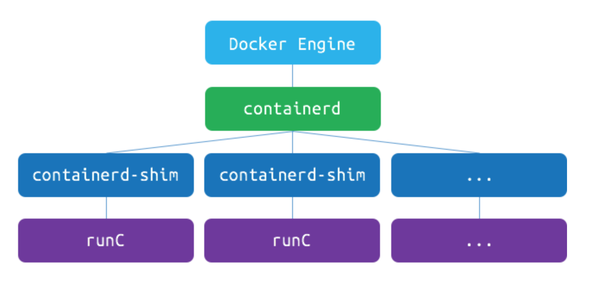

# cgroups and namespaces

컨테이너와 하이퍼바이저는 다르다.

- hypevisor : OS 및 커널이 통째로 가상화됨
- container : filesystem의 가상화만 이루어짐

컨테이너는 Host PC 의 커널을 공유한다. 따라서 init(1) 등의 프로세스가 떠 있을 필요가 없어 적은 메모리 사용량과 적은 overhaed 를 가진다.

컨테이너는 Host PC 자원을 **격리(isolation)** 상태로 활용하기 때문에 성능면에서 VM(Virtual Machine)과 별로 차이가 없다.

## namespaces

VM에서는 각 Guest machine 마다 독립적인 공간을 제공하고 서로 출동하지 않도락 하는 기능이 있는데 리눅스에서도 이와 비슷한 역할을 하는 **namespaces** 기능이 커널에 내장되어 있다.

namespaces 는 다음 기능들을 지원한다

1. **mnt(파일 시스템 마운트)** : 호스트 파일시스템에 구애받지 않고 독립적으로 파일 시스템을 마운트 or 언마운트 가능
2. **pid(프로세스)** : 독립적인 프로세스 공간 할당
3. **net(네트워크)** : namespaces 간 network 출돌 방지(중복 port binding 등)
4. **ipc(SystemV IPC)** : 프로세스간의 독립적인 통신통로 할당
5. **uts(hostname)** : 독립적인 hostname 할당
6. **user(UID)** : 독립적인 사용자 할당

namespaces 기능은 같은 공간을 공유하되 조금 더 제한된 공간을 할당해주는 것이라고 볼 수 있다.

## cgroups (control groups)

**cgroups**는 자원(resources)에 대한 제어를 가능하게 해주는 리눅스 커널의 기능이며 다음 resouces 를 제어할 수 있다.

- memory
- cpu
- i/o
- network
- device node (`/dev/`)

이를 통해 컨테이너에서도 VM과 동일하게 리소스 할당량을 제한할 수 있게 된다.

## LXC, LibContainer, runC

LXC, LibContainer, runC 등은 cgroups, namespaces 를 표준으로 정의해동 Open Container Initative(OCI) 스펙을 구현한 컨테이너 기술의 구현체이다.

도커는 1.8 이전 버전까지는 LXC 를 이용하였고 이후 LibContainer 에서 runC(LibContainer의 리펙토링 구현체)로 자체 구현체를 가지게 되었다.

## Docker

도커는 1.11 버전부터 아래 그림과 같은 구조로 작동하고 있다.

> 그림 출처 : https://tech.ssut.me/what-even-is-a-container/

* containerd : OCI 구현체(주로 runC를 이용해 container를 관리하는 데몬)
* docker engine : 이미지, 네트워크, 디스크 등을 관리하는 역할

docker engine 과 container 가 분리되어있어 docker engine 버전을 올려 재시작하여도 container 의 재시작 없이 사용할 수 있는 것이다.

docker 에서 각각 역할이 분리되어 docker 는 4개의 독립적인 프로세스로 작동하고 있다.

`ps aux | grep docker` 명령어를 통해 `docker`, `docker-containerd`, `docker-containerd-shim`, `docker-runc` 4개의 프로세스가 돌아가는 것을 확인할 수 있다.

## Reference

[Docker(container)의 작동원리: namespaces and cgroups](https://tech.ssut.me/what-even-is-a-container/)

