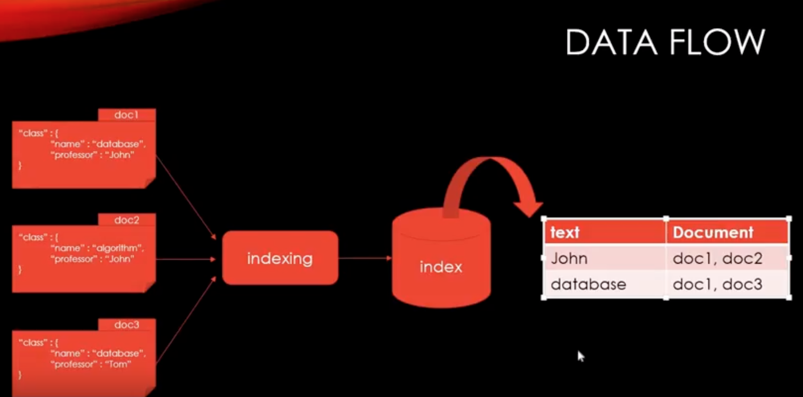

# ELK
ELK stack 은 ElasticSearch + Logstash + Kibana 의 조합이다. 각각의 역할은 Logstash 로 DB data, CSV data 등 어떤 데이터든지 ElasticSearch 에 수집하고 ElasticSearch 로 빠르게 검색하고 Kibana 로 데이터 무더기에서 쓸만한 데이터들을 보기좋게 보여주는 역할이다.

위 그림의 데이터 흐름을 보면 doc 1, doc2, doc3 을 ElasticSearch 에 저장할때 위 그림과 같이 어떤 text가 어떤 document 에 발견되는지를 저장한다. 

## ElasticSearch vs Realation DB
어떤 데이터를 찾고자 할떄 ElasticSearch 는 마치 hash table 와 같아 시간복잡도가 `O(1)` 인 반면에 Realation DB 는 `O(N)` 이다. 따라서 검색 관점에서 ElasticSearch 가 보다 빠르다.

## ElasticSearch data structure

가장 큰 개념은 `Index` 이고 그 안에 `type` 이 있고 type 안에는 여러개의 `document` 를 가지고 있다. document 들은 같은 `property` 를 가지고 있다.

