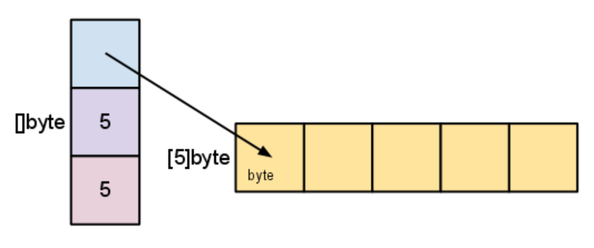

Go의 slice는 형식화된 데이터의 시퀀스로 다른 언어의 배열과 비슷하다. Go의 array(배열) 위에 구축되었다. slice를 이해하기 전에 우선 배열에 대해 간단하게 살펴보자.

## Array (배열)
배열은 다음과 같이 배열의 **length(길이)** 와 **element(요소)**를 type(타입)으로 지정하여 생성한다.

~~~ go
var a [4]int
~~~

배열의 크기는 **고정**되어 있으며 배열의 길이는 타입의 일부이다. 즉, `[4]int` 와 `[5]int` 는 서로 다른 타입이다.

Go에서 배열 변수는 전체 배열을 나타내는 값이며 C에서처럼 첫 번째 배열 요소에 대한 포인터가 아니다. 즉, 배열 값을 할당하거나 전달할 때 해당 내용의 사본을 만든다. 

## Slice (슬라이스)
슬라이스는 배열을 기반으로 하였으며 슬라이스의 타입은 `[]T` 로 지정할 수 있다. 여기서 `T`는 element type 이며 배열과 달리 슬라이스는 지정된 length 가 없다.

슬라이스는 `make()`라는 내장 함수를 사용하여 만들 수 있다. 

~~~ go
func make([]T, len, cap) []T
~~~

여기서 `T`는 만들 슬라이스의 element type 이며 `make()` 함수는 length 와 capacity(용량)을 받을 수 있다. 호출되면 `make()`는 배열을 할당하고 해당 배열을 참조하는 슬라이스를 반환한다.

슬라이스의 length 와 capacity 는 `len()` 와 `cap()`함수를 사용하여 확인 할 수 있다.

슬라이스의 zero value는 nil 이며 `len()` 와 `cap()` 함수는 모두 nil 슬라이스에 대해 0을 반환한다. 

다음과 같이 배열을 이용하여 슬라이스를 만들 수 있다.

~~~ go
x := [3]string{"a", "b", "c"}
s := x[:] // a slice referencing the storage of x
~~~

슬라이스는 array segment 의 descriptor 이다. 배열에 대한 포인터, segment의 length 및 capacity(segment의 최대 length)로 구성된다.

만약 변수 `s`를 `make([]byte, 5)` 로 생성하였다면 다음과 같이 구조화되어 있다. 

length 는 슬라이스가 참조하고 있는 element의 갯수이며 capacity는 underlying array의 element 수 이다.

슬라이스는 슬라이스의 데이터를 복사하지 않고 원래의 배열을 가르키는 새로운 슬라이스 값을 만든다. 따라서 슬라이스 연산을 배열 인덱스 조작만큼 효율적으로 수행 할 수 있다.

~~~ go
d := []byte{'r', 'o', 'a', 'd'}
e := d[2:] 
// e == []byte{'a', 'd'}
e[1] = 'm'
// e == []byte{'a', 'm'}
// d == []byte{'r', 'o', 'a', 'm'}
~~~

슬라이스는 지정된 capacity 이상으로 커질 수 없다. 이를 시도하면 슬라이스 나 배열의 범위를 벗어나 인덱싱 할 때와 같은 런타임 에러를 발생 한다.

### Growing slices (copy and append functions)
슬라이스의 capacity 를 늘리려면 새로운 슬라이스를 만들고 원래 슬라이스의 내용을 새로운 슬라이스에 복사해야한다. 다음 에제는 새로운 슬라이스 `t`를 만들고 `s`의 내용을 `t`로 복사한 다음 슬라이스 값 `t`를 `s`에 할당하여 `s`의 capacity 를 2배로 만든 것이다.

~~~ go
t := make([]byte, len(s), (cap(s) + 1 ) * 2) // +1 in case cap(s) == 0
for i := range s {
        t[i] = s[i]
}
s = t
~~~

위 코드의 loopping 작업은 Go에서 `copy()`라는 내장된 함수로 제공한다. 이름에서 알 수 있듯이 데이터를 복사하고 복사 된 element 의 수를 반환한다.

~~~ go
func copy(dst, src []T) int
~~~

`copy()` 함수는 길이가 다른 슬라이스간에 복사를 지원한다(더 작은 수의 element 만 복사). 또한 동일한 underlying array를 공유하는 슬라이스를 처리하여 중복된 슬라이스를 올바르게 처리 할 수 있다.

`copy()` 함수를 사용하여 위의 코드를 다음과 같이 바꿀 수 있다.
~~~ go
t := make([]byte, len(s), (cap(s) + 1) * 2)
copy(t, s)
s = t
~~~

`append()` 함수는 슬라이스 끝에 데이터를 추가할 수 있다. 이 함수는 바이트 element를 바이트 슬라이스에 추가하고 필요한 경우 슬라이스를 증가시킨 다음 업데이트된 슬라이스 값을 반환한다.

~~~ go
func AppendByte(slice []byte, data ...byte) []byte {
    m := len(slice)
    n := m + len(data)
    if n > cap(slice) { // if necessary, reallocate
        // allocate double what's needed, for future growth.
        newSlice := make([]byte, (n+1)*2)
        copy(newSlice, slice)
        slice = newSlice
    }
    slice = slice[0:n]
    copy(slice[m:n], data)
    return slice
}

p := []byte{2, 3, 5}
p = AppendByte(p, 7, 10, 13) // p == []byte{2, 3, 5, 7, 10, 13}
~~~

Go 에서는 `append()` 라는 함수로 내장되어 있다.

~~~ go
func append(s []T, x ...T) []T
~~~

`append()` 함수는 슬라이스 끝에 elements를 추가하고 더 큰 capacity가 필요한 경우 슬라이스를 증가시킨다.

슬라이스를 다른 슬라이스에 추가하고 싶으면 `...`를 사용하면 된다. 

~~~ go
a := []string{"John", "Paul"}
b := []string{"George", "Ringo", "Pete"}
a = append(a, b...) // equivalent to "append(a, b[0], b[1], b[2])"
// a == []string{"John", "Paul", "George", "Ringo", "Pete"}
~~~

슬라이스의 zero value (nil)는 길이가 0인 슬라이스처럼 동작하기 때문에 슬라이스 변수를 선언한 다음 loop를 통해 append 할 수 있다.

~~~ go
// Filter returns a new slice holding only
// the elements of s that satisfy fn()
func Filter(s []int, fn func(int) bool) []int {
    var p []int // == nil
    for _, v := range s {
        if fn(v) {
            p = append(p, v)
        }
    }
    return p
}
~~~

