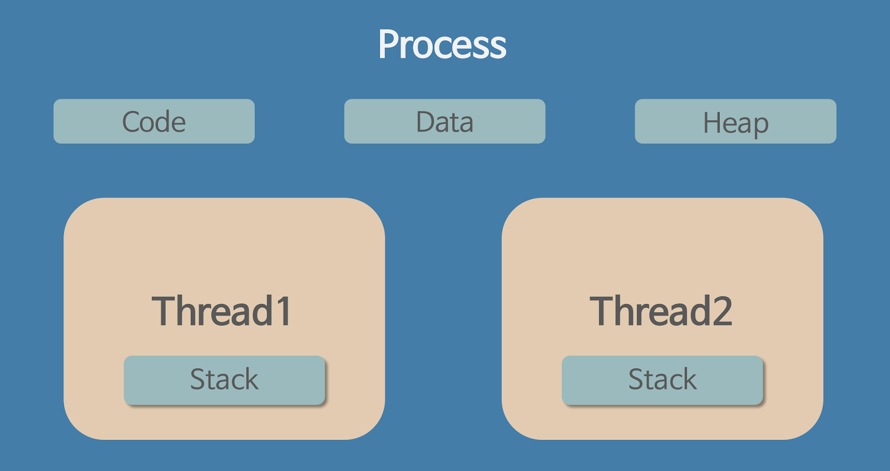
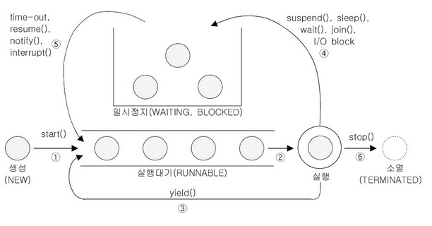
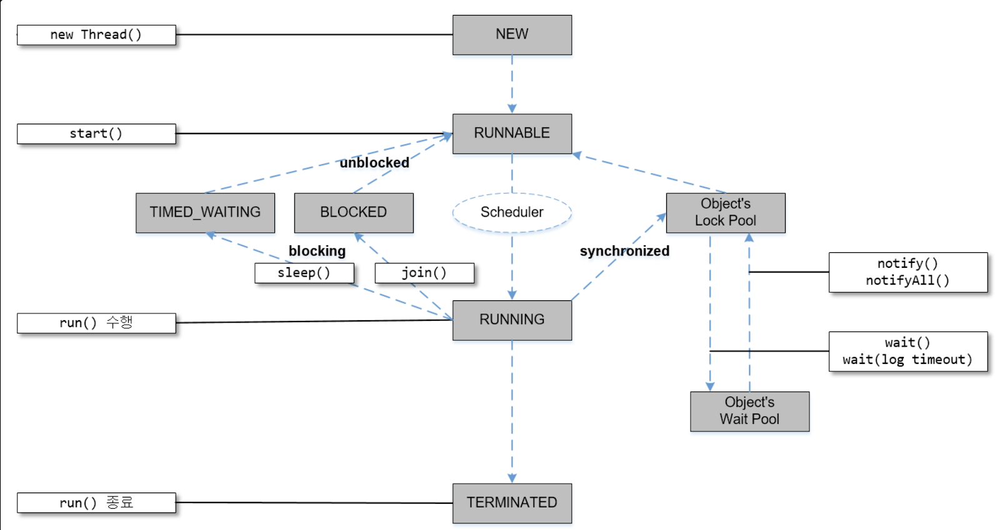
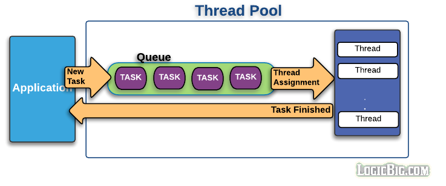
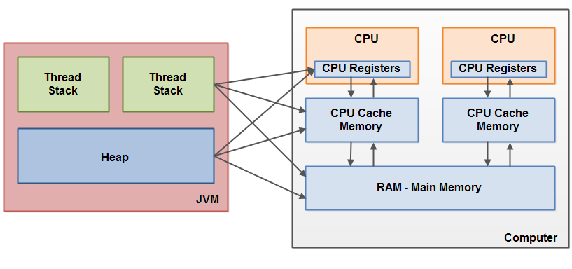

# GDG Incheon Java Study

`2019-03-19 GDG Incheon 자바 스터디 고급`에 참여하여 기록한 내용입니다.

## 프로세스와 스레드

1. **프로세스** : 실행되고 있는 프로그램 개체, 독립적인 개체 - 통신하려면 비용이 크고, 통신IPC 를 사용(파이프, 소켓, 파일)
2. **스레드** : 프로세스가 할당받은 자원을 이용하는 실행 단위, 프로세스와 같은 스택 공간 사용

스레드는 몇 개 까지 만들 수 있을까? - 사실 제한은 없는데.. 
코어 개수만큼 돌릴 수 있다?? -> 맞는 애기 일까? (코어 개수만큼 돌리는게 좋은 것 같다)

## 스레드 풀

스레드를 생성하는데 비용이 발생. -> 여러 스레드를 미리 생성해놓고 재사용하는 클래스
미리 스레드 몇 개 생성해놓고 필요할 떄 배당 해주고 사용완료되면 회수
요청 -> 큐 -> 처리 끝나면 어플리케이션에 리턴

### 스레드 풀의 생성 개수는 어떻게 판단하면 좋을까?

하나의 프로세스가 가질 수 있는 쓰레드의 개수는 제한되어 있지 않으나 쓰레드가 작업을 수행하는데 개별적인 메모리공간(호출 스택)을 필요로 하기 때문에 프로세스의 메모리 한계(호출 스택의 크기)에 따라 생성할 수 있는 스레드의 수가 결정된다.
> [[Java] 쓰레드 기본](https://devbox.tistory.com/entry/Java-쓰레드) 

* 초기 스레드 수: `ExcutorService` 생성될 떄 기본적으로 생성되는 스레드 수 
* 코어 스레드 수 : 스레드가 증가 한후에 사용하지 않은 스레드를 스레드 풀에서 제거할 때 최소한으로 유지해야할 수

**forkJoinPool** : 포크조인(ForkJoin) 프레임웍은 작업을 분리(분리하기 쉽게 선언)하고, 실행하고, 그리고 결과를 병합하기 쉽게 도와준다. 포크(Fork)는 작업을 분리하고, 조인(Join)은 분리한 작업이 완료한 뒤에 결과를 병합하는 과정이다

> [자바로 다중 작업(Multi Task)을 효과적으로 처리하는 방법들](http://sjava.net/tag/cyclicbarrier/)

ThreadPoolExecutor / ForkJoinPool ?
> [쓰레드풀 과 ForkJoinPool](https://hamait.tistory.com/m/612)

## 스레드 구현
`extends Thread`, `implements Runnable`

## 스레드 실행

* `start()`: 스레드 시작
* `run()`: 별도의 runnable 실행 객체를 사용하여 작성된 경우에 해당 runnalbe 객체의 run 메소드 호출 (자바 docs)

start 를 해줬을 때 바로 실행되는 것은 아니고, 실행 대기 상태 추가되어 있다고 자신의 차례가 되면 실행.
start() -> 끝~ -> **재실행 가능?  NO!**

### 스레드 실행 순서?
스레드 실행순서는 OS 스케줄러가 작성한 스케줄에 의해 결정된다.

### 스레드 실행 제어
원하는 순서대로 실행시키게 제어 하려면? 

* `void setPriority(int newPriority)` : 쓰레드의 우선순위를 지정한 값으로 변경한다.
* `int getPriority()` : 쓰레드의 우선순위를 반환한다.

> [[Java] 쓰레드의 우선순위](https://devbox.tistory.com/entry/Java-%EC%93%B0%EB%A0%88%EB%93%9C%EC%9D%98-%EC%9A%B0%EC%84%A0%EC%88%9C%EC%9C%84)

`Thread` 클래스의 `setPriority(Thread.MIN_PRIORITY)`, `setPriority(Thread.MAX_PRIORITY)`, `setPriority(Thread.NORM_PRIORITY)`

### 스레드 우선순위가 높으면? (상대적)
우선순위가 높다 -> 우선순위에 따라 스레드가 얻는 실행 시간이 달라진다. 우선순위를 다르게 하여 특정 스레드가 더 많은 작업 시간을 갖도록 한다. 프로세스 전체에 주어진 실행시간을 우선순위에 따라 비율로 할당된다. 

### join(), yield() 가 뭘까?

* `join()` : 스레드 자신이 하던 작업을 잠시 멈추고 다른 스레드가 지정된 시간동안 작업 수행하도록 할 때 join() 을 사용한다. 
> [쓰레드와 상태제어(join)](https://programmers.co.kr/learn/courses/9/lessons/277)

Waits for this thread to die(Java API)
> [How to Run Threads in Sequence - Java Program](https://netjs.blogspot.com/2016/10/how-to-run-threads-in-sequence-java-program.html)

* `yield()`: 스레드 자신에게 주어진 실행 시간을 다음 차례의 스레드에게 양보한다
(A hint to the scheduler that the current thread is willing to yield its current use of a processor)

## 메모리 관점에서 본 쓰레드
> [[OS]메모리 관점에서 본 쓰레드(thread)](https://mooneegee.blogspot.com/2015/01/os-thread.html)

## 스레드 생명 주기
스레드 생성 -> start ~ terminated 될 때까지 벌어지는 일들? 



> [[Java] 쓰레드의 실행제어](https://devbox.tistory.com/entry/Java-%EC%93%B0%EB%A0%88%EB%93%9C%EC%9D%98-%EC%8B%A4%ED%96%89%EC%A0%9C%EC%96%B4)



> [스레드 생명주기](https://codedragon.tistory.com/3526)

Obejct’s Lock Pool 에서 Lock() ? wait() ?

## 스레드 풀 구조

 


스레드 풀에 속한 스레드는 기본적으로 데몬스레드(주 스레드를 서포트하기 위해 만들어진 스레드, 주 스레드 종료시 강제 종료)가 아니기 때문에 main 스레드가 종료되어도 작업을 처리하기 위해 계속 실행 상태로 남아있다. 즉 main() 메서드가 실행이 끝나도 어플리케이션 프로세스는 종료되지 않는다. 어플리케이션 프로세스를 종료하기 위해선 스레드 풀을 강제로 종료시켜 스레드를 해체시켜줘야 한다.

> [[Java] Thread Pool(스레드 풀)](https://limkydev.tistory.com/55)

Deamon Thread(데몬쓰레드)
* 다른 일반 쓰레드(데몬 쓰레드가 아닌)의 작업을 돕는 보조적인 역할을 수행하는 쓰레드이다.

* 일반 쓰레드가 모두 종료되면 데몬 쓰레드는 강제적으로 자동종료된다.

* 데몬쓰레드가 생성한 쓰레드는 자동으로 데몬 쓰레드가 된다.

* 예) 가비지컬렉터, 워드프로세서의 자동저장, 화면자동갱신 등

> [[Java] 데몬쓰레드](https://devbox.tistory.com/entry/Java-%EB%8D%B0%EB%AA%AC%EC%93%B0%EB%A0%88%EB%93%9C)

> [[Java] java.util.concurrent.locks](https://vnthf.github.io/blog/Java-java.util.concurrent.locks/)

## Synchronized ? 
여러 개의 쓰레드가 하나의 자원에 접근하려 할 때 주어진 순간에는 오직 하나의 쓰레드만이 접근 가능하도록 하는 것

## concurrent package

`concurrent` 패키지가 있는데, synchronized 랑 lock, wait 값을 써서 같은 기능을 구현 할 수 있다.
그럼 둘 중에 뭐가 더 좋을까요? 

### lock vs synchronized 

* Synchronized 는 획득한 순서대로만 잠금을 해제할 수 있습니다.
* lock 임의의 순서로 잠금을 해제할 수 있습니다.

## 스레드 세이프한 자료구조 
vector , Hashtable, concurrent 자료구조

~~~
boolean is = false; 

sync {
 is = true;
}
~~~

다른 스레드에서 접근한다면? 반환 값은 ? 
A,B 스레드가 있다고 가정하면 A가 처음 접근했을때 락을 가지고 있기때문에 B 는 접근이 안됩니다(Block). A가 락이 해제되면 B가 is=true 부분을 접근하기 때문에 true 로 반환할 것 같습니다
-> 확인이 필요할수도있다

## thread volatile
> [Java volatile이란?](https://nesoy.github.io/articles/2018-06/Java-volatile)


> [Java Memory Model](http://tutorials.jenkov.com/java-concurrency/java-memory-model.html)

## 번외
병렬성, 동시성

blocking, non-blocking

각 리눅스 서버 시간(1년씩 돌리면 어느 정도 달라짐)은 어떻게 맞출것인가?

## 참고한 자료

* [[Java] 쓰레드 기본](https://devbox.tistory.com/entry/Java-쓰레드) 
* [자바로 다중 작업(Multi Task)을 효과적으로 처리하는 방법들](http://sjava.net/tag/cyclicbarrier/)
* [쓰레드풀 과 ForkJoinPool](https://hamait.tistory.com/m/612)
* [[Java] 쓰레드의 우선순위](https://devbox.tistory.com/entry/Java-%EC%93%B0%EB%A0%88%EB%93%9C%EC%9D%98-%EC%9A%B0%EC%84%A0%EC%88%9C%EC%9C%84)
* [쓰레드와 상태제어(join)](https://programmers.co.kr/learn/courses/9/lessons/277)
* [How to Run Threads in Sequence - Java Program](https://netjs.blogspot.com/2016/10/how-to-run-threads-in-sequence-java-program.html)
* [[OS]메모리 관점에서 본 쓰레드(thread)](https://mooneegee.blogspot.com/2015/01/os-thread.html)
* [[Java] 쓰레드의 실행제어](https://devbox.tistory.com/entry/Java-%EC%93%B0%EB%A0%88%EB%93%9C%EC%9D%98-%EC%8B%A4%ED%96%89%EC%A0%9C%EC%96%B4)
* [스레드 생명주기](https://codedragon.tistory.com/3526)
* [[Java] Thread Pool(스레드 풀)](https://limkydev.tistory.com/55)
* [[Java] 데몬쓰레드](https://devbox.tistory.com/entry/Java-%EB%8D%B0%EB%AA%AC%EC%93%B0%EB%A0%88%EB%93%9C)
* [[Java] java.util.concurrent.locks](https://vnthf.github.io/blog/Java-java.util.concurrent.locks/)
* [Java volatile이란?](https://nesoy.github.io/articles/2018-06/Java-volatile)
* [Java Memory Model](http://tutorials.jenkov.com/java-concurrency/java-memory-model.html)

## 더 참고할만한 자료

* [Java Concurrency – yield(), sleep() and join() methods](https://www.geeksforgeeks.org/java-concurrency-yield-sleep-and-join-methods/)
* [JAVA Thread wait, notify, notifyAll 쓰레드 협조](https://javaplant.tistory.com/29)
* [Java 8 Concurrency Tutorial: Synchronization and Locks](https://winterbe.com/posts/2015/04/30/java8-concurrency-tutorial-synchronized-locks-examples/)
* [자바에서 volatile 키워드가 뭔가요?](https://hashcode.co.kr/questions/660/%EC%9E%90%EB%B0%94%EC%97%90%EC%84%9C-volatile-%ED%82%A4%EC%9B%8C%EB%93%9C%EA%B0%80-%EB%AD%94%EA%B0%80%EC%9A%94)