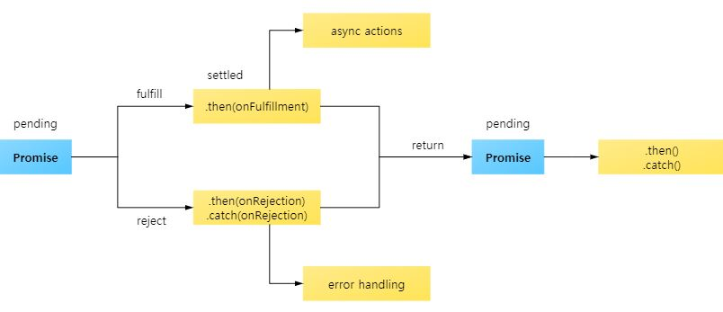

# Promise
프로미스는 자바스크립트의 비동기 처리에 사용되는 객체이다.

> 비동기 처리란?
  특정 코드의 실행이 완료될 때까지 기다리지 않고 다음 코드를 실행하는 것.

## Promise의 3가지 상태(states)

`new Promise()`로 프로미스를 생성하고 종료될 떄까지 3가지 상태를 갖는다. 여기서 상태란 **프로미스의 처리 과정을 의미** 한다.

- Pending (대기) : 비동기 처리가 아직 완료되지 않은 상태
- Fulfilled (이행) : 비동기 처리가 완료되어 프로미스가 결과값을 반환해준 상태
- Rejected (실패) : 비동기 처리가 실패한 상태

### Pending 상태
`new Promise()` 메서드를 호출하면 Pending 상태가 된다. 이떄 메서드를 호출할 때 콜백 함수의 인자로 resolve, reject에 접근할 수 있다.

~~~ js
new Promise(function (resolve, reject)) { }
~~~

### Fulfilled 상태

다음과 같이 resolve 를 실행하면 Fulfilled 상태가 된다.
~~~ js
new Promise(function (resolve, reject)) {
  resolve()
}
~~~

그리고 이행 상태가 되면 `then()`으로 결과 값을 받을 수 있다.

~~~ js
function getData() {
  return new Promise((resolve, reject) => {
    let data = 10;
    resolve(data);
  })
}

getData().then((data) => {
  console.log(data); // 10
})
~~~

### Rejected 상태

콜백 함수 인자 중 resolve 인자로 `reject()` 메서드를 호출하면 Rejected 상태가 되며 `catch()`로 받을 수 있다.

~~~ js
function getData() {
  return new Promise((resolve, reject) => {
    reject(new Error('failed!'));
  })
}

getData().then().catch((err) => {
  console.log(err); // Error: failed!
})
~~~

## 프로미스 처리 흐름

