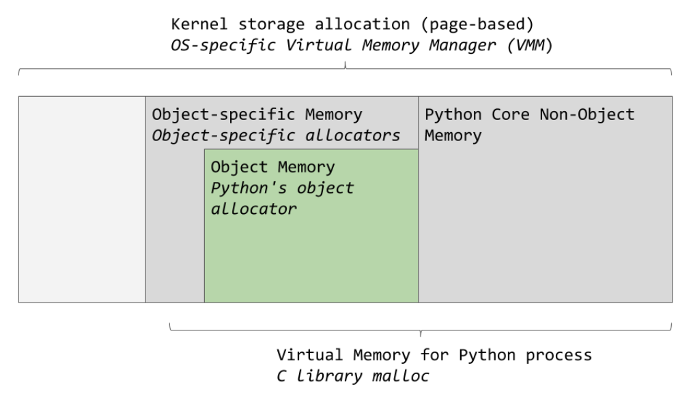
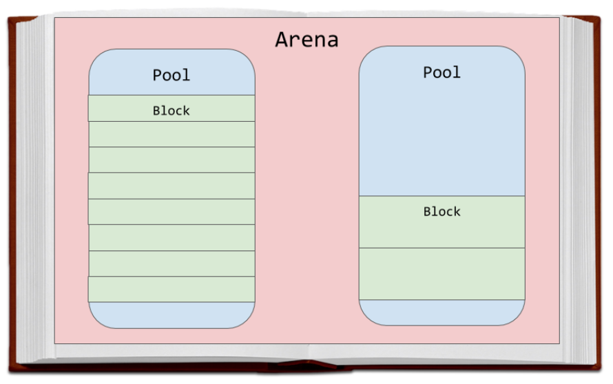
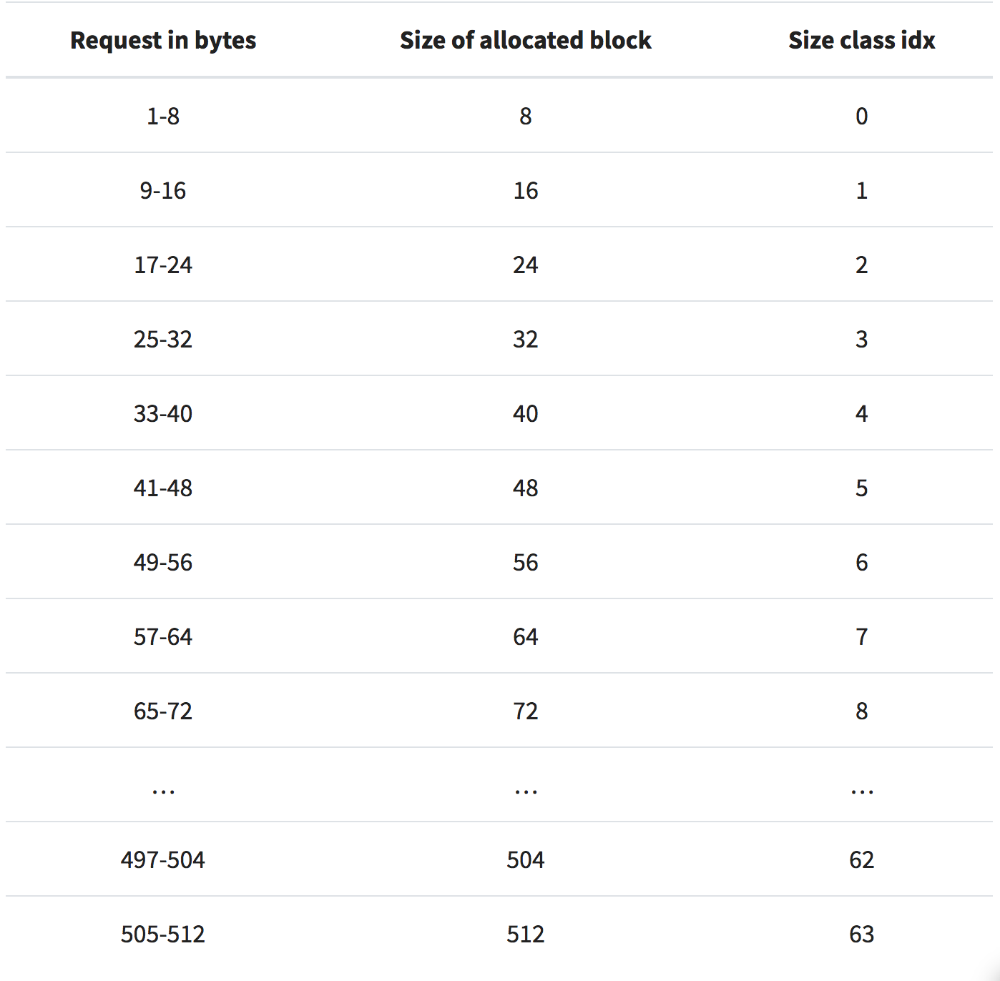
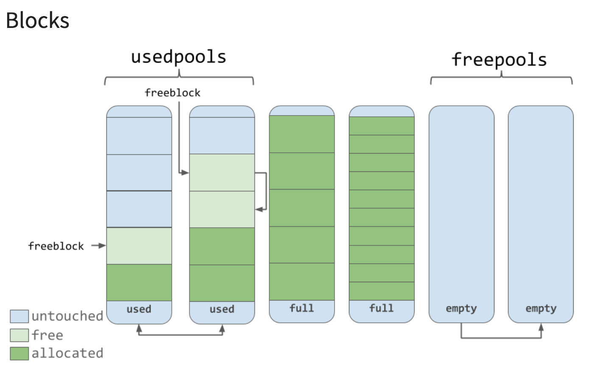
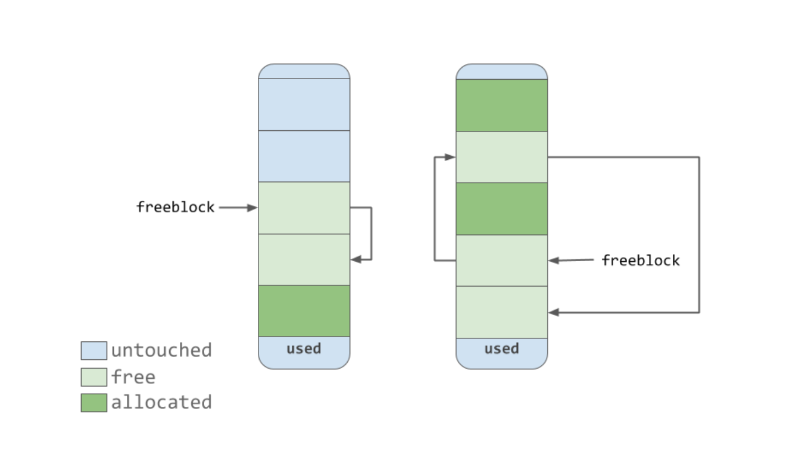
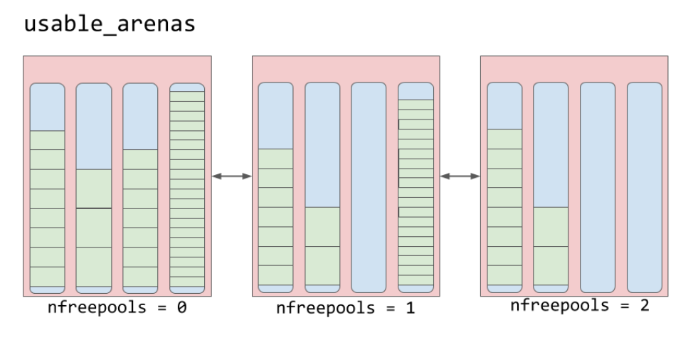

# Memory Management in Python

[Memory Management in Python](https://realpython.com/python-memory-management/) 를 번역 및 정리한 글이다.

파이썬에서 데이터를 어떻게 처리하는지, 변수가 메모리에 어떻게 저장되어 있는지, 언제 삭제되는지, 파이썬의 내부 구조를 살펴보고 메모리 관리가 어떻게 이루어지는짖 알아보자.

다음 내용을 알게 될 것이다.

- Learn more about low-level computing, specifically as relates to memory
- Understand how Python abstracts lower-level operations
- Learn about Python’s internal memory management algorithms

memory management(메모리 관리) 는 어플리케이션이 데이터를 read 하고 write 하는 프로세스이다. memory manager(메모리 관리자) 는 어플리케이션의 데이터를 저장할 위치를 결정한다. 메모리 관리자는 여유 공간을 찾아 애플리케이션에 제공해햐한다. 이 메모리를 제공하는 프로세스를 일반적으로 memory allocation(메모리 할당)이라고 한다.

반대로 데이터가 더 이상 필요 없으면 삭제하거나 해제 할 수 있다. 컴퓨터 어딘가에 파이썬 프로그램을 실행할 때 데이터를 저장하는 physical device(물리적인 장치)가 있다. 객체가 실제로 하드웨어에 도작하기 전에 파이썬 코드가 통과하는 많은 추상화 계층이 있다.  

하드웨어 위에있는 주요 계층 중 하나는 OS(운영체제)이다. 운영체제는 메모리 읽기 및 쓰기 요청을 수행(또는 거부)한다.

운영체제 위에는 애플리케이션이 있으며 그 중 하나는 default python implementation(CPython) 이다. 파이썬 코드의 메모리 관리는 파이썬 애플리케이션에서 처리한다. 

## The Default Python Implementation
The Default Python Implementation(CPython)은 C언어로 작성되어있다. 

파이썬은 [reference manual](https://docs.python.org/3/reference/index.html)에 정의되어있지만 이 메뉴얼만으로는 그다지 유용하지 않다. 메뉴얼의 규칙을 기반으로 작성된 코드를 해석할 무언가가 필요하다.

셀제로 컴퓨터에서 해석 된 코드를 실행하려면 뭔가가 필요하다. CPython은 이러한 요구 사항을 모두 충족시킨다. 파이썬 코드를 instructions(명령어)로 변환하여 virtual machine(가상 머신)에서 실행한다.

파이썬은 interpreted programming language 이다. 파이썬 코드는 실제로 바이트 코드라는 컴퓨터가 읽을 수 있는 명령어로 컴파일된다. 이 명령어는 코드를 실행할 때 가상 머신에 의해 interprete(해석)된다. `.pyc` 파일, `__pycache__` 폴더가 바로 가상 머신에 의해 해석되는 바이트 코드이다.

> CPython 말고도 IronPython, Jython, PyPy 가 있다.

CPython 은 C로 작성되어있고 파이썬 바이트 코드를 해석한다. 이것이 메모리 관리와 어떤 관련이 있을까? 메모리 관리 알고리즘과 구조는 CPython 의 코드, C로 존재한다. 따라서 Python의 메모리 관리를 이해하려면 CPython 대한 이해가 필요하다.

Python에서 모든 것(int, str 등)은 object(객체)라는 이야기가 있다. CPython 의 구현 레벨에서 보면 사실이다. CPython의 모든 객체가 사용하는 `PyObeject` 라고 부르는 구조체가 있다. 

`PyObject` 는 다음 2가지가 포함되어있다.
- **ob_refcnt** : reference count
- **ob_type** : pointer to another type

reference count 는 garbage collection(gc)에서 사용된다. 그런 다음 실제 object type 에 대한 포인터가 있다. object type 은 파이썬 객체(dict, int 등)를 설명하는 또 다른 구조체이다.

객채마다 고유한 memory allocator(메모리 할당자), memory deallocator(메모리 분리기)가 있다.

- **memory allocator** : 각 객체를 저장하기 위한 메모리를 얻음
- **memory deallocator** : 더 이상 필요없는 메모리를 해제

> Each object has its own object-specific memory allocator that knows how to get the memory to store that object. Each object also has an object-specific memory deallocator that “frees” the memory once it’s no longer needed.

메모리 할당 및 해제에 대한 모든 논의에서 중요한 요소가 있다. 메모리는 컴퓨터의 shared resource (공유 리소스)이며 서로 다른 두 프로세스가 동시에 같은 위치에 쓰려고하면 문제가 발생한다. 

## Global Interpreter Lock

두 스레드가 같은 리소스를 동시에 수정하려고하면 원하지 않는 결과가 초래될 수 있다. GIL은 이런 문제점에 대한 해결책이다. 

CPython은 메모리를 처리 할 때 GIL을 사용하여 안전하게 처리한다.

GIL에 대해 더 자세히 알고싶으면 다음 사이트를 참고하자.
> [What is the Python Global Interpreter Lock (GIL)?.](https://realpython.com/python-gil/)

## Garbage Collection

파이썬의 모든 객체는 reference count(참조 횟수) 와 타입에 대한 포인터(pointer to a type)을 가지고 있다. 

참조 횟수는 몇 가지 이유로 증가한다. 예를 들어 다른 변수에 할당하면 참조 횟수는 증가한다.

~~~ python
numbers = [1, 2, 3]
# Reference count = 1
more_numbers = numbers
# Reference count = 2
~~~

또한 인수로 전달하여도 증가한다.

~~~ python
total = sum(numbers)
~~~

다음곽 같이 list 에 포함되어도 참조 횟수는 증가한다.

~~~ python
matrix = [numbers, numbers, numbers]
~~~

`sys` 모듈을 사용하여 객체의 현재 참조 횟수를 확인 할 수 있다. `sys.getrefcount(numbers)` 을 통해 확인이 가능하지만 `getrefcount()` 에 객체를 전달하면 참조 횟수가 1 증가한다.

어떤 경우에도 객체가 여전히 필요가있는 경우 참조 카운트는 0보다 커집니다. 0으로 떨어지면 객체는 메모리를 "free" 라는 특정 deallocation function 를 가지는데 이때 다른 객체 객체가 사용할 수 있습니다.
메모리를 "free" 한다는 것이 무엇을 의미할까? 다른 객체는 그것을 어떻게 사용할까? CPython의 memroy management 를 통해 알아보자.

> In any case, if the object is still required to hang around in your code, its reference count is greater than 0. Once it drops to 0, the object has a specific deallocation function that is called which “frees” the memory so that other objects can use it. But what does it mean to “free” the memory, and how do other objects use it? Let’s jump right into CPython’s memory management.

## CPython's Memory Management
physical hardware 에서부터 CPython까지 이르는 추상 계층이 있다. 운영체제는 physical memory(물리적 메모리)를 추상화하고 애플리케이션(파이썬 포함)이 엑세스 할 수 있는 가상 메모리 (virtual memory)계층을 생성한다.

OS-specific virtual memory manager는 파이썬 프로세스를 위한 메모리 덩어리(a chunk of memory)를 조각 낸다. 밑의 그림에서 어두운 부분이 파이썬 프로세스가 소유하고 있는 부분이다.

파이썬은 내부 사용과 non-object memory를 위해 메모리의 일부분을 사용한다. 다른 부분은 object storage(int, dict 등) 전용이다. 이 그림은 간소화된 그림이다. 전체를 알고 싶으면 [CPython 코드](https://github.com/python/cpython/blob/7d6ddb96b34b94c1cbdf95baa94492c48426404e/Objects/obmalloc.c) 를 참고하자

CPython에는 object memory area 내에서 메모리를 할당하는 object allocator(객체 할당자)가 있다. 이 객체 할당자는 새로운 객체에 공간이 할당되거나 삭제 될 때마다 호출된다.

일반적으로 list 및 int 와 같은 파이썬 객체에 한 번에 너무 많은 데이터를 추가하거나 삭제하지 않는다. 따라서 allocator는 한 번에 소량의 데이터로 잘 작동하도록 디자인되어있다. 또한 필요하기 전까지는 메모리를 절대 할당하지 않는다.

[CPython 코드](https://github.com/python/cpython/blob/7d6ddb96b34b94c1cbdf95baa94492c48426404e/Objects/obmalloc.c)에서 comments를 살펴보면 allocator를 "`malloc` 위에 사용되는 작은 블록을 위한 빠르고, 특수 목적의 메모리 할당자"라고 설명한다.

> "a fast, special-purpose memory allocator for small blocks, to be used on top of a general-purpose malloc."

이제 CPython의 메모리 할당 전략을 살펴보자. 우선, 3가지 주요 요소와 그 상호 관계에 대해 살펴보자

Arenas는 메모리 중 가장 큰 부분이며 메모리의 page boundary(페이지 경계?)에 정렬된다. page boundary는 OS가 사용하는 고정 길이의 연속적인 chunk of memory의 edge 부분이다. 파이썬은 시스템의 페이지 크기가 256 킬로바이트라고 가정한다.

arenas 내에는 하나의 가상 메모리 페이지 (4킬로바이트)인 pool이 있다. (이것은 책에서 페이지와 같다) 이러한 풀은 더 작은 메모리 블록으로 분할된다. 

예를 들어, 42 바이트가 요청되면 데이터는 48 바이트 블록 크리고 배치된다.

### Pools

Pools(풀)는 단일 크기 클래스의 블록(blocks from a single size class)으로 구성된다. 각 풀은 같은 크기 클래스의 다른 풀과 double-linked list로 유지 관리한다.

usedpools list는 각 size class의 데이터에 사용 가능한 공간이 있는 모든 풀을 추적한다. 주어진 블록 크기가 요청되면 알고리즘은 usedpools list에서 해당 블록 크기에 대한 풀 리스트를 확인한다.

풀은 3가지 상태(used, full, empty) 중 하나여야한다. used pool에는 저장할 데이터에 사용 가능한 블록이 있다. full pool의 블록은 모두 할당되고 데이터를 포함한다. empty pool에는 저장된 데이터가 없으며 필요한 경우 블록에 대한 모든 size class를 할당 할 수 있다.

> Pools themselves must be in one of 3 states: used, full, or empty. A used pool has available blocks for data to be stored. A full pool’s blocks are all allocated and contain data. An empty pool has no data stored and can be assigned any size class for blocks when needed.

freepools list는 empty state의 모든 풀을 추적한다. 

코드에 8 바이트 메모리가 필요하다고 가정해보자. 8 바이트 size class의 usedpools에 풀이 없는 경우 8 바이트 블록을 저장하기 위해 새로운 empty pool이 초기화된다. 그런 다음 이 새 풀은 usedpools list에 추가되어 향후 요청에 사용될 수 있다.

메모리가 더 이상 필요없어 full pool이 일부 블록을 해제한다고 해보자. 그 풀은 size class에 대해 usedpools list에 다시 추가 될 것이다.

이 알고리즘을 통해 풀이 이러한 상태간에 자유롭게 이동할 수 있는 방법을 볼 수 있다.

### Blocks

위 다이어그래매에서 볼 수 있듯이 풀에는 "free" 메모리 블록에 대한 포인터가 있다. 할당자는 소스 코드의 주석을 보면 "strives at all levels (arena, pool, and block) never to touch a piece of memory until it’s actually needed," 라고 말한다.

즉, 풀은 3개의 상태로 블록을 가질 수 있다. 이러한 상태는 다음과 같이 정의할 수 있다.
- **untouched** : 할당되지 않은 메모리 부분 
- **free** : CPython에 의해 할당되었지만 나중에 "자유"로 만들어지며 더 이상 관련 데이터를 포함하지 않는 메모리 부분
- **allocated** : 관련 데이터를 실제로 포함하는 메모리 부분

freeblock 포인터는 자유롭게 연결된 메모리 블록 list를 가르킨다. 즉, 데이터를 저장할 장소 list이다. 사용 가능한 free 블록보다 더 필요한 경우 할당자는 풀에서 일부 블록을 가져온다. 

memory manager가 블록을 "free"로 만들면 이제는 비어있는 블록이 freeblock list 앞에 추가된다. 실제 list는 첫 번째 다이어그램과 같이 연속적인 메모리 블록이 아닐 수도 있다. 아래 그림과 비슷할 수 있다.

### Arenas

Arenas에 pools이 포함된다. 이러한 풀은 used, full, empty 상태일 수 있다. arena 자체는 풀처럼 명시적인 상태가 아니다.

Arenas는 used_arenas 라는 doubly linked list로 구성된다. list는 사용 가능한 free pools에 따라 정렬된다. free pools가 적을수록 arenas는 list 앞쪽에 가깝다.

즉, 가장 많은 데이터가잇는 arena를 선택하여 새 데이터를 배치한다. 왜 가장 많은 공간이있는 곳에 데이터를 두지 않을까?

"free" 라는 말이 많이 나오고 있는데 이 이유는 블록이 "free"으로 간주 될 때 해당 메모리가 실제로 운영체제로 다시 해제되지 않기 때문이다. 파이썬 프로세스는 할당 된 상태로 유지하고 나중에 새 데이터에 사용할 것이다. 메모리를 완전히 비우면 사용할 운영 체제로 되돌린다. 

Areanas는 free 될 수 있는 유일한 것이다. 그래서 빈 자리에 더 가까운 arena가 비어있게 해야하는 이유가 있다. 이런 식으로 chunk of memory를 free 하여 파이썬 프로그램의 전체 메모리 사용량을 줄일 수 있다.

## Conclusion

- What memory management is and why it’s important
- How the default Python implementation, CPython, is written in the C programming language
- How the data structures and algorithms work together in CPython’s memory management to handle your data

## Reference
[Memory Management in Python](https://realpython.com/python-memory-management/)