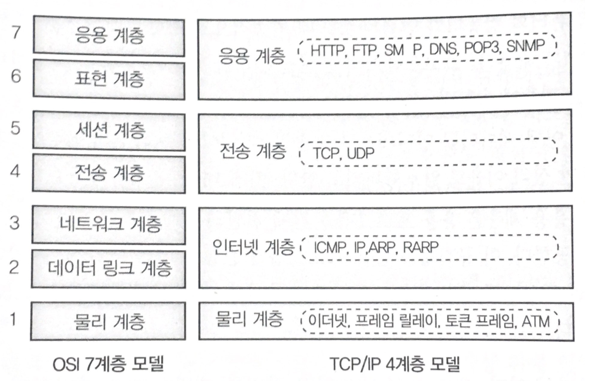

# TCP/IP

네트워크는 노드와 링크로 이루어져있다.
- 노드 : 정보를 저장하고 처리, 다른 노드로 전송하는 일을 한다.
- 링크 : 노드와 노드를 연결하는 통로.

정보는 이 링크를 따라 이동하며 어떤 노드(컴퓨터)에서 다른 노드(컴퓨터)로 이동하기 위해서는 1개 이상의 링크, 노드를 거치게 되는데 이를 **경로** 라고한다.

하지만 컴퓨터와 회선만 있다고 해서 인터넷을 이용할 수 있는 것은 아니다. **어떻게 정보를 주고 받을 것** 인지, **어떻게 경로를 찾도록 할 것** 인지, **수많은 노드는 어떻게 관리할 것** 인지에 대한 **규약(프로토콜)** 과 이들 규약을 집행(실행)할 **소프트웨어** 가 필요하다.

## IP
인터넷은 숫자를 이용해서 노드에 **유일한 값 (IP Address)** 부여한다. 이 값을 이용해서 상대방 컴퓨터의 위치를 알고 서로 통신할 수 있다. IP(Internet Protocol)은 **인터넷 상에서 컴퓨터 위치를 찾아 데이터를 전송하기 위해 지켜야 할 규칙** 이다.

## TCP
IP 를 통해 컴퓨터를 찾아 통신할 수 있겠지만 아직 끝이 아니다. TCP 를 알기 전에 우선 인터넷이 어떤 방식을 채택하고 있는지 살펴보자.

인터넷은 **분산 네트워크** 와 **패킷 데이터 전송** 방식을 채택하고 있다. 패킷 데이터 전송은 데이터 전체를 보내지 않고 여러 조각으로 나누어 전송하는 것을 말한다. 그러면 받는 쪽은 이 조각들을 다시 조립한다. 이떄 패킷은 다양한 경로를 가질 수 있다. 즉, 보낸 순서와 다르게 받을 수 있기때문에 패킷 순서를 확인하여 데이터를 재조립할 수 있어야 한다. 이뿐만 아니라 패킷의 일부가 손실 될 수도 있다. 수신측은 손실 패킷 유무를 파악하여 손실된 패킷만을 다시 전송 요청할 것이다. 따라서 데이터 흐름을 제어하기 위한 프로토콜이 필요하며 이 역할을 **TCP** 가 하는 것이다.

정리하자면, TCP는 데이터 흐름을 제어하고 IP는 데이터 경로를 제어한다고 보면 된다. TCP/IP 덕분에 인터넷에서 컴퓨터의 위치를 찾고, 안전하게 데이터를 전송할 수 있게 된 것이다.

## TCP/IP 4계층
우선 추상화에 대해 알아보자.

### 추상화란?
추상이란 객체의 공통적인 특정을 가져와서 일반화하는 방식을 말하는데 내부의 복잡함을 숨길 수 있으며(은닉) 계층화가 가능하다. 소프트웨어도 추상을 적용하면 여러 단계의 은닉 계층을 만들 수 있다. 계층은 은닉되므로 개발자는 자신이 맡는 계층만 신경을 써서 개발하면 된다. 하위 계층의 복잡함은 감추어지고 간단한 인터페이스만 제공되니 효율적으로 개발이 가능하다. OSI 7계층과 TCP/IP 4계층도 추상화의 결과물이다. 그래서 개발자는 소켓에서 제공하는 함수만 알고 있으면 네트워크 프로그램을 개발할 수 있다.

### TCP/IP 4계층
OSI 7계층이 너무 계층화되어있어 몇 개 계층들끼리 통합한 것이다. TCP/IP 4계층은 OSI 7계층을 기반으로 하고 있다.

- **물리 계층** : 시스템을 연결하기 위한 전기/물리적 규격을 정의.
- **데이터 링크 계층** : 시스템 간의 (Point to Point) 신뢰성 있는 전송을 보장하기 위한 계층.
- **네트워크 계층** : Point to Point가 인터넷으로 확장되면 경로를 찾는 일이 중요해지는데 이 경로를 찾아주기 위한 여러 규격을 제공.
- **전송 계층** : 컴퓨터와 컴퓨터가 신뢰성 있는 데이터 전송을 보장하기 위한 여러 규격을 제공.
- **세션 계층** : 컴퓨터와 컴퓨터가 연결되었을 떄 최종적으로 소프트웨어끼리 통신하게 되는데 이 소프트웨어의 통신을 관리하기 위한 규격을 제공.
- **표현 계층** : 어떤 데이터를 인터넷으로 전송할 때 데이터는 다루기 좋은 형태로 인코딩되거나 혹은 보안 상의 이유로 암호화되는데 이에 대한 규격을 제공.
- **응용 계층** : 응용 프로그램들 간에 전달되는 데이터를 해석하고 표시하기 위한 규격을 제공. 이 규격은 응용 프로그램에 따라 달리질 수 있다.

### TCP/IP 4계층으로 알아보는 네트워크 통신 흐름

모든 인터넷 통신은 반드시 TCP/IP 4계층을 거쳐야 한다.

위 그림의 핵심은 자신이 속한 계층만 신경을 쓰면 된다는 점이다. 응용 계층에 속했다면 응용 계층끼리, 전송 계층끼리 속했다면 전송 계층만 신경 쓴다. 

웹 클라이언트는 HTTP 에 맞추어 웹서버에 페이지를 요청한다. 이 데이터가 전송 계층으로 전달되면 TCP/IP 를 이용하여 인터넷을 건널 준비를 한다. 이렇게 물리 계층인 랜카드까지 도달하면 비로소 인터넷을 통해 서버로 이동하게 된다. 서버는 이 반대의 과정을 거치면서 응용 계층까지 데이터가 전송된다. 이 떄 클라이언트 쪽에서 **Encapsulation(캡슐화)** 과정을 거쳐 웹서버로 보내고 웹서버에서는 **Decapsulation** 과정을 통해 클라이언트 요청(데이터)를 받게 된다.

