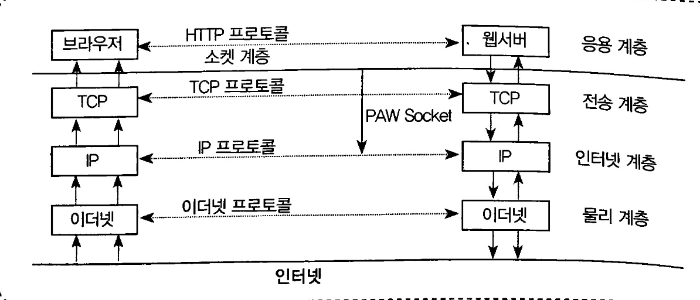
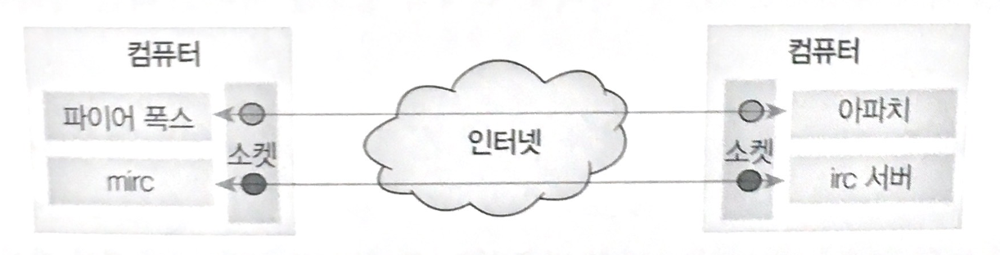

# 소켓

TCP/IP 4계층은 지나치게 세분화된 OSI 7계층을 단순화한 것이다. 그러나 이렇게 단순화하였음에도 네트워크 프로그램 개발 과정이 복잡하여 네트워크 프로그램 개발을 위한 새로운 계층이 만들어졌다. 이렇게 만들어진 네트워크 프로그램 개발 계층이 바로 **소켓 계층** 이다. 소켓의 계층 구조는 다음 그림과 같으며 TCP/IP 계층에서 **응용 계층** 바로 밑에 위치한다.

소켓 계층 덕분에 개발자는 응용 계층에 신경쓰면 되고 나머지는 소켓계층 밑에 감추어져 **거의** 신경을 쓰지 않아도 된다. 소켓 계층은 개발자를 위한 계층이므로 함수 모음으로 이루어진다.

## 프로그램과 프로그램을 연결하는 소켓
인터넷을 컴퓨터와 컴퓨터가 연결된 네트워크라는 측면으로 볼 수 있지만 좀 더 정확하게 보면 아래 그림처럼 프로그램과 프로그램이 연결된 상태이다.

소켓은 이들 프로그램이 서로 연결되어 통신할 수 있도록 **통신선로를 만들어주는 역할** 을 한다.

## 서비스 포트
만약 서버 컴퓨터에 많은 네트워크 프로그램들이 실행되고 있고 클라이언트가 해당 서버의 특정 프로그램과 통신을 하고 싶을때 어떻게 해야할까? 서버 컴퓨터는 IP address 를 이용하여 찾을 수 있지만 특정 프로그램은 어떻게 찾을 수 있을까? 이때 바로 **포트(Port)** 를 이용하면 된다. 포트는 일련의 번호로 이루어져있으며, 각 서비스는 고유의 포트 번호를 가지고 있다.

