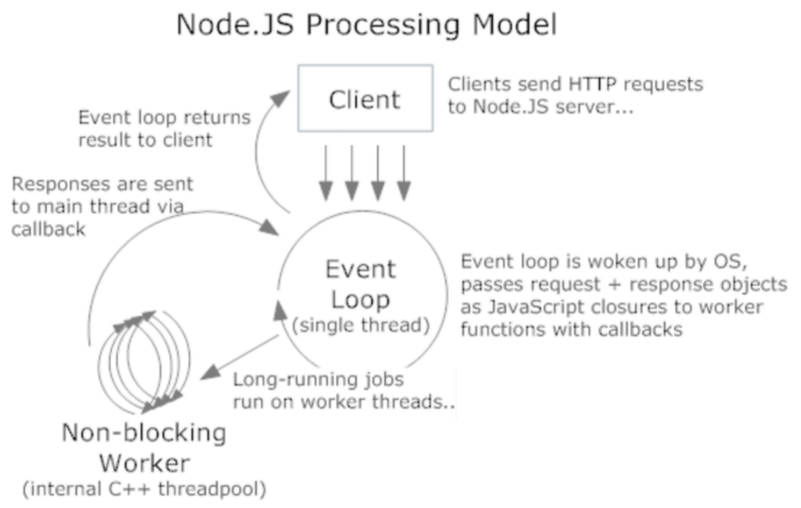

# NodeJS
- 브라우저 밖에서 자바스크립트 코드를 실행 (크롬에서 사용하는 V8 엔진을 사용하기 때문)
- 이벤트 기반의 비동기 I/O 프레임워크
- CommonJS를 구현한 모듈 시스템

## 이벤트 기반의 비동기 I/O 프레임워크

클라이언트 쪽에서 어플리케이션으로 요청을 보낸다.
node는 클라이언트 요청을 이벤트라는 것으로 만들어서 이벤트 큐에다가 쌓아놓는다.
이벤트 루프라는 것은 하나의 스레드(싱글 스레드)로 이루어져 있으며 이벤트 큐에 있는 이벤트 하나하나를 뽑아내서 실행한다. 즉 이벤트 루프라는 Single Thread가 job을 처리하는 것이다.

비동기 I/O라는 말은 이벤트 루프가 이벤트를 하나씩 처리하는데 그 이벤트가 바로 응답하지 않고 오래 걸리는 경우 이벤트 루프가 직접 처리하지 않고 다른 스레드에게 이 일을 위임한다. 그 일은 Non-blocking Worker 라는 녀석이 한다. Non-blocking Worker는 이벤트 루프에게 받은 이벤트를 실행하여 완료되면 그 결과를 다시 이벤트 형식으로 이벤트 큐에다가 다시 전달한다. 이벤트 루프는 이벤트 큐에 있는 이벤트 들을 차곡차곡 실행하다가 Worker 녀석이 보낸 이벤트를 뽑으면 그 이벤트의 결과를 클라이언트에게 보내 준다. 이러한 구조를 비동기 I/O 프레임워크라고 부른다.

정리하자면 1.클라이언트가 보내는 요청을 이벤트로 처리하는 부분, 2.무거운 job들은 worker 스레드에게 전달해서 비동기로 처리하는 부분 이렇게 해서 node.js는 이벤트 기반비동기 I/O 프레임워크라고 부르는 것이다.