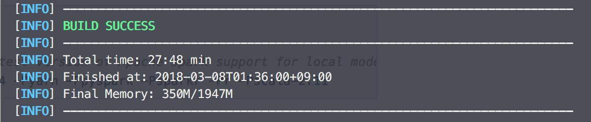

# Apache Zeppelin

## 1. Clone the Apache Zeppelin repository

Github에 [Zeppelin 저장소](https://github.com/apache/zeppelin
) 로 가서 프로젝트를 자신의 PC에 다운로드 받는다. 

`$ git clone https://github.com/apache/zeppelin.git`

## 2. Build Source

maven 이 없으면 maven 을 brew를 통해 설치한다. (macOS)
`$ brew install maven`

`$ mvn -v`  명령어로 maven이 잘 설치가 되었는지 확인

`$ mvn clean package -DskipTests` 명령어로 빌드한다.



빌드가 성공하면 위와 같이 뜨는 것을 확인할 수 있다. 대략 28분 정도 걸린다.

## 3. Done

```
$ cd ./bin
$ ./zeppelin.sh
```
빌드가 성공하면 `bin/` 로 이동하여 `zeppelin.sh`를 실행시켜 Zeppelin 을 볼 수 있다.
`localhost:8080` 으로 접속.

## 4. Contribution

위 1번 과정을 통해 자신의 PC에 다운로드 받았을 경우 Apache Zeppelin 을 자신의 Github 에 fork를 하고 자신의 저장소로 remote 를 변경해야한다.

`$ git remote -v` 로 확인하여 기존의 Apache Zeppelin remote를 삭제한다.

`$ git remote rm origin` 명령어로 삭제한 후 자신의 저장소 주소로 remote add 한다.

`$ git remote add origin {자신의_저장소_URL}`

그런 다음 브런치를 새로 생성하여 코드를 수정한 후 PR (Pull Request)을 날리면 된다.

----
문서를 적극적으로 활용하자.


