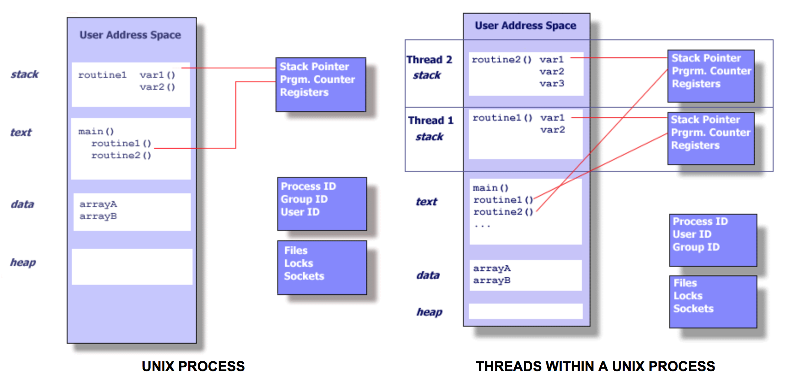

# Pthreads (POSIX Threads)

## What is a Thread?
운영체제에서 실행할 수 있도록 schedule 되는 독립적인 명령어들의 흐름을 스레드라고 한다. main program 으로부터 독립적으로 실행하는 procedure 의 개념과 같다. 

좀 더 나아가, 많은 수의 procedure 가 포함된 main program 을 생각해보자. 이 모든 procedure 가 운영체제에 의해 동시에 (and/or) 독립적으로 실행되도록 schedule 되었다고 하자. 이를 **멀티 스레드** 라고 한다.

스레드를 이해하기 전에 UNIX Process 를 이해해야한다. 프로세스를 생성하려면 많은 양의 Overhead 가 발생한다. 프로세스는 program resources 및 program execution state 에 대한 정보를 포함한다. 
 - PID, Process group ID, user ID, group ID
 - Environment
 - Working directory
 - Program instructions
 - Registers
 - Stack
 - Heap
 - File descriptors
 - Signal actions
 - Shared libraries
 - Inter-process communication tools(such as message queues, pipes, semaphores, or shared memory)

스레드는 이러한 프로세스 자원을 사용하고 존재하지만 운영체제에 의해 스케줄 될 수 있고 실행 가능한 코드로 존재할 수 있게 하는 필수자원을 복제하기 때문에 독립적으로 엔티티로 실행될 수 있다.

스레드가 자체적으로 다음과 같은 것들을 유지관리하므로 독립적인 제어 흐름(flow of control)으로 수행되어진다.
 - Stack pointer (SP)
 - Registers
 - Scheduling properties (such as policy or priority)
 - Set of pending and blocked signals
 - Thread specific data

그래서 유닉스 환경에서 스레드는 다음과 같이 요약할 수 있다.
- 프로세스 안에 존재하고 프로세스 리소스를 사용한다.
- parent process 가 존재하고 OS 가 지원하는 한 독립적인 제어 흐름이 있다.
- 독립적으로 스케줄 할 수 있는 필수 리소스만 복제한다.
- 독립적으로(그리고 의존적으로) 작동하는 다른 스레드와 프로세스 리소스를 공유 할 수 있다.
- parent process 가 죽으면 죽는다.
- 대부분의 overhaed 는 프로세스가 생성되면서 이미 생성되어지므로 "lightweight" 하다.

같은 프로세스로 부터 생성되어진 스레드들은 리소스를 공유한다.
- 한 스레드가 파일 공유와 같은 공유 시스템 자원에 변경한 내용은 다른 모든 스레드에서 볼 수 있다.
- 동일한 값을 갖는 두 포인터는 같은 데이터를 가리킨다.
- 동일한 메모리 위치에 읽고 쓰기가 가능하므로 프로그래머가 명시적으로 동기화해야한다.

## What is a Pthreads?

스레드가 제공하는 기능을 최대한 활용하려면 표준화된 프로그래밍 인터페이스가 필요했다. 유닉스 시스템의 경우 이 인터페이스는 IEEE POSIX 1003.1c standard(1995)에 의해 지정되었다. 이 표준을 준수하여 구현한 것을 POSIX 스레드 또는 Pthreads 라고 한다.

Pthreads 는 `pthread.h` header/include file 과 스레드 라이브러리로 구현된 C language programming types 및 procedure calls (프로시서 호출) 로 정의된다.

Pthread 는 스레드들이 병렬적으로 수행될 수 있도록 새로운 스레드를 만들고 또 스케줄링하는 api 라고 할 수 있다. 실제로 pthread 를 통해 스레드 생성, 스레드 종료, 스레드 동기화를 위한 api 를 제공한다.

## Ref

[POSIX 스레드란 ? Pthread 란?](http://blog.doosikbae.com/73?category=714958)

[POSIX Threads Programming](https://computing.llnl.gov/tutorials/pthreads/#Thread)