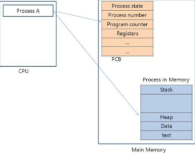
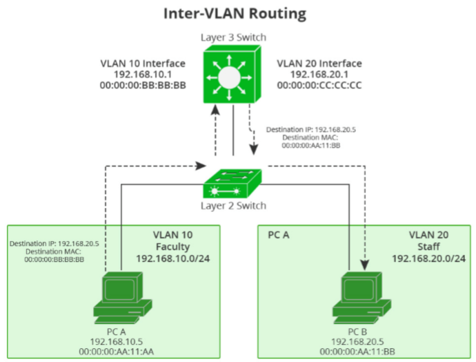
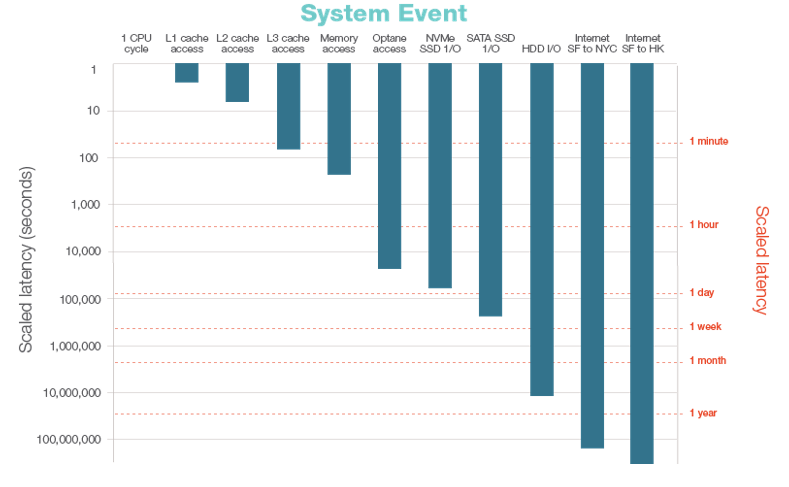

# 시스템 명령어 사용법

크게 2가지 관점에 대한 명령어를 살펴본다.

1. 왜 안 될까?
2. 왜 느릴까?

## 왜 안 될까?

### Process

프로세스 - programming in execution

프로그램은 디스크에 있다. 실행시키면 읽어서 메모리에 올려놓는다. 실행 포인터가 다가오면 스타트 포인터부터 시작해서 메모리에 있는 것들을 읽어 레지스터, 캐시에 넣어 연산을 시작한다.



처음에 프로세스를 cpu에서 실행시키면 메모리에는 Process Control Block (pcb)가 생시고 pcb에는 프로세스 상태, 프로세스 넘버등이 있다. 메모리 영역에는 stack, heap, data, text 즉 프로세스에 따라가는 메모리들이 올라가게 된다.

`ps -ef` 결과 한줄 한줄이 이러한 정보들이다.

프로세스를 볼 때 우리는 **cpu usage** 를 봐야한다. cpu usage는 프로세스가 cpu time 에 대한 점유율의 % 이다.

load 는 cpu 스케쥴링과 관련되어있다.

따라서 `왜 안될까?` **첫 번째**로 확인해야되는 것은 `ps -ef` 를 통해 프로세스가 execution 상태인지 확인한다.

* `ps -ef`

```
ubuntu@ip-172-26-3-79:~$ ps -ef
UID        PID  PPID  C STIME TTY          TIME CMD
root         1     0  0 21:38 ?        00:00:04 /lib/systemd/systemd --system --deserializ
root         2     0  0 21:38 ?        00:00:00 [kthreadd]
root         4     2  0 21:38 ?        00:00:00 [kworker/0:0H]
root         6     2  0 21:38 ?        00:00:00 [mm_percpu_wq]
root         7     2  0 21:38 ?        00:00:00 [ksoftirqd/0]
root         8     2  0 21:38 ?        00:00:00 [rcu_sched]
root         9     2  0 21:38 ?        00:00:00 [rcu_bh]
...
```

* `ps -aux` 는 더 다양한 정보들을 볼 수 있다.

```
ubuntu@ip-172-26-3-79:~$ ps -aux
USER       PID %CPU %MEM    VSZ   RSS TTY      STAT START   TIME COMMAND
root         1  0.2  1.4 225424  7364 ?        Ss   21:38   0:04 /lib/systemd/systemd --sy
root         2  0.0  0.0      0     0 ?        S    21:38   0:00 [kthreadd]
root         4  0.0  0.0      0     0 ?        I<   21:38   0:00 [kworker/0:0H]
root         6  0.0  0.0      0     0 ?        I<   21:38   0:00 [mm_percpu_wq]
root         7  0.0  0.0      0     0 ?        S    21:38   0:00 [ksoftirqd/0]
root         8  0.0  0.0      0     0 ?        I    21:38   0:00 [rcu_sched]
root         9  0.0  0.0      0     0 ?        I    21:38   0:00 [rcu_bh]
root        10  0.0  0.0      0     0 ?        S    21:38   0:00 [migration/0]
...
```

프로세스 상태는 다음과 같이 정리할 수 있다.

* `D` Uninterruptible sleep (usually IO) 
* `R` Running or runnable (on run queue) 
* `S` Interruptible Sleep (Waiting For An Event To Complete) 
* `T` Stopped,either by a job control signal or because it is being traced. 
* `W` paging (not valid since the 2.6.xx kernel) 
* `X` dead(should never be seen) 
* `Z` Defunct ("zombie") process, terminated but not reaped by its parent.

> ref) [리눅스 프로세스 상태코드](https://zetawiki.com/wiki/리눅스_프로세스_상태코드)

`X`, `Z` 상태이면 정상적으로 수행되고 있지않은 상태이다.

* `pstree` 로 프로세스 트리를 확인할 수 있다.

```
ubuntu@ip-172-26-3-79:~$ pstree
systemd─┬─accounts-daemon───2*[{accounts-daemon}]
        ├─2*[agetty]
        ├─amazon-ssm-agen───6*[{amazon-ssm-agen}]
        ├─atd
        ├─cron
        ├─dbus-daemon
```

## Nework

네트워크는 기본적으로 다음과 같이 구성될 수 있다.



pc가 있고 허브가 있고 허브위에 라우터가 있는 구성이다. 보통 개발 pc에서 접근하는 디비는 외부에 있다.

`왜 안될까?` **두 번째**로는 그 네트워크에 접근할 수 있는지 혹은 내가 접근하려고 하는 포트에 서비스가 살아있느지 확인해야한다.

* `nmap -PN daum.net -p80 | grep 80`
* `nmap localhost` (port scanner)
* `netstat -tnlp` (listener with pid)

```
Proto Recv-Q Send-Q Local Address           Foreign Address         State       PID/Program name    
tcp        0      0 127.0.0.53:53           0.0.0.0:*               LISTEN      -                   
tcp        0      0 0.0.0.0:22              0.0.0.0:*               LISTEN      -                   
tcp6       0      0 :::22                   :::*                    LISTEN      -  
```

어떤 프로세스가 어떤 포트를 물고 있는지 확인할 수 있다.

* `nc -zv localhost 22` (Simple Connection check)
간단하게 커넥션을 체크할 수 있다.


`왜 안될까?` **세 번쨰**로 확인해야되는 것은 방화벽이다. 물리적인 방화벽, 서버안에서 만들어내는 논리적인 방화벽을 확인해야한다.

* `iptables -nL —line-numbers`
* `sudo vi /etc/ufw/before.rules`

`왜 안될까?` **네 번쨰**로 라우팅 테이블이 제대로 잡혀있는지 확인해야한다. 외부 시스템이 있다고 한다면 디폴트 게이트웨이가 있어야 시스템 밖으로 갈 수 있다. 이 녀석이 제대로 잡혀있어야한다.

상황에 따라 여러 네트워크로 분비하고 싶으면 라우팅 테이블을 추가하면 된다.

* `route add default gw 192.168.0.1 dev eth0` 
* `route del default gw 192.168.0.1 dev eth0`

디폴트 게이트웨이를 추가하고 삭제하는 명령어이다. default 라는 키워드 대신 다른 네트워크 대역을 줄 수 있다.

> RestAPI Test 는 `curl` 또는 `httpie` 를 통해 테스트할 수 있다

### Disk / Log Rotate

* `df -h` 명령어로 확인 가능
* `du -h --max-depth=1 ./` 로 누가 얼마만큼 점유하고 있는지 확인할 수 있다. 

디스크 용량이 늘어나는 경우는 로그가 쌓일때이다. 로그 디렉토리가 파티션으로 분리되어 있지 않기 때문에 계속계속 쌓아가면 루트 시스템이 죽어버릴 수 있다. 그래서 로그는 별도의 파티션으로 분리해서 저장해야한다.

* `fdisk -l` 로 파시션을 확인할 수 있다.

>  `watch` 명령어로 실시간으로 모니터링할 수 있다.


**접속은 되는데 무언가 잘 안되면 로그를 먼저 봐야된다.**

로그는 `/var/log` 밑에 쌓이게 된다. 
* 로그를 확인할 때는 `tail -f syslog | grep ~~~` 으로 편하게 볼 수 있다.
* log rotate 는 꼭 설정하자. 안하면 꽉 찬다.... 설정하여 자기가 알아서 아카이빙을 한다.

로그를 시스템 아웃풋으로 집어넣는데 이는 로그 레벨, 로그량을 조절할 수 없다. 로그량을 조절할 수 없으니 로그는 계속해서 쌓이고 결국에는 시스템이 죽는다. 로거(logger)로 찍을 때도 문제가 있는데 로거를 async 하게 찍으면 로그를 찍을 때마다 스레드 하나를 점유하게 된다. 따라서 로그를 많이 찍으면 많은 스레드를 로그를 찍는 데 사용하게 된다.


## 왜 느릴까?

`sync` `async` `blocking` `non-blocking` 이 4가지 matrix 를 이해를 할 필요가 있다.

> ref) [Blocking, Non-Blocking / Synchronous, Asynchronous](http://wiki.sys4u.co.kr/pages/viewpage.action?pageId=7767390)

컴퓨터가 빠른다는 메모리까지의 이야기이다. (캐시랑 메모리도 많이 차이나긴하지만 ...)



cpu도 좋고 메모리도 좋은데 왜 느리지? 불필요한 i/o 가 많지 않은지 확인할 필요가 있다.

* `top` 을 이용하여 퍼포먼스를 확인할 수 있다.

**load average** 는 현재 나의 시스템에서 실행시켜야할 프로세스와 실해되고 있는 프로세스가 얼마나 많은지에 대한 지표이다. 그 다음 봐야될 지표는 **io wait** 이다. (`wa` 로 표기되어있음) io 가 얼마나 빈번하게 많은지 확인할 수 있다. 

* 메모리 퍼포먼스는 `vmstat` 를 통해 확인할 수 있다.

swap 과 paging 이 높으면 성능이 떨어지게 되어 있다. 마찬가지로 io 가 높으면 시스템 성능은 떨어진다.

> swap 과 paging 개념을 잘 알자.


* io 만 퍼포먼스를 보고 싶으면 `iostat` 를 이용하면 된다.
* thread check 는 `top -H -p pid` 또는 `htop` 을 이용할 수 있다.

---

파이썬 `psutil`를 통해 더 쉽게 확인이 가능하다. 또는 TICK stack 을 활용하여 간단한 모니터링 시스템을 구축할 수 있다

---

## Command Set

### Process
* ps -ef 
* ps -aux pstree

### Network
* nmap -PN daum.net -p80 | grep ^80 
* nmap localhost netstat -tnlp 
* nc -zv localhost 22 iptables -nL —line-numbers / sudo vi /etc/ufw/before.rules
* route / netstat -nr
* route add[del] default gw 192.168.0.1 dev eth0 
* curl / httpie

### Disk
* df -h 
* du -kh —max-depth=1 ./ 
* fdisk -l 
* head / tail / logrotate

### Performance
* top 
* vmstat 
* iostat 
* top -H -p pid 
* htop


---
## Referecence

* [코딩이랑 무관합니다만 - SW개발자를 위한 시스템 명령어 사용법 - 왜 안 될까? 왜 느릴까?](https://festa.io/events/311)

* [발표자료](https://www.facebook.com/groups/System.out.Coding/permalink/2391157180943963/)