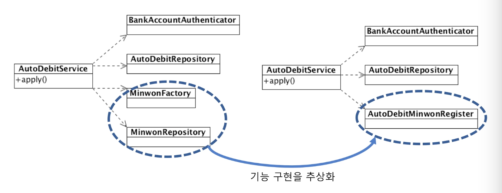
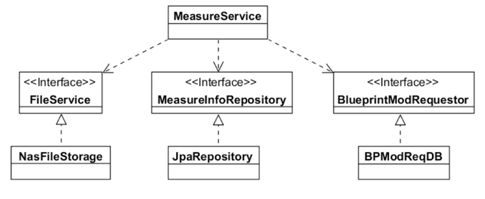
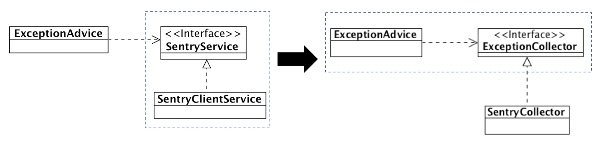
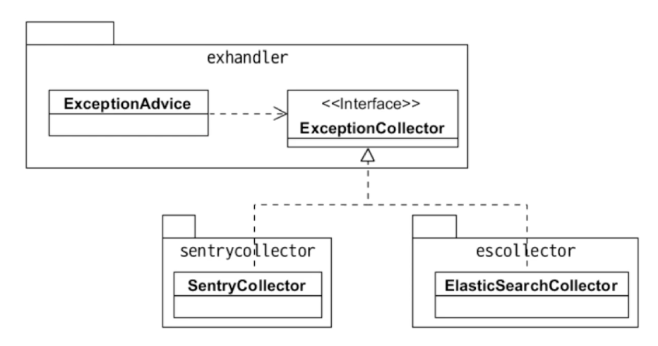
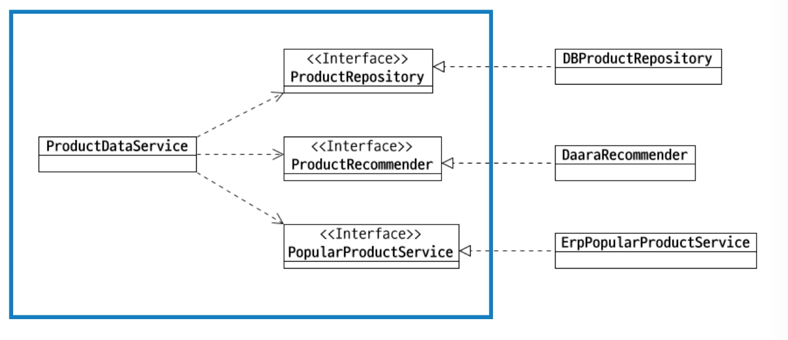

# Dependency 와 DI

## Dependency (의존)

**의존** : 기능 구현을 위해 다른 구성 요소를 사용하는 것

* example : 객체 생성, 메소드 호출, 데이터 사용 -> 의존에 해당된다

* 의존은 변경이 전파될 가능성을 의미
	* 의존하는 대상이 바뀌면 나도 바뀔 가능성이 높아짐
		* 예: 호출하는 메서드의 파리미터 변경
		* 예: 호출하는 메서드가 발생할 수 있는 익셉션 타입 추가

의존은 변경의 전파와도 관련되어 있다. 즉 **의존하는 대상이 바뀌면 나도 바뀔 가능성이 있다.**  예를 들어 호출하는 메서드의 파라미터 변경, 호출하는 메서드가 발생할 수 있는 익셉션 타입이 추가 등

## 순환 의존

순환 의존은 위험하다


* 순환 의존 -> 변경 연쇄 전파 가능성
	* 클래스, 패키지, 모듈 등 모든 수준에서 순환 의존 없도록 해야된다.

```
A -> B -> C -> A
```

`A`가 `B`에 의존하고 있고 `B`가 `C`에 의존하고 다시 `C`가 `A`에 의존하는 형태. 이렇게 의존이 순환해서 발생하는 경우 `A`의 변경이 `B`에 영향을 주고 이는 `C`에 영향을 주고 다시 `A`에 영향을 줄 수 있다. 

순환의존은 변경의 영향이 서로 영향을 끼칠 위험이 크기 떄문에 클래스, 패키지, 모듈 이렇게 모든 수준에서 순환의존이 발생하지 않도록 해야된다.

## 의존하는 대상이 많다면?

의존하는 대상은 적을 수록 좋다, 바뀔 가능성이 적기 떄문.

1. 기능이 많은 경우

한 클래스에서 많은 기능을 제공하는 경우

```java
public class UserService {
	public void regist(ReqReq reqReq) {
		//...
	}
	public void changePw(ChangeReq chgReq) {
	// ...
	}
	public void blockUser(String id, String reason) {
	// ...
	}
```

각 기능마다 의존하는 대상이 다를 수 있음 (regist 메소드가 의존하는 대상과 changePw 메소드가 의존하는 대상이 다를 수 있음)

한 기능 변경이 다른 기능에 영향을 줄 수 있음 (changePw 메소드의 기능을 변경하는데 blockUser 와 관련되 코드를 변경해야되는 상황이 발생할 수 있음)

한 메소드만 테스트하고 싶어도 나머지 기능에서 필요하는 의존 대상까지 초기화해야되는 상황이 만들어짐 -> 즉 테스트 어려움

한 클래스에서 제공하는 기능이 많으면 기능 별로 분리를 고려해봐야한다 -> 클래스 갯수는 많아지지만 각 클래스마다 의존하는 갯수 줄어듬 -> 한 기능을 수정할 때 다른 기능과 관련된 코드를 수정하는 일이 발생하지 않음 -> 개별 기능을 테스트하기 쉬워짐

```java
public class UserRegistService {
	public void regist(ReqReq reqReq) {
		//...
	}
}
public class ChagePwService {
	public void changePw(ChangeReq chgReq){
	// ...
	}
}
public class UserBlockService {
	public void blockUser(String id, String reason) {
	// ...
	}
}
```

2. 묶어보기
몇 가지 의존 대상을 단일 기능으로 묶어서 생각해보면 의존 대상을 줄일 수 있다.



`AutoDebitService` 가 의존하는 대상이 4개가 있다. 이중에서 `MinwonFactory`, `MinwonRepository` 를 사용한 이유가 민원 등록떄문이라고 가정해보면 오른쪽과 같이 `AutoDebitMinwonRegister` 라는 걸로 기능을 추상화함으로써 `AutoDebitService` 가 의존하는 대상을 줄일 수 있다.

## 의존 대상 객체를 직접 생성하면?

의존하는 객체를 직접 생성할 수도 있지만 이 경우에는 생성할 클래스가 바뀌면 의존하는 코드도 바뀜

> 인프런 최범균님의 객체지향 프로그래밍 입문 - 추상화에서 언급했다고 함.

의존 대상 객체를 직접 생성하지 않는 방법

* 팩토리, 빌더
* 의존 주입
* 서비스 로케이터

## 의존 주입

**의존 주입**이란? 의존하는 대상을 직접 생성하지않고 대신에 생성자나 메소드를 이용해서 전달받는 방식.

```java
public class ScheduleService {
	private UserRepository repository;
	private Calculator cal;
	
	public ScheduleService(UserRepository repository) {
		this.repository = repository;
	}
	public void setCalculator(Calculator cal) {
		this.cal = cal;
	}
}
```

```java
// 초기화 코드
UserRepository userRepo = new DbUserRespository();
Calculator cal = new Calculatro();

ScheduleService schSvc = new ScheduleService(userRepo);
schSvc.setCalculator(cal);
```

예를 들어서 위 코드르 보면 생성자와 메소드를 이용하여 의존하는 객체를 전달받고 전달받은 객체를 필드에 할당하고 있다. 생성자와 메소드를 이용하여 객체를 전달하는 것은 초기화 코드에서 진행. 프로그램을 초기화하는 코드에서 알맞은 객체를 생성하고 전달하는 것이다.


## 조립기(Assembler)

프로그램을 시작하는 메인 메소드에서 의존 객체를 생성하고 주입을 할 수 있지만 보통은 조립기를 이용하여 객체를 생성하고 의존 주입을 처리한다.


대표적인 조립기로 스프링 프레임워크가 있다.


```java
@Configuration
public class Config {
	@Bean
	public ScheduleService scheduleSvc() {
		ScheduleService svc = new SchduleService(repo());
		svc.setCalculator(expCal())
		return svc
	}

	@Bean
	public UserRepository repo() { ... }
	
	@Bean
	public Calculator expCal() { ... }
}
```
스프링은 위 코드와 같이 객체를 생성하고 의존대상을 주입하는 코드를 설정으로 작성하고 그 설정 코드를 이용하여 어플리케이션 콘텟스트라는 조립기를 생성한다

밑에 코드를 보면 `AnnotationConfigApplicationContext` 라는 클래스가 있는데 이게 바로 스프링에서 제공하는 조립기에 해당.

```java
// 초기화
ctx = new AnnotationConfigApplicationContext(Config.class);

// 사용할 객체 구함
ScheduleService svc = ctx.getBean(ScheduleService.class);

// 사용
svc.getSchedule(..);
```

조립기를 초기화하는 시점에 설정 클래스를 이용하여 객체를 만들고 의존 주입이 발생함. 초기화 이후에는 조립기에서 필요한 객체를 구하고 그 객체를 사용하면 된다.

## DI 장점
* 의존 대상이 바뀌면 조립기의 설정만 바꾸면 된다
* 의존하는 객체의 실제 구현이 없어도 대역 객체를 사용해서 테스트하기가 쉽다

---

# DIP

## 고수준 모듈, 저수준 모듈

* 고수준 모듈
    - 어떤 의미있는 단일 기능을 제공하는 모듈
    - 고수준 모듈은 상위 수준의 정책을 구현

* 저수준 모듈
    - 고수준 모듈의 기능을 구현하기 위해 필요한 하위 기능의 실제 구현

말이 어렵다 예시를 보자.

## 고수준 모듈, 저수준 모듈 예
ex) 수정한 도면 이미지를 NAS에 저장하고 측정 정보를 DB 테이블에 저장하고 수정 의뢰 정보를 DB에 저장하는 기능


이 기능에서 고수준의 하위 기능은 도면 이미지를 저장, 측정 정보 저장, 도면 수정 의뢰로 이루어진다


각 하위 기능의 실제 구현이 저수준에 위치하는데 예를 들어 고수준에서 도면 이미지를 저장한다는 하위 기능을 이 기능을 구현한 저수준 모듈은 NAS에 이미지를 저장한다가 된다. 

* 고수준
    * 도면 이미지를 저장하고
    * 측정 정보를 저장하고
    * 도면 수정 의뢰를 한다

* 저수준
    * NAS에 이미지를 저장한다
    * MEAS_INFO 테이블에 저장한다
    * BP_MOD_REQ 테이블에 저장한다

이렇게 고수준 모듈은 기능의 정책을 제공하고 저수준 모듈은 하위 기능의 구현을 제공한다

## 고수준이 저수준에 직접 의존하면?

예를 들어보자

```java
public class MeasureService {
	public void measure(MesureReq req) {
		File file = req.getFile();
		nasStorage.save(file)
	}

	jdbcTemplate.update("insert into MEAS_INFO ...");
	jdbc.Template.update("insert into BP_MOD_REQ ...");

}
```

``` java
pubic class MeasureService {
	public void measure(MeasureReq req) {
		File file = req.getFile();
		s3storage.upload(file)
	}
	
	jdbcTemplate.update("insert into MEAS_INFO ...");

	rabitmq.convertAndSend(...);
	
}
```

위 코드와 같이 `MeasureService` 가 고수준 모듈인데 이 모듈에서 도면 이미지 저장에 해당하는 하위 기능에 대해 NAS에 저장한다는 저수준 구현을 바로 사용했다고 가정해보자.
이 상태에서 도면 이미지를 NAS 대신 s3 에 저장하도록 저수준 구현이 바뀌게 되면 `MeasureService` 클래스가 두번째 코드 처럼 바뀌게 된다.

즉 고수준 정책이 바뀌지 않았으나 저수준 구현 변경으로 코드 변경 발생.

# Dependency Inversion Principle

이렇게 고수준 모듈이 저수준 모듈에 의존하면서 발생하는 문제 즉, 저수준 구현이 바뀌면서 고수준 모듈도 같이 바뀌는 원칙을 방지하기 위한 것이 DIP(의존 역전 원칙) 이다.

고수준 모듈이 저수준 모듈에 의존하면 안되며 저수준 모듈이 고수준 모듈에서 정의한 추상타입에 의존해야한다는 것이 DIP.




`FileService`, `MessureInfoRepository`, `BlueprintModRequestor` 가 중앙에 위치한 이 3가지가 고수준 모듈에 포함된 추상타입이다. 저수준 모듈은 이 추상타입을 상속해서 구현하는 방식으로 고수준 모듈에 의존하게 된다. 예를 들어 NAS에 파일을 저장하는 기능을 구현한  `NasFileStorage` 저수준 모듈이 파일을 저장한다는 기능을 정의한 고수준의 `FileService` 추상타입을 상속받고 있다. 

고수준 모듈이 저수준 모듈에 의존하는 것이 아니라 저수준 모듈이 고수준 모듈에 의존하도록 의존의 방향을 역전시키라는 원칙이 DIP!!!

`FileService`, `MessureInfoRepository`, `BlueprintModRequestor` 는 고수준 모듈에서 하위 기능을 정의한 추상타입. 이 3가지의 추상타입은 `MessureService`   와 함께 고수준 모듈 패키지에 위치하게 된다. 이들 추상타입을 구현한 클래스는 저수준 패키지에 위치하게 된다.



DIP 에서 하위기능에 대한 추상타입을 도출할때는 고수준 입장에서 추상화해야한다. 저수준 입장에서 추상화하면 안된다. 예를 들어서 exception 이 발생하면 Sentry 라는 곳으로 exception 을 수집한다는 요구사항이 있고 이를 위해 Sentry client 를 이용해서 exception data 를 전송하도록 구현햇다고 가정. 이때 저수준 구현 관점에서 추상화를 하면 sentry 가 중심이 된다. 그래서 `SentryService` 라는 타입을 도출하게 된다.

반면에 고수준 입장에서 exception 을 수집한다는 하위 기능을 추상화하면 `ExceptionCollator` 라는 타입을 도출하게 된다. 같은 추상타입이지만 `SentryService` 는 저수준 모듈의 구현에 가깝고 `ExceptionCollator` 은 고수준 모듈의 정책에 더 가깝다. 이렇게 고수준 입장에서 저수준 모듈을 추상화해햐한다.

## DIP는 유연함을 높인다

* 고수준 모듈의 변경을 최소화하면서 저수준 모듈의 변경 유연함을 높임.

DIP를 적용하면 고수준 모듈을 변경하지 않으면서 저수준 모듈을 변경할 수 있는 유연함이 생기게 된다. 





그림에서 exception을 centry 가 아니라 elasticsearch 로 보내고 싶다고 하자. 그 경우 고수준 모듈에 정의되어 있는 `ExceptionCollector`  를 구현한 저수준 모듈을 알맞게 구현해주기만 하면 된다. 이 과정에서 고수준 모듈인 `ExceptionAdvice` 나 `ExceptionCollector` 는 바뀌지 않는다. 즉, 고수준 모듈이 안바뀌면서 저수준 모듈의 구현을 바꿀수 잇는 유연함이 생긴다

## 부단한 추상화 노력 필요

처음부터 바로 좋은 설계가 나오지는 않음

* 요구 사항/업무 이해가 높아지면서 저수준 모듈을 인지하고 상위 수준 관점에서 저수준 모듈에 대한 추상화를 시도.

> TODO: 이부분 다시 확인해볼것

처음부터 DIP 를 잘 따르는 구조는 나오기 힘들다. 

익셉션이 발생하면 sentry에 익셉션 정보를 보냄 -> 익셉션이 발생하면 sentry에 익셉션 정보를 모음 -> 익셉션이 발생하면 익셉션을 모음

## 연습

상품 상세 정보와 추천 상품 목록 제공 기능

* 상품 번호를 이용해서 상품 DB에서 상세 정보를 구함
* Daara API를 이용해서 추천 상품 5개 구함
* 추천 상품이 5개 미만이면 같은 분류에 속한 상품 중 최근 한달 판매가 많은 상품을 ERP에서 구해 5개를 채움.

이러한 요구사항이 있다고 하자. 우리는 이 요구사항에서 고수준과 저수준을 분리해보자.

*고수준 
    * 상품 번호로 상품 상제 정보 구함
    * 추천 상품 5개 구함
    * 인기 상품 구함

이런식으로 고수준 모듈의 하위 기능을 도출. 각 하위 기능의 저수준 구현은 다음과 같다.

* 저수준
    * DB에서 상세 정보 구함
    * Daara API에서 상품 5개 구함
    * 같은 분류에 속한 상품에서 최근 한달 판매가 많은 상품 ERP에서 구함


이렇게 분리한 구조를 설계에 반영해보자. 다음과 같이 설계를 할 수 잇다



왼쪽 파랑색 -> 고수준

오른쪽 -> 저수준

파랑색 박스안 `ProductRespository`, `ProductRecommender`, `PopularProductService` 3개의 인터페이스가 하위기능을 추상화한 타입이되고 이 추상화 타입을 저수준 모듈에서 구현하게 된다.

DIP 만 잘해도 좋은 설계가 될 가능성이 매우 높다.
고수준과 저수준 관점에서 기능을 분리하고 설계하는 연습을 많이 해보자.
끝

## Refence & Further more

* 인프런 - 객체지향 프로그래밍 입문 (최범균님)

* [Dependency Injection 이란?](https://medium.com/@jang.wangsu/di-dependency-injection-%EC%9D%B4%EB%9E%80-1b12fdefec4f)

* [세 가지 DI 컨테이너로 향하는 저녁 산책](http://www.nextree.co.kr/p11247/)

* [DI Inversion Of Control Container 란? - Clint Jang - Medium](https://medium.com/@jang.wangsu/di-inversion-of-control-container-%EB%9E%80-12ecd70ac7ea)

* [예제로 배우는 스프링 입문 8. 의존성 주입 (Dependency Injection)](https://www.youtube.com/watch?v=IVzYerodIyg) 

* [Design Pattern DI란 (Dependency Injection) - Heee's Development Blog](https://gmlwjd9405.github.io/2018/11/09/dependency-injection.html)